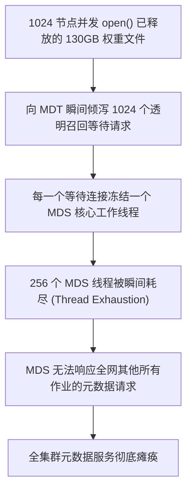

# 17.6 生产事故案例：千卡并发读取 Released 巨型模型引发召回雪崩与 MDS 线程耗尽

## 17.6.1 故障现象

某国家人工智能实验室在一套 1024 节点的 GPU 训练集群上拉起一次针对千亿大模型的分布式评估评测。评估脚本被 SLURM 调度器同时广播至 1024 个计算节点，所有节点并发执行：
```python
model = torch.load("/mnt/lustre/models/deepseek-67b/weights.pt")
```
脚本执行瞬间，全集群所有节点的 Python 进程全部陷入挂死状态。紧接着，主元数据服务器 MDT0000 发生不可中断卡死，全网正常业务的 `ls`、`mkdir` 全部报超时错误，集群监控报警 MDS 线程池利用率打满 100%。

## 17.6.2 排查过程

1. **文件物理与 HSM 状态确认**：  
   运维人员在 MDS 节点上查询目标模型权重文件的状态：
   ```bash
   lfs hsm_state /mnt/lustre/models/deepseek-67b/weights.pt
   ```
   输出：
   ```text
   weights.pt: (0x0000000d) exists archived released, archive_id: 1
   ```
   **排查发现**：该模型在此前由于长期未使用，已被运维自动化脚本执行了 `lfs hsm_release`，其 130GB 的物理数据在 OST 上已被全部清空，数据仅留存在后端的 S3 归档桶中。

2. **根因机理深入分析**：  
   - 1024 个计算节点在同一秒钟并发执行 `open()` 操作；
   - 客户端内核向 MDT 发送了 **1024 个针对同一文件的透明召回请求**；
   - 在当时的内核实现中，MDT Coordinator 虽然识别出是同一个文件，但每一个阻塞的客户端连接依然各自占据了一个专用的 MDT RPC 接收工作线程，直接耗尽了 MDS 全部预留的 256 个服务线程；
   - 与此同时，后台配置的 Copytool 节点仅有 2 台，面对高达 130GB 的大文件，从对象存储通过网络下载需要数分钟，漫长的网络传输期内，MDS 的所有线程被完全死锁挂起，引发全集群元数据雪崩。



## 17.6.3 修复措施与成效

1. **紧急带外疏导与优先召回**：  
   - 运维人员登录集群调度器，紧急暂停相关评估作业（`scancel`），使 1024 个挂起的 RPC 连接断开，释放 MDS 工作线程池；
   - 随后由管理员在控制台手动以单线程方式执行提前预热召回：
     ```bash
     lfs hsm_restore /mnt/lustre/models/deepseek-67b/weights.pt
     ```
   - 等待 Copytool 完成 130GB 数据的全量落盘，确认文件脱离 `RELEASED` 状态；
   - 为避免再次发生热点单文件读争用，使用 `lfs mirror extend -N2` 将该权重文件在不同的 OST 存储池间创建两个物理镜像副本。
2. **制度规范与技术屏障加固**：  
   - **禁止在共享大模型权重上使用动态透明召回**：在业务准入规范中确立红线，所有多机并行训练加载的数据集与权重，必须在作业脚本的前置阶段（Prolog Script）执行非阻塞显式预热（Pre-warm），严禁依赖运行时的透明挂起召回；
   - **调优 Coordinator 排队参数**：设置 `lctl set_param mdt.*.hsm.active_request_timeout=600`，并在 MDS 边界增加对相同 FID 重复召回请求的快速聚合去重熔断机制。

加固后重新提交评估任务，1024 节点在 15 秒内全速完成模型加载，集群元数据保持平稳。

---

