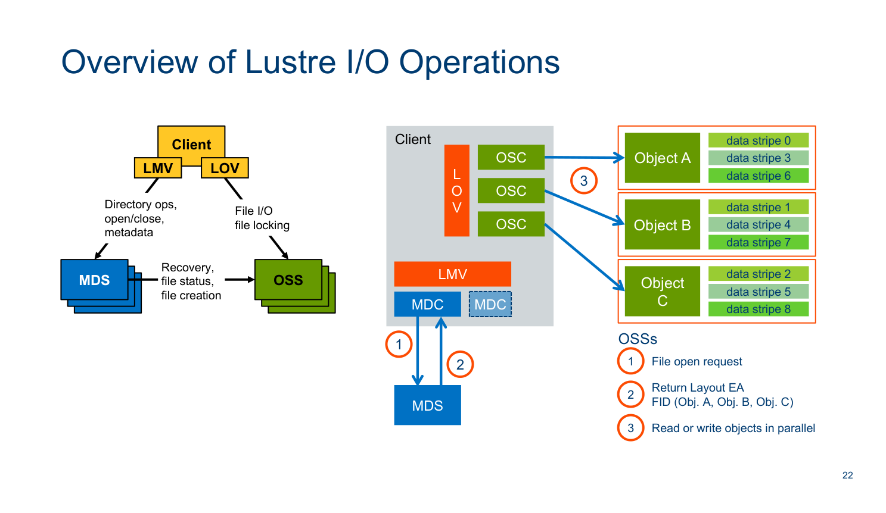
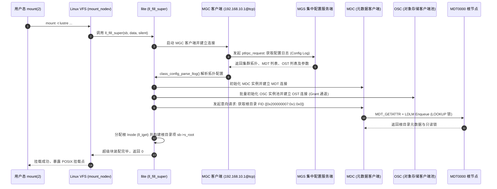
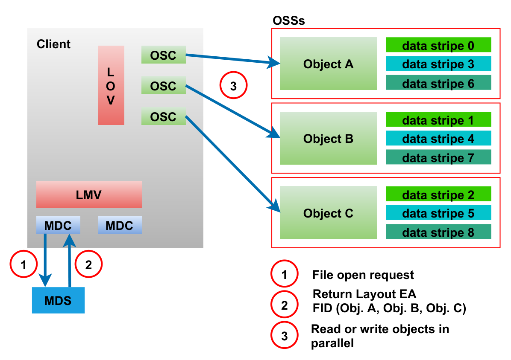
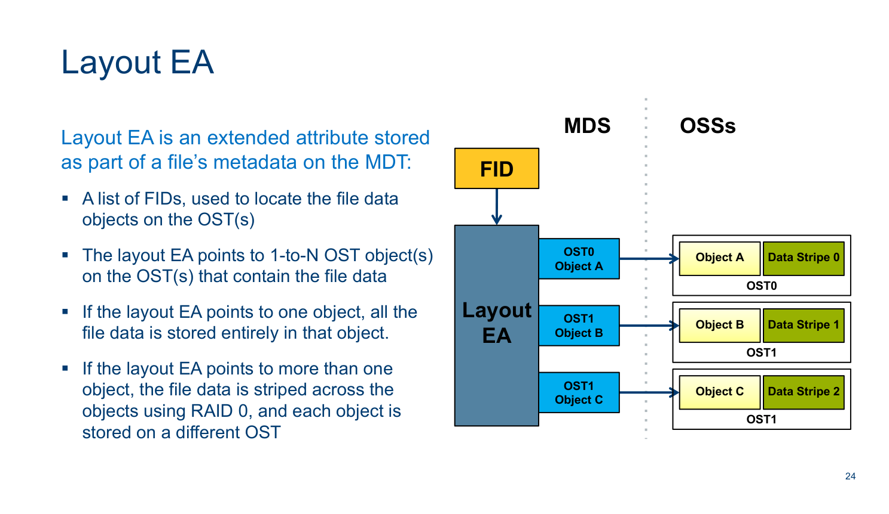

# 第 18 章：llite 与 Linux VFS 深度适配与生命周期

> **本章核心源码文件**：  
> - `lustre/llite/llite_lib.c`：文件系统挂载注册、超级块初始化（`ll_fill_super()`）与卸载实现  
> - `lustre/llite/file.c`：标准文件操作表（`file_operations`）与 `read`/`write` 迭代器实现  
> - `lustre/llite/namei.c`：Inode 操作表（`inode_operations`）与目录项查找（`lookup`/`create`）实现  
> - `lustre/llite/dcache.c`：分布式 Dentry 验证器（`ll_d_revalidate()`）与缓存生命周期管理  
> - `lustre/llite/rw26.c`：页面缓存操作表（`address_space_operations`）与直接 I/O 绑定  
> - `lustre/include/lustreapi.h`：用户态开发库 `liblustreapi`（LLAPI）条带与底层控制接口定义  

---

## 16.1 llite 架构定位：Linux VFS 与分布式集群的适配中枢

在 Linux 操作系统中，虚拟文件系统（VFS, Virtual File System）为用户空间进程屏蔽了底层存储介质的差异，提供通用的系统调用入口（如 `open(2)`、`read(2)`、`write(2)`、`stat(2)`）。

对于本地文件系统（如 Ext4、XFS），VFS 下方直接对接单机通用块层与物理磁盘；而对于分布式文件系统 Lustre，内核客户端必须通过专门的驱动桥梁——**`llite`（Lustre Lite）**，将单机 POSIX 文件系统调用平滑转换为跨网络的分布式元数据（MDT）与数据对象（OST）交互。


如图 16-1 所示，`llite` 处于客户端协议栈的核心枢纽位置：
1. **向上对接 Linux VFS**：向内核注册 `struct file_system_type lustre_fs_type`，实例化 `super_operations`、`inode_operations`、`file_operations`、`dentry_operations` 与 `address_space_operations` 五大核心操作跳转表。
2. **向下驱动 Lustre 子系统**：
   - **元数据分支**：通过 `llite` 的 Inode 属性与目录操作，驱动 `lmv`（元数据虚拟卷）与 `mdc`（元数据客户端），经由 LNet 与 MDS 节点建立 RPC 会话；
   - **数据对象分支**：通过 `cl_object` 与 `cl_io` 状态机，驱动 `lov`（对象虚拟卷）与 `osc`（对象存储客户端），完成文件逻辑偏移量到 OST 对象偏移量的条带切分与并发 I/O 投递。



在图 16-2 展示的内核分层视图中，Lustre 客户端绕过了传统的单机 Linux Page Cache 和块设备 I/O 调度器（Block I/O Scheduler）。`llite` 将内核请求截获后，交由 Lustre 专属的客户端缓存子系统（CL Cache / OSC RPC Batcher）与分布锁管理器（LDLM）进行协调，从而在普通 PC 服务器上聚合出数百 GB/s 的并行 I/O 能力。

---

## 16.2 挂载与装配流程：`ll_fill_super()`

当系统管理员在客户端节点执行挂载命令时：
```bash
mount -t lustre 10.10.10.1@o2ib:10.10.10.2@o2ib:/lustrefs /mnt/lustre
```
内核 VFS 解析 `lustre` 文件系统类型并调用注册的入口函数 `ll_fill_super()`（位于 `lustre/llite/llite_lib.c`）。该流程完成从配置拉取、网络建链到本地根目录绑定的完整装配：



### 装配核心步骤详解

1. **MGC 配置日志订阅**：
   `llite` 根据挂载命令传入的 MGS NID（支持高可用双活 NID），在本地生成临时 MGC 设备，向 MGS 请求获取 `<fsname>-client` 配置日志。该日志以二进制 llog 形式存储在服务端，包含了当前文件系统所有活动的 MDT、OST 命名、UUID、网络地址和全局参数。
2. **底层 OBD 堆栈级联展开**：
   根据配置日志中的指令序列，内核依次调用 `class_process_config()`：
   - 实例化 `lmv`（Lustre Metadata Virtual）设备，并在其下方挂载各个 MDT 对应的 `mdc` 设备；
   - 实例化 `lov`（Lustre Object Virtual）设备，并在其下方挂载各个 OST 对应的 `osc` 设备；
   - 启动本地 LDLM 客户端命名空间与 RPC 守护线程池。
3. **根 Inode 锚定与 VFS 绑定**：
   客户端向主元数据节点 MDT0000 发起 RPC，查询根目录对象。根据 Lustre 规范，根目录具有固定的保留 FID（`ROOT_FID = [0x200000007:0x1:0x0]`）。MDT 返回根目录的 `struct mdt_body` 及其 Inode Bits 锁。`llite` 调用 `ll_iget()` 分配内存 `struct inode`，将其包装为 `struct ll_inode_info`，设置 `sb->s_root = d_make_root(root_inode)`。

---

## 16.3 核心数据结构内嵌：`struct ll_inode_info`

Linux 内核通过面向对象的思想组织 VFS，每种文件系统都需要将自身特有的元数据状态附加到标准 `struct inode` 上。Lustre 采用外包装结构体（In-memory Wrapper）模式定义了 `struct ll_inode_info`（位于 `lustre/llite/llite_internal.h`）：

```c
struct ll_inode_info {
    /* 1. 分布式文件唯一标识 (128-bit FID) */
    struct lu_fid           lli_fid;

    /* 2. 客户端通用对象模型指针 (数据/锁/缓存状态机) */
    struct cl_object       *lli_clob;

    /* 3. 内嵌的 Linux 原生 VFS Inode (必须作为成员嵌入) */
    struct inode            lli_vfs_inode;

    /* 4. 读写一致性与锁保护 */
    struct rw_semaphore     lli_glimpse_sem;    /* Glimpse 探测保护读写信号量 */
    unsigned long           lli_flags;          /* 状态标记 (LLIF_UPDATE_ATIME, LLIF_MDS_SIZE_LOCK 等) */
    struct mutex            lli_layout_mutex;   /* 动态布局变更互斥锁 */

    /* 5. 小 I/O 合并与性能优化 */
    struct ptlrpc_request  *lli_tiny_write_req; /* 小写入合并 RPC 请求缓存 */
    __u64                   lli_maxbytes;       /* 允许写入的最大逻辑偏移量 */
    
    /* 6. 打开文件引用与意向句柄 */
    struct list_head        lli_open_files;     /* 打开该文件的所有进程结构体链表 */
    struct obd_client_handle *lli_pending_och;  /* 延迟关闭的元数据句柄 */
};
```

### 内存指针转换机制

内核通过标准的 `container_of` 宏实现 VFS Inode 与 `ll_inode_info` 之间的无开销双向指针换算：

```c
static inline struct ll_inode_info *ll_i2info(struct inode *inode)
{
    return container_of(inode, struct ll_inode_info, lli_vfs_inode);
}

static inline struct inode *ll_info2i(struct ll_inode_info *lli)
{
    return &lli->lli_vfs_inode;
}
```

当系统调用触发 `file_operations` 或 `inode_operations` 时，VFS 传入的第一个参数始终是 `struct inode *`。`llite` 仅需通过单次地址偏移运算 `ll_i2info(inode)`，即可在纳秒级别提取出文件的全局 FID、条带分布策略（`cl_object`）以及相关的分布式并发锁。

---

## 16.4 分布式 Dentry 校验与生命周期：`ll_d_revalidate()`

在单机本地文件系统中，Linux 内核的目录项缓存（Dentry Cache / dcache）在被创建后默认长期有效，仅在本地进程执行 `unlink(2)` 或内存紧张时才会被剔除。

然而，在多客户端并发访问的分布式存储环境中，如果客户端 A 缓存了 `/data/model.pt` 的 Dentry，而数毫秒前客户端 B 在远端通过 `unlink(2)` 删除了该文件，客户端 A 若不经校验直接使用本地 Dentry 就会导致“幻影文件读取”（Stale Dentry）。

为兼顾高性能本地路径缓存与强一致性语义，`llite` 实现了由 LDLM 锁驱动的 **`ll_d_revalidate()`** 机制：

```mermaid
flowchart TD
    A["VFS 遍历解析路径分段 (如 /data/model.pt)"] --> B{"本地 dcache 中是否存在对应 dentry？"}
    B -->|未命中| C["触发 inode_operations->ll_lookup() 向 MDT 发起意向查询"]
    B -->|命中缓存| D["调用 dentry_operations->ll_d_revalidate() 验证时效性"]
    
    D --> E{"客户端本地是否仍持有该 Dentry 对应父目录的<br/>MDS_INODELOCK_LOOKUP 锁？"}
    
    E -->|持有有效锁 (Lock Valid)| F["【快速路径 Fast Path】<br/>没有任何其他节点修改过该目录项<br/>无需发起任何网络 RPC，直接返回 1 (有效)"]
    
    E -->|锁缺失或已被服务端 AST 撤销| G["【慢速路径 Slow Path】<br/>向 MDT 发送 Intent Lookup RPC 验证实际状态"]
    
    G --> H{"MDT 校验结果：该文件在服务端是否存在？"}
    H -->|仍存在| I["MDT 重新授予客户端 LOOKUP 锁<br/>更新本地 Inode 属性与 Dentry，返回 1"]
    H -->|已被其他客户端删除| J["返回 0 (失效)<br/>VFS 将本地 dentry 移入失效列表并执行释放"]
```

### 16.4.1 快速路径（Fast Path）与 Inode Bits 锁解耦
当大量进程在同一目录并发执行 `stat`、`open` 或 `access` 时，只要客户端持有父目录的 `MDS_INODELOCK_LOOKUP` 锁，`ll_d_revalidate()` 便能在极短的 CPU 内存原子比对中判定 Dentry 依然合法，耗时仅需数十纳秒，直接避免昂贵的网络往返。

### 16.4.2 慢速路径（Slow Path）与 Intent RPC
一旦其他客户端在当前目录内创建、重命名或删除了同名子项，MDT 会向本地客户端发送 `Blocking AST`，强行使客户端持有的 `MDS_INODELOCK_LOOKUP` 锁失效。下一次路径访问时，`ll_d_revalidate()` 发现本地锁已失效，立刻退化为 Intent RPC，向 MDT 发起单次往返请求。如果服务端确认文件已被删除，则向 VFS 返回 0，触发 VFS 自动清理本地目录项缓存，确保分布式语义一致。

---

## 16.5 客户端完整读写 I/O 流水线

用户态应用发起的 `read(2)` 与 `write(2)` 请求在客户端内核中跨越多个子系统完成对象寻址与网络并发。



图 16-3 展示了请求在 `llite` 内核驱动内部的执行流转。结合分层组件交互视图（图 16-4），完整的读写操作流经历以下关键阶段：



### 阶段一：VFS 分发与模式判定
1. 应用程序发起 `write(fd, buf, count)`；
2. VFS 将请求投递至 `file_operations` 对应的 `ll_file_write_iter()`（`lustre/llite/file.c`）；
3. **Direct I/O vs Buffered I/O 分流**：
   - 若设置了 `O_DIRECT` 标志，跳过客户端 Page Cache，请求被直接构造成向量页映射（`iov_iter`），交由 `ll_direct_IO()` 处理；
   - 若为标准缓冲 I/O，请求进入通用页面缓存管理逻辑，通过 `address_space_operations` 的 `ll_write_begin()` 与 `ll_write_end()` 进行脏页分配。

### 阶段二：CL Object 抽象与条带切分
1. `llite` 获取或初始化当前操作对应的 `struct cl_io` 状态机；
2. 请求进入 **LOV（Lustre Object Virtual）** 层。LOV 根据该文件关联的条带化布局（Stripe Count、Stripe Size、OST 索引池）：
   - 计算逻辑偏移量属于哪个条带（Stripe Index = `(offset / stripe_size) % stripe_count`）；
   - 计算该分段在对应 OST 对象上的目标偏移量（Target Offset = `(offset / (stripe_size * stripe_count)) * stripe_size + (offset % stripe_size)`）；
3. 将一个文件级的连续逻辑请求拆分为 $N$ 个针对各个 OST 目标对象的独立子请求。

### 阶段三：OSC 聚合与 LNet 传输
1. 各分片请求被分发给下层的 **OSC（Object Storage Client）** 实例；
2. OSC 检查客户端本地持有的 **Grant 配额** 与 **Extent Lock 锁范围**：
   - 若无对应区间锁，向该 OST 发起 LDLM 申请；
   - 若 Grant 足额，将页面加入 OSC 脏页队列（Dirty Queue）并根据 RPC 批量上限（默认单次 1MB 或 4MB）打包为 `brw_page` 结构数组；
3. OSC 组装 Portal RPC 数据报文，通过 LNet（Lustre Network）跨 InfiniBand 或以太网直投目标 OSS 节点。

---

## 16.6 用户态 C 语言控制接口：`liblustreapi`（LLAPI）

除标准 POSIX 系统调用外，HPC、AI 训练平台及大数据应用通常需要直接感知和控制文件的底层条带分布、缓存策略与预取行为。Lustre 提供了专用的用户态 C 语言链接库 **`liblustreapi`**（头文件 `<lustre/lustreapi.h>`）。

### 16.6.1 条带创建与动态布局定义：`llapi_file_create()` 与 `llapi_layout_*`

在高性能并行计算（如 MPI-IO）场景下，如果依赖系统默认条带策略，大文件可能仅被写入单台 OST 导致吞吐瓶颈。通过 LLAPI，程序可在创建文件时显式指定条带拓扑：

```c
#define _GNU_SOURCE
#include <stdio.h>
#include <stdlib.h>
#include <fcntl.h>
#include <unistd.h>
#include <string.h>
#include <errno.h>
#include <lustre/lustreapi.h>

/**
 * 示例 1：使用标准 llapi_file_create() 创建指定条带的文件
 */
int create_striped_file_simple(const char *path)
{
    unsigned long long stripe_size = 2 * 1024 * 1024; /* 2MB 条带单位 */
    int stripe_offset = -1;                          /* -1 表示由 MDS 负载均衡选择起始 OST */
    int stripe_count = 8;                            /* 跨越 8 台 OST 并行条带化 */
    int stripe_pattern = LOV_PATTERN_RAID0;          /* RAID0 模式 */
    int rc;

    /* llapi_file_create 内部执行 open(O_CREAT | O_LOV_DELAY_CREATE) 并通过 ioctl 注入布局 */
    rc = llapi_file_create(path, stripe_size, stripe_offset, stripe_count, stripe_pattern);
    if (rc < 0) {
        fprintf(stderr, "Failed to create striped file %s: %s\n", path, strerror(-rc));
        return rc;
    }
    printf("Successfully created striped file: %s (stripes=%d, size=2MB)\n", path, stripe_count);
    return 0;
}

/**
 * 示例 2：使用更灵活的 llapi_layout API 构建复杂复合布局
 */
int create_file_with_layout_api(const char *path)
{
    struct llapi_layout *layout;
    int fd, rc;

    /* 1. 分配空的布局对象 */
    layout = llapi_layout_alloc();
    if (!layout) {
        perror("llapi_layout_alloc failed");
        return -ENOMEM;
    }

    /* 2. 配置条带参数 */
    llapi_layout_stripe_count_set(layout, 16);
    llapi_layout_stripe_size_set(layout, 4 * 1024 * 1024); /* 4MB */
    llapi_layout_pool_name_set(layout, "flash_pool");      /* 指定写入全闪存储池 */

    /* 3. 使用该布局原子创建并打开文件 */
    fd = llapi_layout_file_create(path, O_CREAT | O_WRONLY | O_TRUNC, 0644, layout);
    if (fd < 0) {
        fprintf(stderr, "llapi_layout_file_create failed: %s\n", strerror(errno));
        llapi_layout_free(layout);
        return -errno;
    }

    printf("File %s created using custom layout in 'flash_pool'. FD: %d\n", path, fd);

    /* 4. 释放布局对象引用并关闭文件 */
    llapi_layout_free(layout);
    close(fd);
    return 0;
}
```

### 16.6.2 客户端 I/O 智能提示与锁预取：`llapi_ladvise()`

在大规模深度学习大模型训练的 Checkpoint 读取与加载场景中，客户端可通过 `llapi_ladvise()` 向内核发出 Advice 提示，指示底层提前预取或锁定数据区间，大幅降低多节点同时打开同一个巨型模型权重时的元数据风暴与网络抖动：

```c
#include <stdio.h>
#include <fcntl.h>
#include <unistd.h>
#include <lustre/lustreapi.h>

/**
 * 示例 3：利用 LU_LADVISE_LOCKAHEAD 提前向服务端请求范围锁
 */
int prelock_file_range(int fd, uint64_t start_offset, uint64_t length)
{
    struct llapi_lu_ladvise advice;
    int rc;

    advice.lla_advice = LU_LADVISE_LOCKAHEAD;
    advice.lla_value1 = LCK_CR; /* 预先获取只读共享锁 (Concurrent Read) */
    advice.lla_value2 = 0;
    advice.lla_start  = start_offset;
    advice.lla_end    = start_offset + length;

    /* 通过专用系统调用接口投递 Lustre Advice 指令 */
    rc = llapi_ladvise(fd, LU_LADVISE_FLAG_SYNC, 1, &advice);
    if (rc < 0) {
        fprintf(stderr, "llapi_ladvise failed: %s\n", strerror(-rc));
        return rc;
    }

    printf("Range [0x%llx, 0x%llx] prelocked successfully.\n", 
           (unsigned long long)start_offset, (unsigned long long)(start_offset + length));
    return 0;
}
```

- **`LU_LADVISE_WILLNEED`**：通知底层 OSC 提前从远端 OST 预读目标数据页到本地缓存；
- **`LU_LADVISE_DONTNEED`**：通知底层 OSC 立即释放该范围的客户端缓存脏页，避免挤占宝贵的内核物理内存；
- **`LU_LADVISE_LOCKAHEAD`**：提前完成 LDLM Extent 锁的申请与入队，使后续高并发的并行读取完全处于“锁已就绪”状态。

---

## 16.7 生产调优与运行指标

### 16.7.1 核心运行时参数调节

通过 `lctl` 可对客户端 `llite` 模块进行细粒度微调：

```bash
# 1. 调整客户端的最大预读（Read-Ahead）上限 (设为 64MB)
lctl set_param llite.*.max_read_ahead_mb=64

# 2. 控制单文件最大预读阈值，防止单作业霸占预读内存
lctl set_param llite.*.max_read_ahead_per_file_mb=16

# 3. 开启异步预读（在后台线程静默拉取数据）
lctl set_param llite.*.async_read_ahead=1

# 4. 设置客户端 Dentry 缓存空闲保留上限
lctl set_param llite.*.dcache_max_unused=100000

# 5. 控制快速重试超时与 RPC 并发队列
lctl set_param llite.*.statahead_max=32
```

### 16.7.2 核心监控指标与性能排查

| 监控项目 | 查询命令 | 关键指标字段与含义 |
| :--- | :--- | :--- |
| **客户端 I/O 吞吐与调用频次** | `lctl get_param llite.*.stats` | `read_bytes`、`write_bytes`（累计吞吐）、`open`、`close`、`seek`（每秒频次统计） |
| **预读效率与命中率** | `lctl get_param llite.*.read_ahead_stats` | `hits`（命中次数）、`misses`（未命中）、`read_ahead_pages`（实际预读页数） |
| **Statahead 预取统计** | `lctl get_param llite.*.statahead_stats` | `statahead_hit`（目录遍历时预取元数据命中率），用于排查 `ls -l` 性能 |
| **内存 Dentry 驻留统计** | `lctl get_param llite.*.dcache_count` | 客户端缓存在内存中的 Dentry 数量，若超过 100 万需关注 SLAB 内存 |

---

## 16.8 生产故障案例：冷锁滞留导致 VFS Dentry 泄露与客户端内核 OOM

### 16.8.1 故障现象

某国家超算中心的大规模基因组学检索作业在 1024 台计算节点上连续运行 72 小时后，大批节点相继爆发内核无可用内存故障，Linux `oom-killer` 频繁唤醒并强杀核心业务进程。

运维监控捕获到异常特征：
- 节点物理内存总量为 256GB，用户态应用实际 RSS 内存占用均低于 25GB；
- 系统 Buffer/Cache 占用仅 10GB 左右；
- 内核 Slab 内存（`/proc/meminfo` 中的 `SUnreclaim`）异常暴涨至 **210GB**，占物理内存的 82%；
- 手动执行 `echo 3 > /proc/sys/vm/drop_caches` 仅能回收不足 2GB 内存，海量内核对象无法被内核 Shrinker 机制释放。

### 16.8.2 排查过程

1. **定位内核 Slab 内存分布**：  
   在故障计算节点上执行 `slabtop -s c` 抓取占用前列的 Cache：
   ```text
    ACTIVE / SLABS / CACHE NAME
    19,410,240 / 924,297 / dentry
    19,410,240 / 693,222 / ll_inode_info
     2,450,110 / 122,505 / kmalloc-512
   ```
   **数据分析**：内存中滞留了超过 1900 万个活跃的 `dentry` 与 `ll_inode_info` 结构体，活跃比率高达 99.8%。这表明内核认为这些结构体“处于被占用中”，直接阻止了内存回收。

2. **追溯引用计数与持锁机理**：  
   - 该基因组分析程序在启动阶段对一个包含数千万只读零碎参考文件的公共数据集执行了全量路径扫描与元数据检索；
   - 客户端在读取目录结构时，向 MDT 申请了海量的只读 `MDS_INODELOCK_LOOKUP` 锁并全部放入本地客户端的 LDLM LRU 队列中；
   - 在 Linux VFS 架构设计中，**只要 Inode 上挂接的分布式锁（`ldlm_lock`）未被释放，`struct inode` 与其关联的 `dentry` 的引用计数就无法归零**；
   - 检查客户端配置发现，管理员为了提升重复查询的性能，此前执行了：
     ```bash
     lctl set_param ldlm.namespaces.*.lru_size=0
     ```
     在 Lustre 机制中，`lru_size=0` 意味着“完全不限制本地客户端持锁数量，永不主动淘汰”。由于参考数据集是完全静态的只读数据，其他节点从未在该目录发起过修改，因此 MDT 绝不会主动向客户端发送 `Blocking AST` 撤销锁。1900 万把锁将对应的内存 Inode 与 Dentry 永久“钉死”在 SLAB 内存中，最终引发灾难性 OOM。

### 16.8.3 根因机理


### 16.8.4 修复与防护方案

1. **紧急带内释放**：  
   在存活节点上执行指令，强制清空本地未使用的 LDLM 锁并释放 Dentry：
   ```bash
   # 强制清空客户端全部命名空间的 LRU 锁
   lctl set_param ldlm.namespaces.*.lru_size=clear
   # 释放内核可回收 Slab
   echo 3 > /proc/sys/vm/drop_caches
   ```
   执行后，1900 万个滞留结构体在 10 秒内被完全释放，各节点瞬间归还超过 200GB 物理内存。

2. **固化生产运维基准参数**：  
   在所有客户端节点的 `/etc/modprobe.d/lustre.conf` 中显式固化 LRU 锁淘汰水线，禁止设置为 0：
   ```text
   options ldlm ldlm_lru_size=800
   ```
   同时在节点监控 Agent 中配置对 `/proc/meminfo` 中 `SUnreclaim` 的预警指标，一旦其占比超过物理内存 30% 立即触发告警。

---

## 16.9 运维基线检查清单

- [ ] **严禁将客户端 `ldlm_lru_size` 设置为 0**：生产计算节点必须保持合理的本地锁回收阈值（通常设定在 400 到 1600 之间），确保静态只读冷锁能够随时间自动被淘汰出内存。
- [ ] **合理配置预读上限**：对于大文件顺序读为主的计算集群（如模型训练、流媒体处理），将 `max_read_ahead_mb` 调大至 64MB~128MB，并确保 `async_read_ahead=1` 开启；对于海量随机小 I/O 业务，则应降低预读上限以节约带宽与内存。
- [ ] **关注 Direct I/O 与对齐条件**：应用程序在采用 `O_DIRECT` 绕过内核缓存时，必须确保缓冲区指针与 I/O 偏移量严格按照 4KB（或当前页面大小）对齐，否则系统将自动回退为缓冲 I/O。
- [ ] **优先使用 `LLAPI` 布局优化**：对于高并发写入的超大文件（>100GB），严禁以默认单条带写入，必须在代码中通过 `llapi_file_create` 或外层 `lfs setstripe` 设置跨多个 OST 的宽条带化布局。

---

## 本章小结

本章系统剖析了 Lustre 客户端核心适配中枢 `llite` 的工作机理与工程落地细节：
1. **架构衔接**：`llite` 通过实现标准 Linux VFS 的五大操作跳转表，将单机 POSIX 系统调用高效平滑地转换为 Lustre 底层的元数据（LMV/MDC）与数据对象（LOV/OSC）调度；
2. **内存对象绑定**：通过结构体包装技术，`struct ll_inode_info` 将 128 位全局 FID、条带分布策略和并发锁无缝绑定到原生 `struct inode` 上；
3. **分布式目录缓存**：`ll_d_revalidate()` 依托 LDLM 的 Inode Bits 锁机制，实现了“持锁即本地极速命中、失效则退化 Intent RPC”的分布式路径一致性验证；
4. **I/O 流水线与 LLAPI 拓展**：通过分层流水线完成了逻辑偏移量到物理条带的并发映射，并通过 `liblustreapi` 赋能上层应用精细控制条带分布与锁预取；
5. **内存治理**：通过生产级 OOM 事故案例，阐明了分布式锁生命周期对内核 VFS Dentry 内存释放的决定性影响，建立了生产配置基线。
