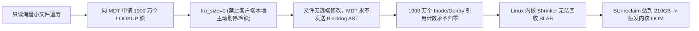

# 18.8 生产故障案例：冷锁滞留导致 VFS Dentry 泄露与客户端内核 OOM

## 16.8.1 故障现象

某国家超算中心的大规模基因组学检索作业在 1024 台计算节点上连续运行 72 小时后，大批节点相继爆发内核无可用内存故障，Linux `oom-killer` 频繁唤醒并强杀核心业务进程。

运维监控捕获到异常特征：
- 节点物理内存总量为 256GB，用户态应用实际 RSS 内存占用均低于 25GB；
- 系统 Buffer/Cache 占用仅 10GB 左右；
- 内核 Slab 内存（`/proc/meminfo` 中的 `SUnreclaim`）异常暴涨至 **210GB**，占物理内存的 82%；
- 手动执行 `echo 3 > /proc/sys/vm/drop_caches` 仅能回收不足 2GB 内存，海量内核对象无法被内核 Shrinker 机制释放。

## 16.8.2 排查过程

1. **定位内核 Slab 内存分布**：  
   在故障计算节点上执行 `slabtop -s c` 抓取占用前列的 Cache：
   ```text
    ACTIVE / SLABS / CACHE NAME
    19,410,240 / 924,297 / dentry
    19,410,240 / 693,222 / ll_inode_info
     2,450,110 / 122,505 / kmalloc-512
   ```
   **数据分析**：内存中滞留了超过 1900 万个活跃的 `dentry` 与 `ll_inode_info` 结构体，活跃比率高达 99.8%。这表明内核认为这些结构体“处于被占用中”，直接阻止了内存回收。

2. **追溯引用计数与持锁机理**：  
   - 该基因组分析程序在启动阶段对一个包含数千万只读零碎参考文件的公共数据集执行了全量路径扫描与元数据检索；
   - 客户端在读取目录结构时，向 MDT 申请了海量的只读 `MDS_INODELOCK_LOOKUP` 锁并全部放入本地客户端的 LDLM LRU 队列中；
   - 在 Linux VFS 架构设计中，**只要 Inode 上挂接的分布式锁（`ldlm_lock`）未被释放，`struct inode` 与其关联的 `dentry` 的引用计数就无法归零**；
   - 检查客户端配置发现，管理员为了提升重复查询的性能，此前执行了：
     ```bash
     lctl set_param ldlm.namespaces.*.lru_size=0
     ```
     在 Lustre 机制中，`lru_size=0` 意味着“完全不限制本地客户端持锁数量，永不主动淘汰”。由于参考数据集是完全静态的只读数据，其他节点从未在该目录发起过修改，因此 MDT 绝不会主动向客户端发送 `Blocking AST` 撤销锁。1900 万把锁将对应的内存 Inode 与 Dentry 永久“钉死”在 SLAB 内存中，最终引发灾难性 OOM。

## 16.8.3 根因机理



## 16.8.4 修复与防护方案

1. **紧急带内释放**：  
   在存活节点上执行指令，强制清空本地未使用的 LDLM 锁并释放 Dentry：
   ```bash
   # 强制清空客户端全部命名空间的 LRU 锁
   lctl set_param ldlm.namespaces.*.lru_size=clear
   # 释放内核可回收 Slab
   echo 3 > /proc/sys/vm/drop_caches
   ```
   执行后，1900 万个滞留结构体在 10 秒内被完全释放，各节点瞬间归还超过 200GB 物理内存。

2. **固化生产运维基准参数**：  
   在所有客户端节点的 `/etc/modprobe.d/lustre.conf` 中显式固化 LRU 锁淘汰水线，禁止设置为 0：
   ```text
   options ldlm ldlm_lru_size=800
   ```
   同时在节点监控 Agent 中配置对 `/proc/meminfo` 中 `SUnreclaim` 的预警指标，一旦其占比超过物理内存 30% 立即触发告警。

---

