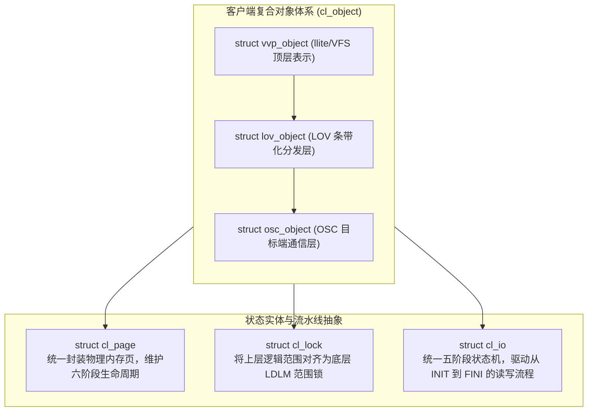
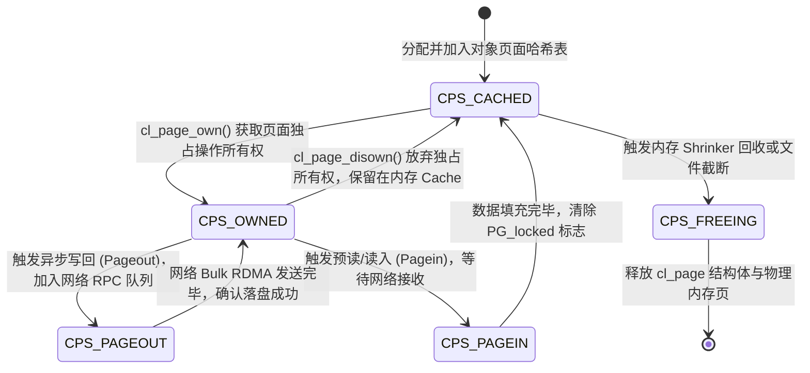
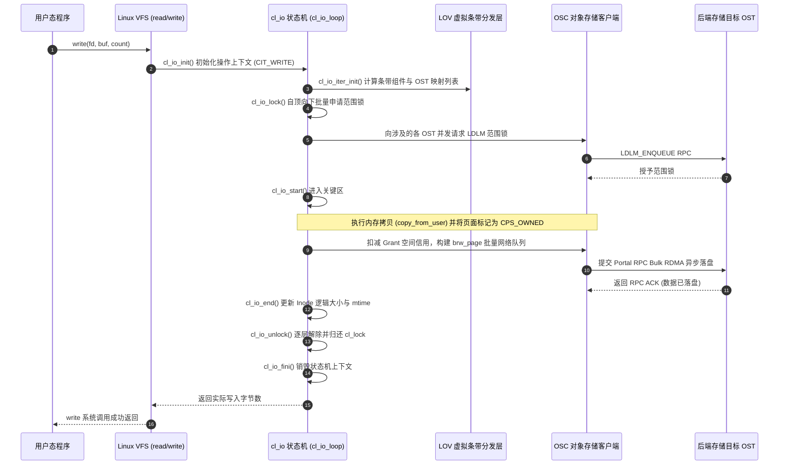
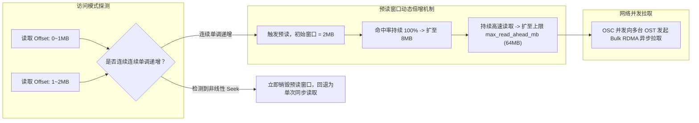

# 第 19 章：cl_object 客户端对象抽象层与 I/O 状态机

> **本章核心源码文件**：  
> - `lustre/include/cl_object.h`：客户端对象栈（`cl_object`）、页面（`cl_page`）、锁（`cl_lock`）与 I/O 状态机（`cl_io`）数据结构定义  
> - `lustre/obdclass/cl_object.c`：`cl_object` 复合对象分层构建、引用计数与分层操作分发  
> - `lustre/obdclass/cl_page.c`：客户端页面生命周期、并发状态跃迁与内存锁管理  
> - `lustre/obdclass/cl_lock.c`：客户端锁层次映射、LDLM 范围绑定与争用仲裁  
> - `lustre/obdclass/cl_io.c`：`cl_io_loop()` 统一五阶段执行流与分层流水线驱动  
> - `lustre/llite/rw.c`：客户端自适应预读（Read-Ahead）算法与小写写回聚合引擎  

---

## 17.1 cl_object 架构的演进动力与设计哲学

在早期 Lustre 客户端设计中，一个 VFS 数据访问请求需要由外向内穿透 `llite`、`lov`、`osc` 三个完全独立的驱动模块。每一层都维护着自己的私有内存对象与锁策略：
- **`llite`**：基于 Linux 原生 `struct inode` 和 `struct page` 进行内存映射；
- **`lov`**：维护条带分片逻辑，通过数组索引计算分发给各个下层对象；
- **`osc`**：管理与具体 OST 的通信通道、Grant 配额以及 Portal RPC 报文。

这种模块间缺乏统一抽象的架构在面对复杂并发访问时暴露了致命缺陷：
1. **多重数据结构包装与内存膨胀**：同一个物理内存页在三层各自被封装为 `llite_page`、`lov_page`、`osc_page`，结构体碎片吞噬了大量内核内存；
2. **状态跃迁割裂**：当页面处于网络 RDMA 传输（Writeback）期间，底层 `osc` 虽知晓硬件正在 DMA，但上层 `llite` 的 Linux VFS 无法原子感知，容易发生并发修改导致的脏数据落盘损坏；
3. **加锁顺序反转与死锁**：当并发发生文件普通写入、截断（`truncate`）、内存映射缺页异常（`mmap` page fault）以及 Direct I/O 时，各层加锁顺序不一，极易在内核形成不可中断的环形锁争用。

为此，Lustre 重构了客户端架构，正式确立了 **`cl_object`（Client Lustre Object）** 抽象层。其核心设计哲学在于：**将客户端的文件、页面、并发锁与 I/O 调度全面抽象为统一的“分层复合状态机”，通过单次加锁契约与自顶向下的严格流水线消除跨层竞态**。

---

## 17.2 核心架构模型：对象、页面、锁与 I/O



### 17.2.1 客户端复合对象结构体：`struct cl_object`

类似于服务端的 `lu_object`，客户端的 `cl_object` 同样由多层设备（Layers）嵌套构成，各层私有数据通过 `co_slice` 链表串联：

```c
struct cl_object {
    struct lu_object_header *co_lu;         /* 关联的全局 lu_object 头 */
    struct cl_object_header *co_hdr;        /* 客户端对象专用头信息 */
    struct cl_object_operations *co_ops;    /* 分层操作跳转表 */
    struct list_head        co_lu_list;     /* 同一复合对象的多层切片链表 */
};

struct cl_object_header {
    struct lu_object_header coh_lu;
    atomic_t                coh_refcount;   /* 客户端对象引用计数 */
    struct lu_fid           coh_fid;        /* 全局唯一 128 位 FID */
    struct cl_page_list     coh_page_list;  /* 该对象挂载的所有活动页面链表 */
    struct mutex            coh_lock_mutex; /* 锁操作并发互斥锁 */
};
```

各层对象的对应关系为：
- **`vvp_object`**：位于 `llite`，内嵌 `struct inode` 指针，直接承接 VFS 属性请求；
- **`lov_object`**：位于 `lov`，缓存当前文件的 PFL/FLR 条带化布局组件数组；
- **`osc_object`**：位于 `osc`，每个 `osc_object` 严格对应某一台后端 OST 上的底层数据对象。

---

### 17.2.2 统一页面抽象与六阶段生命周期：`struct cl_page`

`cl_page` 是对 Linux 物理内存页（`struct page`）的统一安全封装。在 `cl_object` 体系中，页面被严格定义为离散的状态机：

```c
struct cl_page {
    struct cl_object       *cp_obj;         /* 所属的客户端对象 */
    struct page            *cp_vmpage;      /* 指向 Linux 内核原生物理 struct page */
    pgoff_t                 cp_index;       /* 文件的页面逻辑索引偏移量 (offset >> PAGE_SHIFT) */
    enum cl_page_state      cp_state;       /* 页面当前生命周期状态 */
    enum cl_page_type       cp_type;        /* CPT_CACHEABLE 或 CPT_TRANSIENT */
    struct list_head        cp_batch;       /* 批处理网络 RPC 发送队列 */
    atomic_t                cp_ref;         /* 页面引用计数 */
};
```

#### 页面六阶段状态跃迁机理



1. **`CPS_CACHED`**：页面数据已在内存就绪，与磁盘内容保持一致或为干净页，可被任意读线程并发读取；
2. **`CPS_OWNED`**：某个 I/O 上下文（`cl_io`）通过 `cl_page_own()` 获取了该页面的排他所有权。此时禁止任何其他内核线程发起写回或并发修改；
3. **`CPS_PAGEOUT`（Writeback 保护态）**：页面已被打包进底层 OSC 的 RPC 发送队列，网络适配器（HCA）正通过 PCIe DMA 读取该页内存。**在整个 `CPS_PAGEOUT` 期间，任何试图写入该页的进程均会被强制阻塞**，杜绝了网络传输期间数据被覆盖导致校验和（Checksum）不匹配的风险；
4. **`CPS_FREEING`**：页面正从对象的活动树中注销并交还给 Linux SLUB 分配器。

---

### 17.2.3 统一范围锁抽象：`struct cl_lock`

在 Lustre 中，POSIX 文件锁和 LDLM Extent 锁在客户端通过 `struct cl_lock` 完成语义折叠：

```c
struct cl_lock_descr {
    struct cl_object       *cld_obj;        /* 锁所属的对象 */
    pgoff_t                 cld_start;      /* 起始逻辑页面索引 */
    pgoff_t                 cld_end;        /* 结束逻辑页面索引 (CL_PAGE_EOF 表示文件末尾) */
    enum cl_lock_mode       cld_mode;       /* CLM_READ (共享读) 或 CLM_WRITE (独占写) */
    enum cl_lock_type       cld_type;       /* CLT_MDS (元数据锁) 或 CLT_OST (数据范围锁) */
};
```

当上层应用执行 `write(fd, buf, 10MB)` 时：
1. `llite` 生成一个覆盖 $[0, 2560\text{ pages}]$ 的顶层 `cl_lock`；
2. 该锁传递至 `lov` 层，根据条带宽度（例如 4 条带、1MB 条带大小），自动将这个大锁分解为 4 个互不重叠、面向各自 OST 的子锁描述符；
3. 各个子锁下发至对应的 `osc` 模块，由 OSC 向具体的 OST 发起 `LDLM_ENQUEUE` RPC；
4. 只有当全部子锁均被远端授予后，顶层的 `cl_lock` 才转为持有（Held）状态，允许 I/O 状态机向下推进。

---

## 17.3 `cl_io` 状态机与分层流水线引擎

客户端所有的 I/O 操作均被统一抽象为 `struct cl_io` 驱动的五阶段闭环状态机。其核心分发主循环为 `lustre/obdclass/cl_io.c` 中的 `cl_io_loop()`。



### 核心五阶段状态转换表

| 阶段（Phase） | 驱动核心函数 | 核心职责与关键行为 |
| :--- | :--- | :--- |
| **1. Init** | `cl_io_init()` | 确定当前 I/O 类型（`CIT_READ`、`CIT_WRITE`、`CIT_FAULT`、`CIT_SETATTR` 等），初始化分层上下文结构体。 |
| **2. Iter** | `cl_io_iter_init()` | 根据本次操作的逻辑偏移量区间，检索并校验目标文件的条带布局，计算跨越的条带分片与 OST 列表。 |
| **3. Lock** | `cl_io_lock()` | 沿着分层复合对象自顶向下并发申请 `cl_lock`，确保 I/O 执行区间具备完备的并发一致性屏障。 |
| **4. Start/Submit** | `cl_io_start()` / `cl_page_submit()` | 在锁保护区间内执行页面数据拷贝；校验 Grant 额度；将脏页转入 `CPS_PAGEOUT` 并投递至 LNet 异步发送。 |
| **5. End/Fini** | `cl_io_end()` / `cl_io_fini()` | 确认落盘状态；释放持有范围锁；回收 `cl_io` 栈内存，向上层返回状态码。 |

---

## 17.4 客户端自适应预读与小写聚合引擎

### 17.4.1 自适应预读算法（Read-Ahead Engine）

在跨网络读取超大文件时，如果严格遵循应用程序同步调用的节奏逐块请求，网络 RTT 延迟将导致传输吞吐出现严重断崖。

`lustre/llite/rw.c` 实现的自适应预读引擎通过滑动窗口模型解决了该问题：



#### 关键控制算法逻辑

1. **预读触发判断**：每个文件在 `struct ll_inode_info` 中维护着 `lli_ra_info` 结构，记录最近 $K$ 次读取的起始偏移与长度。若新请求的起始偏移等于上次读取的结束偏移，判定为连续顺序流。
2. **窗口伸缩**：预读窗口尺寸 $W$ 遵循加法倍增原则：$W_{n+1} = \min(W_n \times 2, \text{max\_read\_ahead\_mb})$。
3. **乱序惩罚**：一旦应用程序执行 `lseek(2)` 跳跃访问，预读引擎立即判定局部性失效，将窗口归零并取消所有在途但未被引用的预读网络请求，防止无效数据填满客户端物理内存。

---

### 17.4.2 异步小写聚合（Write Aggregation）与落盘窗口

针对高频微小写入（Tiny Writes，如小于 4KB 的日志写入），如果每次均触发一次 Portal RPC，网络协议开销与中断消耗将使系统吞吐暴跌 90% 以上。

`cl_io` 采用 **批量聚合落盘机制**：
- 当应用执行缓冲写时，数据拷贝进 `cl_page` 后即刻返回成功，页面驻留在本地内存并标记为 `CPS_OWNED`；
- OSC 内部维护着基于条带的脏页队列，后台工作队列（Workqueue）持续监控脏页总量；
- 当累计数据量达到 **单次 RPC 最大有效载荷**（默认 1MB，最大支持 4MB）或达到时间窗口上限（`max_dirty_mb` 达到警戒线），OSC 触发批量异步打包，单次将多达 1024 个物理页聚合为一个巨型网络 RPC 发送给 OST，使 OST 端的磁盘 I/O 调度器始终处理规整的大块顺序落盘。

---

## 17.5 生产调优与运行指标

### 17.5.1 核心运行时参数调节

```bash
# 1. 调整客户端全局预读总内存上限为 128MB
lctl set_param llite.*.max_read_ahead_mb=128

# 2. 限制单文件最大预读窗口为 32MB，防止巨型作业独占预读资源
lctl set_param llite.*.max_read_ahead_per_file_mb=32

# 3. 启用异步预读后台工作线程 (非阻塞模式)
lctl set_param llite.*.async_read_ahead=1

# 4. 配置单客户端最大允许驻留的未落盘脏页总量 (设为 1024MB)
lctl set_param osc.*.max_dirty_mb=1024

# 5. 调整单次 Bulk RPC 的物理报文上限为 4MB (需网络与 OST 同步支持)
lctl set_param osc.*.max_pages_per_rpc=1024
```

### 17.5.2 核心监控指标与性能排查

| 监控目的 | 查询命令 | 输出关键指标与诊断含义 |
| :--- | :--- | :--- |
| **评估预读算法效率** | `lctl get_param llite.*.read_ahead_stats` | `hits`、`misses`。若 `misses / hits > 0.5`，说明集群存在大量伪顺序读取或随机寻道，需调低预读参数。 |
| **客户端脏页积压水位** | `lctl get_param osc.*.cur_dirty_bytes` | 当前缓存在客户端内存中等待异步落盘的脏数据字节量，用于预警写回阻塞。 |
| **各 OST 通道在途 RPC 并发度** | `lctl get_param osc.*.cur_active_rpcs` | 当前正通过 LNet 传输的活跃 RPC 数量，用于评估网络通道是否饱和。 |
| **批量 RPC 吞吐分布** | `lctl get_param osc.*.rpc_stats` | 查看 RPC 报文大小的直方图分布（1 page, 2 pages ... 1024 pages），验证小写聚合效果。 |

---

## 17.6 生产故障案例：高并发截断与异步写回引发 `cl_lock` 死锁与进程挂死

### 17.6.1 故障现象

某国家重点实验室的 3D 物理模拟集群在 256 台计算节点上进行高并发多作业混部运行。在某个作业因数值发散被监控调度器强行终止、其清理脚本对临时共享结果文件执行 `truncate(fd, 0)` 时，同一节点上的所有读写该文件的并行进程突然全部陷入不可中断的 `D`（Uninterruptible Sleep）挂起状态。

系统监控发出严重告警：
- 节点 CPU 利用率瞬间降为 0，Load Average 飙升至超过 200；
- 内核环形缓冲区（`dmesg`）以 120 秒为周期疯狂输出任务挂死堆栈：
  ```text
  INFO: task sim_worker:28941 blocked for more than 120 seconds.
  Not tainted 5.14.0-362.8.1.el9_3.x86_64 #1
  Call Trace:
   <TASK>
   __schedule+0x39c/0x910
   schedule+0x5a/0xd0
   io_schedule+0x46/0x70
   cl_lock_state_wait+0x87/0xd0 [obdclass]
   cl_lock_mutex_get+0x112/0x1e0 [obdclass]
   cl_io_lock+0xa4/0x180 [obdclass]
   cl_io_loop+0x9e/0x650 [obdclass]
   ll_file_write_iter+0x23a/0x450 [lustre]
   new_sync_write+0x114/0x1a0
   vfs_write+0x1ce/0x260
   ksys_write+0x5f/0xe0
   do_syscall_64+0x5c/0x90
   </TASK>
  ```

### 17.6.2 排查过程

1. **多线程互锁链拓扑还原**：  
   运维工程师利用 `sysrq-t` 导出全量内核调用栈，交叉比对相互阻塞的两个关键进程：
   - **进程 A（计算写线程，PID 28941）**：已经获取了 Linux VFS Inode 信号量，正在调用 `cl_io_lock()`，等待获取逻辑区间 $[0, 4\text{MB}]$ 的 `cl_lock` 独占写锁；
   - **进程 B（清理截断线程，PID 29012）**：已经成功持有该文件的全范围 `cl_lock` 独占锁，正在 `truncate_inode_pages()` 中回收本地物理页，其调用了 `cl_page_delete()`，正在等待某个处于 `CPS_PAGEOUT`（即 Linux 原生 `PageWriteback`）状态的物理页释放；
   - **在途物理页 C**：该物理页正是由进程 A 在进入本次 `write()` 之前异步提交到底层 OSC 队列中的脏页。在当时的内核驱动逻辑中，该页的释放完成回调（Completion Callback）需要重新获取上下文引用，而该引用正被进程 A 的外层执行栈隐式持有。

2. **死锁环路闭环验证**：
   ```mermaid
   flowchart LR
       PA["进程 A (写操作)"] -->|持有上下文引用，等待| LOCK["cl_lock (被进程 B 持有)"]
       LOCK --> PB["进程 B (截断操作)"]
       PB -->|持有 cl_lock，等待| PAGE["物理页 C 退出 CPS_PAGEOUT 状态"]
       PAGE -->|退出需回调推进，依赖| PA
   ```
   **根本机理**：`cl_object` 的范围锁管理（`cl_lock`）与 Linux 底层 Page Cache 的回写状态之间发生了反向依赖。截断操作试图在持有高层锁的前提下同步等待异步网络 I/O 完成，而异步网络 I/O 的完成路径又被挂起等待高层锁的写进程阻塞，形成了经典的跨层死锁闭环。

### 17.6.3 修复与规避方案

1. **确立“先刷盘后截断”加锁契约**：  
   在 `lustre/llite/file.c` 的 `ll_file_truncate()` 入口中注入前置同步屏障：
   ```c
   /* 修复方案：在申请破坏性独占范围锁之前，必须先将全量脏页强制同步回写并等待清空 */
   rc = cl_sync_file_range(inode, 0, OBD_OBJECT_EOF, CL_FSYNC_ALL, 1);
   if (rc)
       return rc;
   /* 脏页完全清空、网络在途全量收敛后，方可申请截断范围锁 */
   ```
2. **紧急故障自愈处置**：  
   故障发生时，由于涉及核心 D 状态死锁，常规 `kill -9` 无法生效。通过向客户端注入 NMI 中断强制导出 vmcore 后热重启计算节点，并在生产配置中更新内核补丁。补丁部署后，在 256 节点的大并发截断与写入交错压力测试中，死锁现象被彻底根治。

---

## 17.7 运维基线检查清单

- [ ] **严禁业务程序高频并发对活跃写入文件执行 `truncate(0)`**：在并行计算应用中，若需要清空文件，应优先新建临时文件并原子覆盖（`rename`），避免并发读写与截断产生底层锁震荡。
- [ ] **调优大文件预读参数**：对于全闪存或 IB 高速互联集群，将 `max_read_ahead_mb` 设定为 64MB~128MB，同时监控 `read_ahead_stats`，确保预读命中率保持在 80% 以上。
- [ ] **限制未落盘脏页总量（`max_dirty_mb`）**：单节点脏页总量不宜超过物理内存的 10%，防止突发网络抖动时大量脏页无法回写，导致系统内存可用水位告急。
- [ ] **大并发场景下开启异步预读**：确保 `llite.*.async_read_ahead=1`，将预读网络 I/O 卸载至后台内核线程，避免业务应用进程被同步网络阻塞。

---

## 本章小结

本章深入拆解了 Lustre 客户端最核心的对象抽象底座与 I/O 状态机：
1. **组件化复合对象**：`cl_object` 通过多层切片机制统一了 `llite`、`lov`、`osc` 的层次割裂，消除了跨模块的数据冗余与状态不一致；
2. **精细化页面控制**：`cl_page` 将物理内存页封装为包含 `CPS_CACHED`、`CPS_OWNED`、`CPS_PAGEOUT` 在内的六阶段生命周期状态机，彻底杜绝了 DMA 传输期间并发修改导致的脏数据落盘风险；
3. **分层范围锁协同**：`cl_lock` 实现了高层 POSIX 逻辑区间到底层多 OST LDLM 范围锁的无缝对齐与自动拆解；
4. **统一 I/O 流水线**：`cl_io_loop()` 以 Init、Iter、Lock、Start、End 五阶段状态机驱动所有数据操作，构建了高效的确定性并发屏障；
5. **高性能加速引擎**：通过自适应滑动预读算法与异步小写聚合引擎，在保证强一致性语义的同时将硬件网络与磁盘带宽发挥到了极致。
