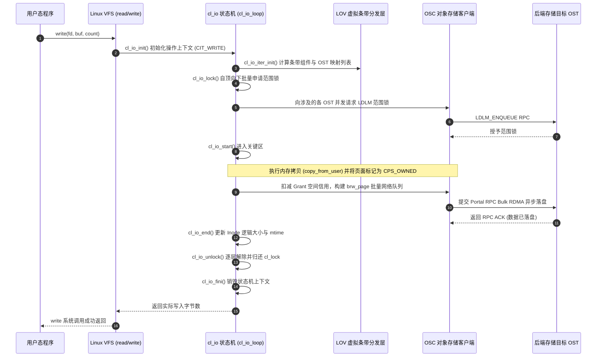

# 19.3 cl_io 状态机与分层流水线引擎

客户端所有的 I/O 操作均被统一抽象为 `struct cl_io` 驱动的五阶段闭环状态机。其核心分发主循环为 `lustre/obdclass/cl_io.c` 中的 `cl_io_loop()`。

## 核心五阶段状态转换表

| 阶段（Phase） | 驱动核心函数 | 核心职责与关键行为 |
| :--- | :--- | :--- |
| **1. Init** | `cl_io_init()` | 确定当前 I/O 类型（`CIT_READ`、`CIT_WRITE`、`CIT_FAULT`、`CIT_SETATTR` 等），初始化分层上下文结构体。 |
| **2. Iter** | `cl_io_iter_init()` | 根据本次操作的逻辑偏移量区间，检索并校验目标文件的条带布局，计算跨越的条带分片与 OST 列表。 |
| **3. Lock** | `cl_io_lock()` | 沿着分层复合对象自顶向下并发申请 `cl_lock`，确保 I/O 执行区间具备完备的并发一致性屏障。 |
| **4. Start/Submit** | `cl_io_start()` / `cl_page_submit()` | 在锁保护区间内执行页面数据拷贝；校验 Grant 额度；将脏页转入 `CPS_PAGEOUT` 并投递至 LNet 异步发送。 |
| **5. End/Fini** | `cl_io_end()` / `cl_io_fini()` | 确认落盘状态；释放持有范围锁；回收 `cl_io` 栈内存，向上层返回状态码。 |

---

