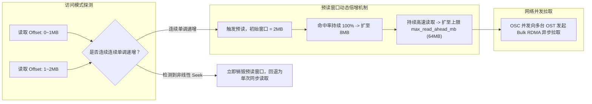

# 19.4 客户端自适应预读与小写聚合引擎

## 17.4.1 自适应预读算法（Read-Ahead Engine）

在跨网络读取超大文件时，如果严格遵循应用程序同步调用的节奏逐块请求，网络 RTT 延迟将导致传输吞吐出现严重断崖。

`lustre/llite/rw.c` 实现的自适应预读引擎通过滑动窗口模型解决了该问题：

### 关键控制算法逻辑

1. **预读触发判断**：每个文件在 `struct ll_inode_info` 中维护着 `lli_ra_info` 结构，记录最近 $K$ 次读取的起始偏移与长度。若新请求的起始偏移等于上次读取的结束偏移，判定为连续顺序流。
2. **窗口伸缩**：预读窗口尺寸 $W$ 遵循加法倍增原则：$W_{n+1} = \min(W_n \times 2, \text{max\_read\_ahead\_mb})$。
3. **乱序惩罚**：一旦应用程序执行 `lseek(2)` 跳跃访问，预读引擎立即判定局部性失效，将窗口归零并取消所有在途但未被引用的预读网络请求，防止无效数据填满客户端物理内存。

---

## 17.4.2 异步小写聚合（Write Aggregation）与落盘窗口

针对高频微小写入（Tiny Writes，如小于 4KB 的日志写入），如果每次均触发一次 Portal RPC，网络协议开销与中断消耗将使系统吞吐暴跌 90% 以上。

`cl_io` 采用 **批量聚合落盘机制**：
- 当应用执行缓冲写时，数据拷贝进 `cl_page` 后即刻返回成功，页面驻留在本地内存并标记为 `CPS_OWNED`；
- OSC 内部维护着基于条带的脏页队列，后台工作队列（Workqueue）持续监控脏页总量；
- 当累计数据量达到 **单次 RPC 最大有效载荷**（默认 1MB，最大支持 4MB）或达到时间窗口上限（`max_dirty_mb` 达到警戒线），OSC 触发批量异步打包，单次将多达 1024 个物理页聚合为一个巨型网络 RPC 发送给 OST，使 OST 端的磁盘 I/O 调度器始终处理规整的大块顺序落盘。

---

