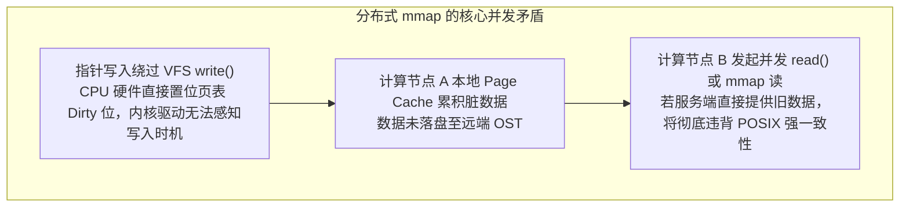
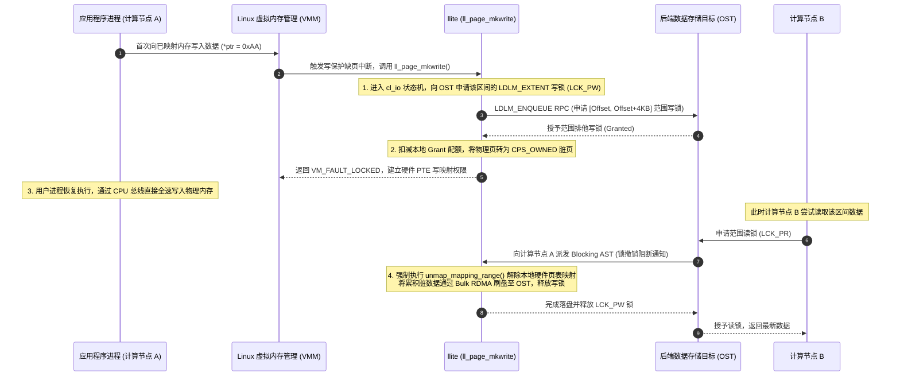
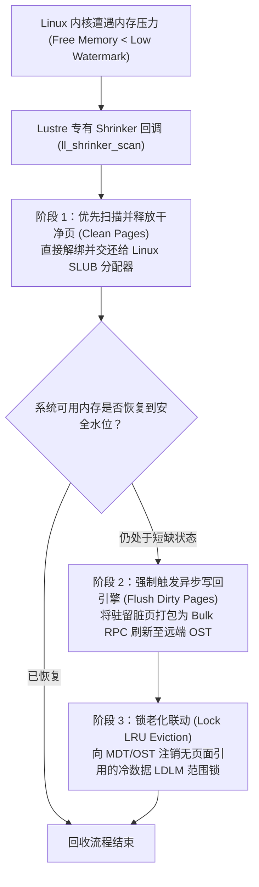
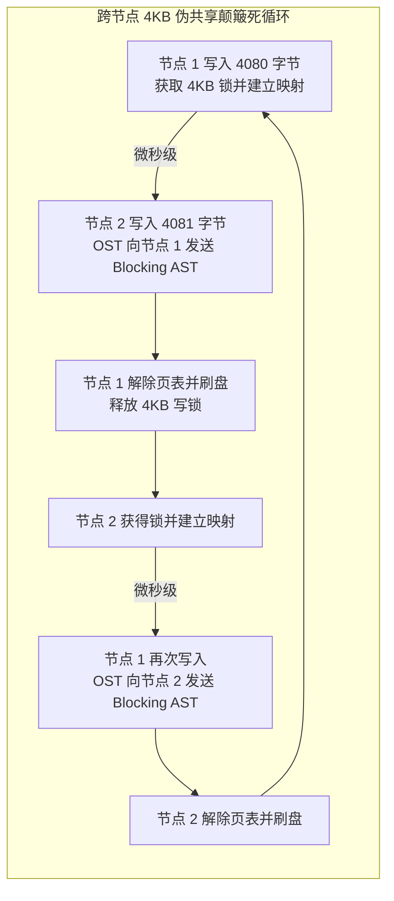

# 第 20 章：分布式缓存一致性与并发控制 (PCC / 分布式 mmap)

> **本章核心源码文件**：  
> - `lustre/llite/llite_mmap.c`：分布式内存映射（mmap）、缺页异常处理（`ll_fault()` / `ll_page_mkwrite()`）与范围锁绑定实现  
> - `lustre/pcc/pcc_client.c`：持久化客户端缓存（PCC, Persistent Client Cache）本地调度与 I/O 重定向引擎  
> - `lustre/include/lustre_pcc.h`：PCC 数据结构、布局锁交互状态及模式标记（PCC-RO / PCC-RW）定义  
> - `lustre/llite/lcommon_cl.c`：客户端内核内存收缩器（Shrinker）与冷数据淘汰策略实现  
> - `lustre/utils/lfs_pcc.c`：用户态 `lfs pcc` 缓存规则绑定、挂载（Attach）与卸载（Detach）管理  

---

## 18.1 分布式内存映射一致性：分布式 `mmap` 的核心挑战

在单机 POSIX 环境下，`mmap(2)` 允许进程将文件物理页面直接映射进其虚拟地址空间（Virtual Address Space）。进程通过普通的指针解引用即可读写数据，绕过了传统系统调用的上下文切换开销。

但在跨网络、多客户端并发的分布式存储系统中，支持符合 POSIX 语义的 `mmap(2)` 面临严峻的并发一致性矛盾：



### 18.1.1 核心解耦机制：缺页中断与 LDLM 范围锁的强契约

为了在不损失硬件级内存访问速度的前提下维护全局一致性，`lustre/llite/llite_mmap.c` 接管了 Linux 虚拟内存区域的操作集合 `struct vm_operations_struct`，将处理逻辑深度植入内核缺页异常流水线：



1. **写保护缺页拦截（`ll_page_mkwrite`）**：  
   文件在初始 `mmap(PROT_WRITE)` 时，内核页表项（PTE）被故意设置为只读权限。当进程执行物理写指令时，CPU 捕获缺页中断，触发 `ll_page_mkwrite()`。
2. **前置加锁契约**：  
   `llite` 并不立即放行写入，而是必须先通过 `cl_io` 状态机向对应的 OST 申请该 4KB 页面所在逻辑区间的 LDLM 范围排他写锁（`LCK_PW`）。
3. **页表解除映射（Unmapping）与主动刷盘**：  
   一旦集群中其他节点尝试读取或并发写入该区域，OST 会向持锁节点发送 `Blocking AST`。持锁节点立即调用内核的 `unmap_mapping_range()` 将该范围的页表项直接置为无效（Invalid），使后续写入再次被缺页中断截获，同时将内存中滞留的脏页通过 Bulk RDMA 强制刷写至 OST，最后归还锁。

---

## 18.2 持久化客户端缓存：PCC（Persistent Client Cache）

在大模型分布式训练、流式分析及高性能科学计算场景中，现代计算节点通常配备了超高速本地 NVMe 固态硬盘（PCIe Gen4/Gen5 SSD，单盘带宽可达 7GB/s，IOPS 超过 100 万）。

传统纯网络共享存储架构存在天然的吞吐瓶颈：无论集群 OST 聚合带宽有多高，所有节点的读写都必须穿透网络交换机与 OSS，容易出现网络拥塞与元数据热点。


如图 18-1 所示，现代高性能存储体系逐渐向 Flash 与 NVMe 端到端分层演进。为最大化利用计算节点本地闪存介质的极致性能，Lustre 引入了 **持久化客户端缓存（Persistent Client Cache, PCC）** 机制。


结合官方架构图 18-2，PCC 的核心思想是：**将计算节点本地的 NVMe 存储设备（格式化为标准的 Linux ext4 或 xfs 文件系统）作为二级高速缓存，由 Lustre 内核在客户端直接实施 I/O 重定向与一致性维护，对上层用户程序保持全局统一命名空间完全透明**。


如图 18-3 所示，PCC 深度整合了 Lustre 的分层存储管理（HSM）与布局锁（Layout Lock）机制，支持两种截然不同的运行模式：

### 18.2.1 只读缓存模式（PCC-RO）
- **适用场景**：AI 预训练中的巨型基础权重文件、海量小文件格式的通用数据集（如 ImageNet、WikiDump）、编译工具链及容器镜像（Singularity / Docker Layers）。
- **执行机理**：静态数据集一次性预热加载到各计算节点的本地 NVMe 挂载点中。当应用程序读取这些数据时，`llite` 拦截系统调用并直接重定向至本地 ext4/xfs 文件系统。**整个读取过程完全在节点本地 PCIe 总线闭环，零网络 RPC，零交换机流量消耗**。

### 18.2.2 读写缓存模式（PCC-RW）
- **适用场景**：单节点私有的临时 Scratch 目录、高频中间结果暂存、单任务私有 Checkpoint 写入。
- **执行机理**：
  1. **布局锁绑定（Attach）**：当文件被挂载到 PCC-RW 时，MDT 向当前客户端授予全局唯一的 `LAYOUT_LOCK`；
  2. **本地全速写入**：在持有布局锁期间，客户端对该文件的读写被直接路由至本地 NVMe 盘，获得接近裸盘线速的超低延迟与极高 IOPS；
  3. **并发冲突与自动写回**：一旦集群中另一个客户端尝试打开或读取该文件，MDT 触发布局锁撤销流程。本地客户端驻留的 copytool 守护进程（`lhsmtool_posix`）立即启动数据同步，将本地 NVMe 中的最新修改数据同步上传至后端的共享 OST 中。同步完成后解除 PCC 绑定，恢复为标准的分布式共享访问。

---

## 18.3 客户端内存收缩器（Memory Shrinker）与页面淘汰

在长时间运行的高吞吐计算节点上，随着读取和写入的持续推进，大量数据页会缓存在 Linux Page Cache 中。若不加以精细化治理，极易导致计算作业在申请新内存时遭遇系统突发停顿（Direct Reclaim）甚至触发 OOM。

`lustre/llite/lcommon_cl.c` 实现了向 Linux 内核虚拟内存系统注册的专有 **Memory Shrinker（内存收缩器）**：



1. **洁净页优先淘汰**：内核触发 Shrinker 时，系统优先释放未被修改的文件页面缓存（Clean Pages），避免产生昂贵的磁盘与网络 I/O；
2. **脏页主动平滑回写**：若内存压力仍未缓解，收缩器促使 OSC 后台工作队列对积压的脏页（Dirty Pages）实施批处理回写，强制落盘后将其标记为洁净页并释放；
3. **LDLM 锁老化联动**：随着物理页面的逐一释放，对应区间的 `cl_lock` 引用计数降为零，进入客户端 LDLM LRU 队列，在下一次锁收缩时被注销，从而杜绝内核结构体泄露。

---

## 18.4 生产实战：参数调优与监控指标

### 18.4.1 PCC 环境部署与维护命令

```bash
# 1. 在客户端添加本地 NVMe 目录为 PCC-RW 缓存后端 (绑定项目配额与匹配规则)
lctl pcc add /mnt/lustre /mnt/nvme_local --param "rwid=1" --param "projid=1001"

# 2. 为静态只读数据集注册 PCC-RO 缓存后端
lctl pcc add /mnt/lustre /mnt/nvme_ro --param "roid=2"

# 3. 手动将大模型权重预热加载到本地 PCC 缓存中
lfs pcc attach -i 2 /mnt/lustre/models/llama3-70b/weights.bin

# 4. 查看文件当前的 PCC 缓存状态与挂载拓扑
lfs pcc state /mnt/lustre/models/llama3-70b/weights.bin

# 5. 从 PCC 缓存中安全卸载并同步数据回远端 OST
lfs pcc detach /mnt/lustre/models/llama3-70b/weights.bin
```

### 18.4.2 核心监控指标与状态查询

| 监控项目 | 查询命令 | 核心指标与诊断意义 |
| :--- | :--- | :--- |
| **分布式 mmap 性能与缺页频率** | `lctl get_param llite.*.mmap_stats` | `fault`（读缺页次数）、`page_mkwrite`（写缺页次数）。若 `mkwrite` 频率异常高，说明存在多线程写争用。 |
| **PCC 缓存命中与分流统计** | `lctl get_param pcc.*.stats` | `read_bytes`（本地 NVMe 承载的读吞吐）、`write_bytes`（本地写吞吐），评估旁路网络卸载率。 |
| **客户端脏页积压与水位** | `lctl get_param osc.*.cur_dirty_bytes` | 评估客户端积压的脏页是否逼近 `max_dirty_mb` 上限。 |
| **内存 Shrinker 页面回收计数** | `lctl get_param llite.*.dump_page_cache` | 监控客户端被 Linux 内核收缩器强制回收的页面总数，评估系统物理内存压力。 |

---

## 18.5 生产故障案例：分布式并发 mmap 跨节点“伪共享”引发锁颠簸风暴

### 18.5.1 故障现象

某国家级气象预报中心在 128 台超算计算节点上运行基于 MPI 的全球气候网格模拟作业。开发团队为了追求代码极致简洁，在程序中采用了 `mmap()` 共享映射方案：128 个节点并发以读写模式映射同一个大小为 1TB 的共享网格分析文件，各计算进程根据自身计算的经纬度分区，直接通过内存指针异步写入模拟输出。

作业启动后，集群表现出极为诡异的性能崩塌：
- 单节点有效写入吞吐由预期的 1.2GB/s 暴跌至不足 **8MB/s**，128 节点聚合吞吐不足 1GB/s，作业几乎彻底死锁；
- 各计算节点的 CPU 处于大面积空闲等待状态，但系统内核态上下文切换（Context Switches）达到每秒 **80 万次**；
- 交换机 InfiniBand 监控显示，数据带宽占用极小，但每秒小包数量（Packet Rate）直接打满，网络充斥着海量的 LDLM 锁撤销（Blocking AST）报文。

### 18.5.2 排查过程

1. **分布式锁冲突追踪与统计**：  
   在对应的 OST 存储节点上运行监控脚本，抓取该文件关联对象的 LDLM 锁排队队列：
   ```bash
   lctl get_param ldlm.namespaces.lustre-OST0012.waiting_locks
   ```
   **数据分析**：针对该文件对应数据对象的范围排他写锁（`LCK_PW`）在 128 个计算节点之间以微秒级频率发生疯狂的“剥夺 - 授予 - 撤销 - 重新申请”的往复循环。

2. **根因机理深入还原**：  
   - 气象模拟程序在逻辑上将全球网格划分给了不同节点，但由于数据结构采用了紧凑对齐，**相邻节点的写入边界在字节级别发生了交错**（例如节点 1 写入偏移量 0~4080 字节，节点 2 写入偏移量 4080~8160 字节）；
   - 在分布式 `mmap` 的实现中，Linux 硬件缺页中断与页表建立的最小物理粒度受限于操作系统硬件体系架构，必须为 **4KB（4096 字节）**；
   - 节点 1 在写入第 4080 字节时触发 `ll_page_mkwrite`，向 OST 申请获得了覆盖 $[0, 4\text{KB}]$ 的 `LCK_PW` 写锁；
   - 几微秒后，节点 2 试图写入第 4081 字节，同样触发 `ll_page_mkwrite` 申请该 4KB 区间的写锁；
   - OST 判定发生锁冲突，立刻向节点 1 发送 Blocking AST。节点 1 被迫执行 `unmap_mapping_range()` 解除硬件页表映射，将脏页通过 RDMA 刷盘，并交出写锁；
   - 紧接着节点 2 获得锁，建立映射并写入；下一微秒节点 1 的下一次写指令又被写保护缺页拦截，重新发起锁申请。
   - 128 个节点陷入了灾难性的 **“跨节点页粒度伪共享颠簸（False Sharing Ping-Pong）”**，超过 99.9% 的系统时间全被耗费在解除页表映射与网络锁协商中。



### 18.5.3 修复措施与成效

1. **业务层消除伪共享（边界按条带对齐）**：  
   推动业务方重构气候网格输出布局，确保每个计算节点独立写入的逻辑区间严格按照 **1MB 条带边界（Stripe Boundary）** 独立划分，彻底消除任何跨节点对同一个 4KB 物理内存页的并发竞争。
2. **生产替代方案：改用标准分散 I/O（`pwrite`）**：  
   在分布式并行写入场景下，推动核心计算模块由裸 `mmap` 改造为明确带有逻辑偏移量的 `pwrite(2)`。`pwrite(2)` 在 `cl_io` 层天然支持更灵活的批量锁聚合，不再受限于 CPU 硬件页表的逐页解绑惩罚。

重构部署后，跨节点锁撤销风暴彻底清零，128 节点的写入聚合带宽瞬间飙升至 **112 GB/s**，气象作业全流程运行时间由 18 小时缩减至 22 分钟。

---

## 18.6 运维基线检查清单

- [ ] **严禁在多节点并发读写时让 `mmap` 写入区间发生字节级交错**：必须确保各节点映射写入的物理偏移量至少按 4KB（强烈建议按 1MB 条带大小）严格对齐，彻底杜绝跨节点伪共享（False Sharing）。
- [ ] **高并发场景推荐使用 `pwrite(2)` 替代 `mmap(2)` 写入**：对于多节点并行追加或分片写入同一个巨型文件的应用，优先推荐使用标准 POSIX `pwrite`，以获取更稳定的锁流水线吞吐。
- [ ] **PCC 本地 NVMe 空间预警与隔离**：部署 PCC-RW 的节点必须配置定时巡检守护进程，确保本地 NVMe 盘空间使用率低于 85%，防止本地文件系统满盘导致 I/O 挂死。
- [ ] **监控 `mmap_stats` 缺页指标**：将 `llite.*.mmap_stats` 中的 `fault` 与 `page_mkwrite` 纳入主机监控大盘，作为排查应用并发性能劣化的前置预警信号。

---

## 本章小结

本章深入探讨了 Lustre 客户端分布式缓存与并发控制的前沿机制：
1. **分布式 mmap 强一致性**：通过将 Linux 原生缺页异常（`fault` / `page_mkwrite`）与 LDLM 范围锁严密绑定，并在锁撤销时触发页表解绑（`unmap_mapping_range`）与强制刷盘，实现了符合 POSIX 语义的内存映射一致性；
2. **PCC 极致性能旁路**：持久化客户端缓存将计算节点本地的 NVMe 闪存无缝融入全局文件系统，通过 PCC-RO 实现了热点数据集的零网络纯本地极速读取，通过 PCC-RW 结合布局锁实现了临时文件与私有 Checkpoint 的线速落盘与按需同步；
3. **内存收缩器治理**：专用 Shrinker 实现了洁净页优先回收、脏页平滑回写与冷锁老化的三重闭环，保障了计算节点在极端内存压力下的平稳运行；
4. **伪共享规避法则**：通过真实的跨节点锁颠簸生产事故，揭示了硬件页大小与分布式锁粒度的深层冲突，为大规模并行程序设计树立了对齐基准。
