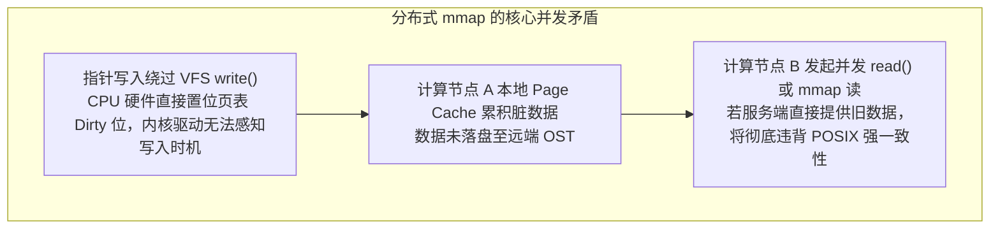
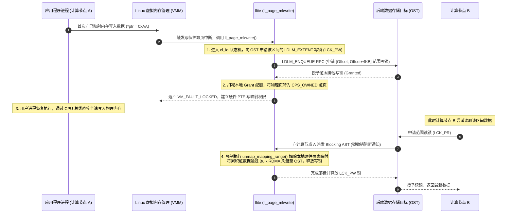

# 20.1 分布式内存映射一致性：分布式 mmap 的核心挑战

在单机 POSIX 环境下，`mmap(2)` 允许进程将文件物理页面直接映射进其虚拟地址空间（Virtual Address Space）。进程通过普通的指针解引用即可读写数据，绕过了传统系统调用的上下文切换开销。

但在跨网络、多客户端并发的分布式存储系统中，支持符合 POSIX 语义的 `mmap(2)` 面临严峻的并发一致性矛盾：

## 18.1.1 核心解耦机制：缺页中断与 LDLM 范围锁的强契约

为了在不损失硬件级内存访问速度的前提下维护全局一致性，`lustre/llite/llite_mmap.c` 接管了 Linux 虚拟内存区域的操作集合 `struct vm_operations_struct`，将处理逻辑深度植入内核缺页异常流水线：

1. **写保护缺页拦截（`ll_page_mkwrite`）**：  
   文件在初始 `mmap(PROT_WRITE)` 时，内核页表项（PTE）被故意设置为只读权限。当进程执行物理写指令时，CPU 捕获缺页中断，触发 `ll_page_mkwrite()`。
2. **前置加锁契约**：  
   `llite` 并不立即放行写入，而是必须先通过 `cl_io` 状态机向对应的 OST 申请该 4KB 页面所在逻辑区间的 LDLM 范围排他写锁（`LCK_PW`）。
3. **页表解除映射（Unmapping）与主动刷盘**：  
   一旦集群中其他节点尝试读取或并发写入该区域，OST 会向持锁节点发送 `Blocking AST`。持锁节点立即调用内核的 `unmap_mapping_range()` 将该范围的页表项直接置为无效（Invalid），使后续写入再次被缺页中断截获，同时将内存中滞留的脏页通过 Bulk RDMA 强制刷写至 OST，最后归还锁。

---

