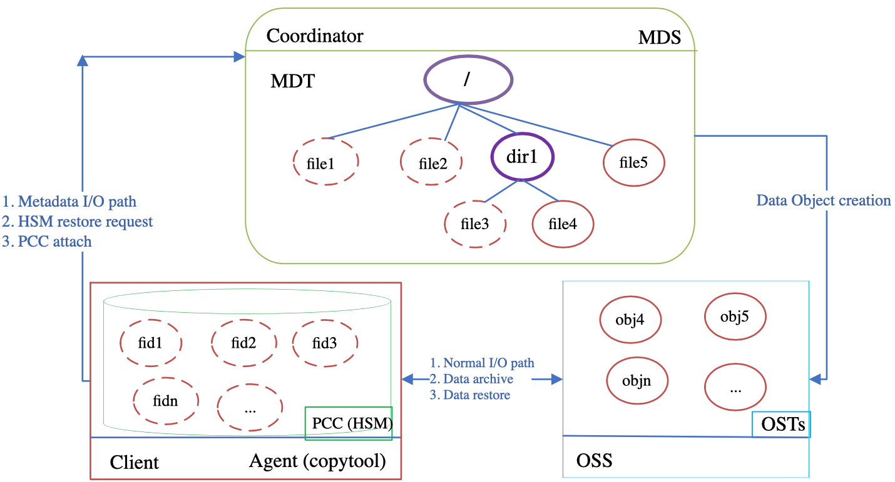

# 20.2 持久化客户端缓存：PCC（Persistent Client Cache）

在大模型分布式训练、流式分析及高性能科学计算场景中，现代计算节点通常配备了超高速本地 NVMe 固态硬盘（PCIe Gen4/Gen5 SSD，单盘带宽可达 7GB/s，IOPS 超过 100 万）。

传统纯网络共享存储架构存在天然的吞吐瓶颈：无论集群 OST 聚合带宽有多高，所有节点的读写都必须穿透网络交换机与 OSS，容易出现网络拥塞与元数据热点。

如图 18-1 所示，现代高性能存储体系逐渐向 Flash 与 NVMe 端到端分层演进。为最大化利用计算节点本地闪存介质的极致性能，Lustre 引入了 **持久化客户端缓存（Persistent Client Cache, PCC）** 机制。

结合官方架构图 18-2，PCC 的核心思想是：**将计算节点本地的 NVMe 存储设备（格式化为标准的 Linux ext4 或 xfs 文件系统）作为二级高速缓存，由 Lustre 内核在客户端直接实施 I/O 重定向与一致性维护，对上层用户程序保持全局统一命名空间完全透明**。

如图 18-3 所示，PCC 深度整合了 Lustre 的分层存储管理（HSM）与布局锁（Layout Lock）机制，支持两种截然不同的运行模式：

## 18.2.1 只读缓存模式（PCC-RO）
- **适用场景**：AI 预训练中的巨型基础权重文件、海量小文件格式的通用数据集（如 ImageNet、WikiDump）、编译工具链及容器镜像（Singularity / Docker Layers）。
- **执行机理**：静态数据集一次性预热加载到各计算节点的本地 NVMe 挂载点中。当应用程序读取这些数据时，`llite` 拦截系统调用并直接重定向至本地 ext4/xfs 文件系统。**整个读取过程完全在节点本地 PCIe 总线闭环，零网络 RPC，零交换机流量消耗**。

## 18.2.2 读写缓存模式（PCC-RW）
- **适用场景**：单节点私有的临时 Scratch 目录、高频中间结果暂存、单任务私有 Checkpoint 写入。
- **执行机理**：
  1. **布局锁绑定（Attach）**：当文件被挂载到 PCC-RW 时，MDT 向当前客户端授予全局唯一的 `LAYOUT_LOCK`；
  2. **本地全速写入**：在持有布局锁期间，客户端对该文件的读写被直接路由至本地 NVMe 盘，获得接近裸盘线速的超低延迟与极高 IOPS；
  3. **并发冲突与自动写回**：一旦集群中另一个客户端尝试打开或读取该文件，MDT 触发布局锁撤销流程。本地客户端驻留的 copytool 守护进程（`lhsmtool_posix`）立即启动数据同步，将本地 NVMe 中的最新修改数据同步上传至后端的共享 OST 中。同步完成后解除 PCC 绑定，恢复为标准的分布式共享访问。

---

