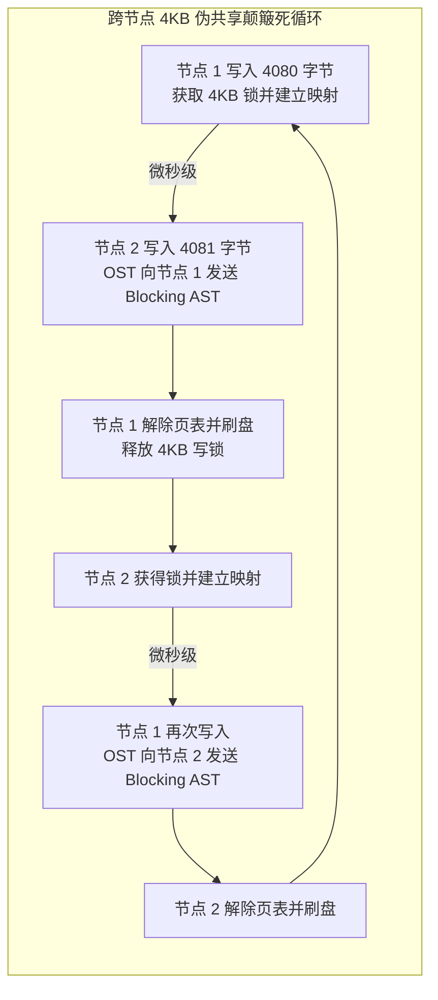

# 20.5 生产故障案例：分布式并发 mmap 跨节点“伪共享”引发锁颠簸风暴

## 18.5.1 故障现象

某国家级气象预报中心在 128 台超算计算节点上运行基于 MPI 的全球气候网格模拟作业。开发团队为了追求代码极致简洁，在程序中采用了 `mmap()` 共享映射方案：128 个节点并发以读写模式映射同一个大小为 1TB 的共享网格分析文件，各计算进程根据自身计算的经纬度分区，直接通过内存指针异步写入模拟输出。

作业启动后，集群表现出极为诡异的性能崩塌：
- 单节点有效写入吞吐由预期的 1.2GB/s 暴跌至不足 **8MB/s**，128 节点聚合吞吐不足 1GB/s，作业几乎彻底死锁；
- 各计算节点的 CPU 处于大面积空闲等待状态，但系统内核态上下文切换（Context Switches）达到每秒 **80 万次**；
- 交换机 InfiniBand 监控显示，数据带宽占用极小，但每秒小包数量（Packet Rate）直接打满，网络充斥着海量的 LDLM 锁撤销（Blocking AST）报文。

## 18.5.2 排查过程

1. **分布式锁冲突追踪与统计**：  
   在对应的 OST 存储节点上运行监控脚本，抓取该文件关联对象的 LDLM 锁排队队列：
   ```bash
   lctl get_param ldlm.namespaces.lustre-OST0012.waiting_locks
   ```
   **数据分析**：针对该文件对应数据对象的范围排他写锁（`LCK_PW`）在 128 个计算节点之间以微秒级频率发生疯狂的“剥夺 - 授予 - 撤销 - 重新申请”的往复循环。

2. **根因机理深入还原**：  
   - 气象模拟程序在逻辑上将全球网格划分给了不同节点，但由于数据结构采用了紧凑对齐，**相邻节点的写入边界在字节级别发生了交错**（例如节点 1 写入偏移量 0~4080 字节，节点 2 写入偏移量 4080~8160 字节）；
   - 在分布式 `mmap` 的实现中，Linux 硬件缺页中断与页表建立的最小物理粒度受限于操作系统硬件体系架构，必须为 **4KB（4096 字节）**；
   - 节点 1 在写入第 4080 字节时触发 `ll_page_mkwrite`，向 OST 申请获得了覆盖 $[0, 4\text{KB}]$ 的 `LCK_PW` 写锁；
   - 几微秒后，节点 2 试图写入第 4081 字节，同样触发 `ll_page_mkwrite` 申请该 4KB 区间的写锁；
   - OST 判定发生锁冲突，立刻向节点 1 发送 Blocking AST。节点 1 被迫执行 `unmap_mapping_range()` 解除硬件页表映射，将脏页通过 RDMA 刷盘，并交出写锁；
   - 紧接着节点 2 获得锁，建立映射并写入；下一微秒节点 1 的下一次写指令又被写保护缺页拦截，重新发起锁申请。
   - 128 个节点陷入了灾难性的 **“跨节点页粒度伪共享颠簸（False Sharing Ping-Pong）”**，超过 99.9% 的系统时间全被耗费在解除页表映射与网络锁协商中。



## 18.5.3 修复措施与成效

1. **业务层消除伪共享（边界按条带对齐）**：  
   推动业务方重构气候网格输出布局，确保每个计算节点独立写入的逻辑区间严格按照 **1MB 条带边界（Stripe Boundary）** 独立划分，彻底消除任何跨节点对同一个 4KB 物理内存页的并发竞争。
2. **生产替代方案：改用标准分散 I/O（`pwrite`）**：  
   在分布式并行写入场景下，推动核心计算模块由裸 `mmap` 改造为明确带有逻辑偏移量的 `pwrite(2)`。`pwrite(2)` 在 `cl_io` 层天然支持更灵活的批量锁聚合，不再受限于 CPU 硬件页表的逐页解绑惩罚。

重构部署后，跨节点锁撤销风暴彻底清零，128 节点的写入聚合带宽瞬间飙升至 **112 GB/s**，气象作业全流程运行时间由 18 小时缩减至 22 分钟。

---

