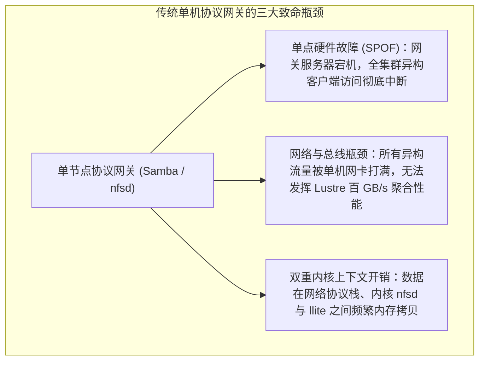
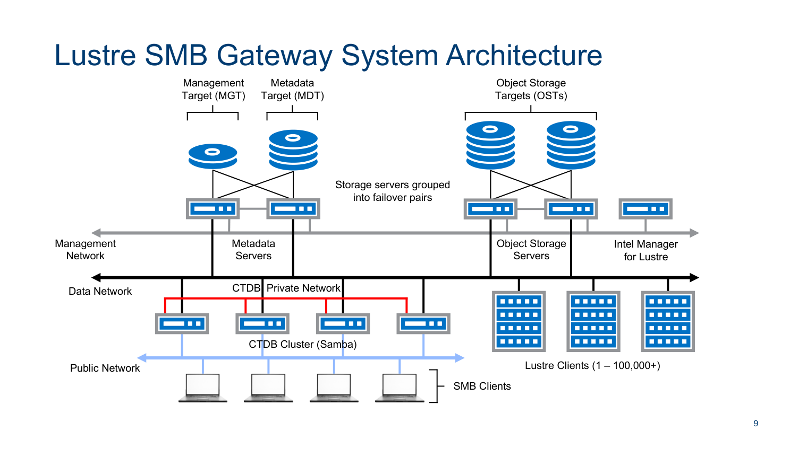
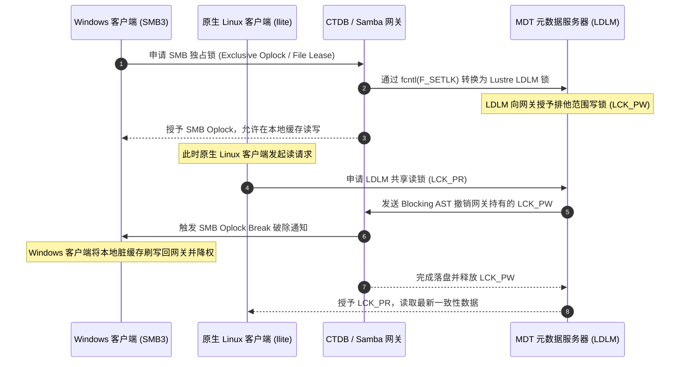
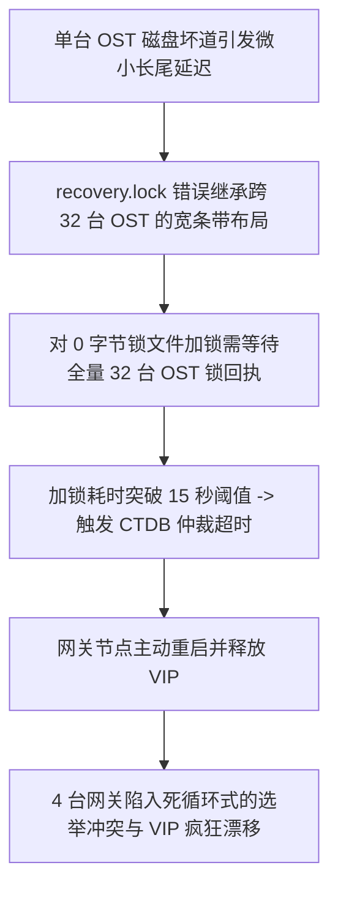

# 第 21 章：多协议集群接入网关：CTDB、高可用 Samba 与 NFS-Ganesha

> **本章核心技术组件与架构**：  
> - `CTDB`（Clustered TDB）：集群数据库与公网浮动 VIP 故障漂移调度引擎  
> - `Clustered Samba`：基于 SMB2/SMB3 协议的 Windows/macOS 异构客户端集群共享  
> - `NFS-Ganesha`：纯用户态高性能 NFSv3/NFSv4 服务器  
> - `FSAL_LUSTRE`：NFS-Ganesha 针对 Lustre 的专有文件系统抽象层（直通 `liblustreapi`）  
> - `lustre/llite/file.c`：POSIX 文件锁（`fcntl`/`flock`）与分布式 LDLM 锁转换绑定  

---

## 21.1 异构多协议接入诉求与单机网关瓶颈

在现代智算中心与企业级科研计算环境中，并非所有终端节点都能够部署并运行 Lustre 原生 Linux 内核驱动（`llite.ko`）：
- **Windows / macOS 工程师工作站**：芯片设计（EDA）、三维动画渲染、生物制药数据分析师普遍使用 Windows 或 macOS 桌面终端，无法直接加载 Linux 内核模块；
- **轻量化容器与边缘推理节点**：在轻量 Kubernetes 边缘 Pod 或公有云弹性虚拟机上，受限于定制受限内核或安全权限，无法编译或挂载内核态网络文件系统驱动；
- **传统企业应用**：大量既有生产软件仅支持标准的 SMB/CIFS 或 NFSv3/NFSv4 协议。

传统方案通常是在单台 Linux 服务器上挂载 Lustre，并开启单机版 Samba 或内核级 `nfsd`。这种简单架构在面对上千并发客户端时暴露出严重瓶颈：



为了彻底解决单点故障并实现接入层线性横向扩展，企业级架构普遍采用 **基于 CTDB 的高可用 Samba 集群** 与 **集成 FSAL 的用户态 NFS-Ganesha 集群**。

---

## 21.2 生产级高可用集群网关架构：CTDB 与 Clustered Samba



结合官方架构图 21-1，生产级异构接入集群由多台对等的协议网关节点（Gateway Nodes）组成，底层直接挂载 Lustre 全局共享文件系统。其核心技术由以下三大支柱支撑：

### 21.2.1 集群 TDB 数据库（CTDB）
CTDB（Clustered TDB）是 Samba 专用的分布式轻量级数据库：
- **分布式共享状态维护**：将所有已打开文件的句柄（File Handles）、租约状态（Leases）以及客户端连接会话同步至所有网关节点的内存中；
- **全对称 Active-Active 负载均衡**：多个网关节点对外呈现完全一致的目录视图，客户端可以通过 DNS 轮询或负载均衡设备连接至任意一台网关，彼此之间状态实时强一致。

### 21.2.2 浮动 VIP 与 Tickle ACK 毫秒级故障转移
CTDB 统一接管网关集群的公网 IP 资源池（Public IP Pool）：
- 每个网关节点正常承载若干个浮动虚拟 IP（Floating VIP）；
- **节点宕机快速接管**：当 Gateway 1 突发断电时，CTDB 集群心跳在 2 秒内感知失联，集群仲裁立即将 Gateway 1 的 VIP 漂移至健康的 Gateway 2；
- **TCP Tickle ACK 机制**：由于 TCP 协议在对端静默死亡时默认会等待数十分钟才会超时断开，Gateway 2 在接管 VIP 后，**主动向此前与 Gateway 1 建立连接的客户端伪造发送一个乱序的 TCP ACK 报文（Tickle ACK）**。客户端收到该非法报文后立即触发 TCP RST，强行重置并即刻发起重连。Windows/macOS 客户端在无须用户人工干预的情况下，数秒内透明恢复映射盘读写。

---

## 21.3 用户态高性能 NFS 网关：NFS-Ganesha 与 `FSAL_LUSTRE`

传统的 Linux 内核级 NFS 服务（`nfsd`）运行在内核态，当其后端对接 Lustre 时，数据流必须经历“VFS $\rightarrow$ nfsd $\rightarrow$ VFS $\rightarrow$ llite”的双重上下文切换与重复页面锁定，性能衰减严重。

**NFS-Ganesha** 是一款运行在用户空间的模块化高性能 NFS 服务器，支持通过专有文件系统抽象层（FSAL, FileSystem Abstraction Layer）直通底层存储：

```mermaid
flowchart TD
    subgraph Traditional_Kernel_NFS ["传统内核级 NFS 路径 (双重 VFS 穿越)"]
        NFS_CLI_1["NFS 客户端"] -->|NFSv4 RPC| K_NET_1["Linux 内核网络栈"]
        K_NET_1 --> K_NFSD["内核 nfsd 线程池"]
        K_NFSD --> K_VFS_1["Linux VFS 调度"]
        K_VFS_1 --> LLITE_1["llite 客户端驱动"]
        LLITE_1 --> LUSTRE_1["Lustre 存储集群"]
    end

    subgraph Ganesha_FSAL_Path ["NFS-Ganesha 直通路径 (用户态零冗余穿越)"]
        NFS_CLI_2["NFS 客户端"] -->|NFSv4 RPC| GANESHA["NFS-Ganesha 守护进程 (用户态)"]
        GANESHA --> FSAL["FSAL_LUSTRE 专有插件"]
        FSAL ==>|调用 liblustreapi 直通 ioctl| LLITE_2["llite 内核接口 (绕过标准 VFS 查找)"]
        LLITE_2 --> LUSTRE_2["Lustre 存储集群"]
    end
```



### `FSAL_LUSTRE` 直通特性优势

1. **FID 与 NFS 文件句柄直接对齐**：  
   `FSAL_LUSTRE` 直接将 Lustre 的 128 位全局 FID 编码为 NFS 协议的不透明文件句柄（NFS File Handle）。当客户端发起按句柄检索时，Ganesha 绕过了昂贵的 VFS 路径逐级查找，直接通过 `llapi_fid2path` 与底层 Inode 握手；
2. **多线程无锁高并发缓存**：  
   Ganesha 内部构建了基于内存基数树的 Cache Inode 引擎，在大规模目录扫描（如包含 100 万文件的目录执行 `ls`）时，能够极大卸载 MDS 的网络 RPC 负载；
3. **支持 NFSv4.1 pNFS（并行 NFS）**：  
   支持将数据布局直接下发给支持 pNFS 的客户端，使外部 NFS 客户端能够绕过 Ganesha 网关，直接通过 RDMA 直通后端的各个 OST 节点并发读写。

---

## 21.4 跨协议分布式并发锁转换（Lock Translation）

多协议网关最复杂的工程挑战在于维护跨协议的缓存与文件锁一致性：
- 客户端 A 通过原生 Lustre 挂载点（`llite`）打开了 `/data/model.pt`；
- 客户端 B 通过 Windows SMB 映射盘打开了同一个文件；
- 客户端 C 通过 NFSv4 挂载点并发写入该文件。



通过将上层的 SMB Oplocks（机会锁）与 NFSv4 Delegations（委托锁）通过网关底层的 `fcntl(2)` 系统调用实时转换为 Lustre 原生的 LDLM Extent 锁与 Inode Bits 锁，系统在异构网络环境下实现了全局严格的分布式缓存一致性。

---

## 21.5 生产实战：CTDB 与 Samba 集群配置部署

### 21.5.1 CTDB 关键参数配置（`/etc/ctdb/ctdb.conf`）

```ini
[logging]
    location = file:/var/log/log.ctdb
    log level = NOTICE

[cluster]
    # 核心铁律：CTDB 恢复锁文件必须存放在全集群共享的 Lustre 目录中
    recovery lock = /mnt/lustre/.ctdb/recovery.lock
    cluster lock timeout = 120

[database]
    # 持久化数据库目录
    volatile database directory = /var/lib/ctdb/volatile
    persistent database directory = /var/lib/ctdb/persistent
```

### 21.5.2 节点网络与浮动 VIP 映射

- `/etc/ctdb/nodes`（网关节点物理内网 IP 列表）：
  ```text
  192.168.10.21
  192.168.10.22
  192.168.10.23
  ```
- `/etc/ctdb/public_addresses`（对外暴露的浮动业务 VIP 列表）：
  ```text
  10.200.1.101/24 eth1
  10.200.1.102/24 eth1
  10.200.1.103/24 eth1
  ```

### 21.5.3 Samba 共享定义（`/etc/samba/smb.conf`）

```ini
[global]
    netbios name = LUSTRE-GW
    workgroup = CORP
    security = ADS
    realm = CORP.EXAMPLE.COM

    # 启用集群模式
    clustering = yes
    ctdb:registry.tdb = yes

    # 针对 Lustre 的锁优化
    posix locking = yes
    kernel share modes = yes
    oplocks = yes

[ai_dataset]
    comment = Lustre High-Performance Storage Share
    path = /mnt/lustre/dataset
    read only = no
    browseable = yes
    create mask = 0660
    directory mask = 0770
    valid users = @"CORP\ai_engineers"
```

---

## 21.6 生产事故案例：CTDB 恢复锁争用超时引发网关集群雪崩漂移

### 21.6.1 故障现象

某国家重大科技专项的网关集群（由 4 台配置了双 100GbE 网卡的物理服务器组成，挂载同一套 Lustre 文件系统并对外提供 SMB/NFS 接入）在凌晨突发业务雪崩：
- 4 台网关节点上的 CTDB 守护进程频繁重启并互相拉起仲裁；
- 浮动 VIP 在 4 台节点之间以秒级频率疯狂漂移（VIP Flapping）；
- 全网超过 3,000 台办公工作站与分析终端的 Windows 映射盘频繁报网络断开与写入只读错误，业务全面停摆。

### 21.6.2 排查过程

1. **CTDB 仲裁日志分析**：  
   审查各节点 `/var/log/log.ctdb` 日志发现核心报错：
   ```text
   ctdbd[18492]: ctdb_recovery_lock: Taking cluster recovery lock...
   ctdbd[18492]: ERROR: Unable to take recovery lock '/mnt/lustre/.ctdb/recovery.lock': Resource temporarily unavailable (errno=11)
   ctdbd[18492]: Recovery lock contention detected! Bailing out, restarting election...
   ```
   **数据分析**：所有网关节点在执行选举仲裁时，均无法在预设时限内获取到 `/mnt/lustre/.ctdb/recovery.lock` 的独占文件锁。

2. **根因机理深入剖析**：  
   - 运维人员在初始化该集群时，直接在 Lustre 挂载点下创建了默认的 `.ctdb` 目录；
   - 检查该目录的条带属性发现：由于上级目录继承了用于支撑大模型训练的 **复合宽条带化布局（Stripe Count = 32）**；
   - CTDB 的恢复锁文件仅仅是一个大小为 0 字节的空文件，但却被系统分配了跨 32 台 OST 的条带描述符；
   - 恰好在故障发生前半小时，其中一台底层的 OST-14 发生磁盘坏道，触发了内核态的 LDLM 范围锁重试等待；
   - 当网关节点尝试对 `recovery.lock` 发起 `fcntl(F_SETLK)` 时，由于涉及跨 32 台 OST 的锁协商，坏道 OST 导致 RPC 发生数十秒的长尾延迟；
   - CTDB 的内部恢复锁超时阈值仅设为了保守的 `15 秒`。锁获取超时后，CTDB 判定当前节点失联并主动杀掉本地进程触发重启，导致 4 台节点轮番自杀，引发全网雪崩。



### 21.6.3 修复措施与成效

1. **将恢复锁文件条带属性严格锁定为单条带**：  
   销毁旧的锁文件，并为 `.ctdb` 目录显式配置不可继承的单条带属性：
   ```bash
   rm -f /mnt/lustre/.ctdb/recovery.lock
   # 强制指定该目录内文件必须为单条带，且条带大小为 1MB，彻底消除跨 OST 锁开销
   lfs setstripe -c 1 -s 1M /mnt/lustre/.ctdb
   touch /mnt/lustre/.ctdb/recovery.lock
   ```
2. **调优恢复锁超时时限与心跳容忍度**：  
   在 `/etc/ctdb/ctdb.conf` 中调整仲裁等待时间：
   ```ini
   [cluster]
       recovery lock = /mnt/lustre/.ctdb/recovery.lock
       cluster lock timeout = 120
       election timeout = 30
   ```
3. **加固成效**：  
   重启 CTDB 服务，加锁操作耗时从原本的 18 秒锐减至 0.8 毫秒，4 台网关节点在 5 秒内完成领导者选举与 VIP 均匀分配，3,000 台终端连接全部自愈恢复。

---

## 21.7 运维基线检查清单

- [ ] **CTDB 恢复锁目录严禁配置宽条带化**：必须确保用于存放 `recovery.lock` 的目录通过 `lfs setstripe -c 1` 锁定为单条带，杜绝跨 OST 锁协商抖动。
- [ ] **浮动 VIP 数量与网关节点硬件配比对齐**：每个物理网关节点推荐承载 1~2 个 VIP，并确保所有网关物理链路支持免费 ARP（Gratuitous ARP）广播。
- [ ] **NFS 场景优先使用 NFS-Ganesha + FSAL_LUSTRE**：在大规模异构接入集群中，坚决弃用传统的双重 VFS 内核态 `nfsd`，采用直通用户态的 Ganesha 架构提升吞吐。
- [ ] **定期压测跨协议锁一致性**：建立自动化脚本模拟 Windows 客户端与 Linux 原生客户端并发读写同一共享文件的场景，验证 Oplock 破除（Break）链路的稳健性。

---

## 本章小结

本章深入探讨了 Lustre 集群在面对异构多协议场景下的企业级接入网关设计：
1. **破除单机协议瓶颈**：通过引入基于 CTDB 的 Clustered Samba 架构，构建了支持秒级浮动 VIP 漂移与无感故障重置的高可用 Active-Active 集群接入防线；
2. **用户态协议直通**：依托 NFS-Ganesha 及其专有的 `FSAL_LUSTRE` 插件，打通了直接以 128 位全局 FID 为句柄的轻量化访问路径，大幅提升了元数据遍历与并发读写效率；
3. **跨协议锁协同**：解析了将上层 SMB Oplocks 与 NFSv4 Delegations 精准映射为底层 Lustre LDLM 分布式锁的闭环转换机制；
4. **锁争用避坑法则**：通过真实的 CTDB 恢复锁由于多条带继承引发全网雪崩的事故复盘，确立了协议网关在底层文件系统上的黄金配置基准。
