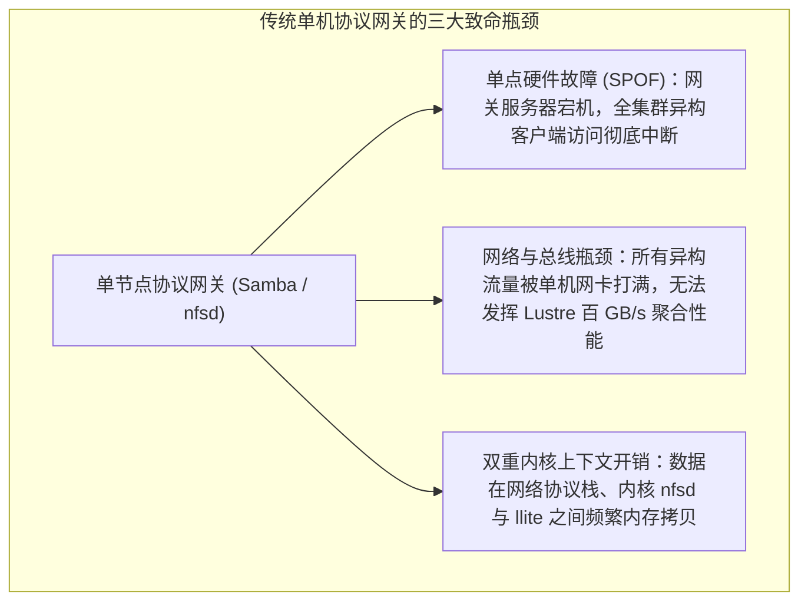

# 21.1 异构多协议接入诉求与单机网关瓶颈

在现代智算中心与企业级科研计算环境中，并非所有终端节点都能够部署并运行 Lustre 原生 Linux 内核驱动（`llite.ko`）：
- **Windows / macOS 工程师工作站**：芯片设计（EDA）、三维动画渲染、生物制药数据分析师普遍使用 Windows 或 macOS 桌面终端，无法直接加载 Linux 内核模块；
- **轻量化容器与边缘推理节点**：在轻量 Kubernetes 边缘 Pod 或公有云弹性虚拟机上，受限于定制受限内核或安全权限，无法编译或挂载内核态网络文件系统驱动；
- **传统企业应用**：大量既有生产软件仅支持标准的 SMB/CIFS 或 NFSv3/NFSv4 协议。

传统方案通常是在单台 Linux 服务器上挂载 Lustre，并开启单机版 Samba 或内核级 `nfsd`。这种简单架构在面对上千并发客户端时暴露出严重瓶颈：

为了彻底解决单点故障并实现接入层线性横向扩展，企业级架构普遍采用 **基于 CTDB 的高可用 Samba 集群** 与 **集成 FSAL 的用户态 NFS-Ganesha 集群**。

---

