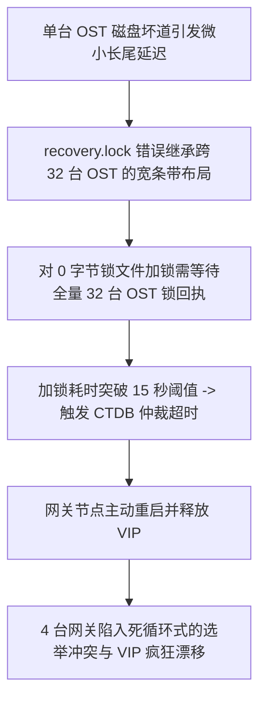

# 21.6 生产事故案例：CTDB 恢复锁争用超时引发网关集群雪崩漂移

## 21.6.1 故障现象

某国家重大科技专项的网关集群（由 4 台配置了双 100GbE 网卡的物理服务器组成，挂载同一套 Lustre 文件系统并对外提供 SMB/NFS 接入）在凌晨突发业务雪崩：
- 4 台网关节点上的 CTDB 守护进程频繁重启并互相拉起仲裁；
- 浮动 VIP 在 4 台节点之间以秒级频率疯狂漂移（VIP Flapping）；
- 全网超过 3,000 台办公工作站与分析终端的 Windows 映射盘频繁报网络断开与写入只读错误，业务全面停摆。

## 21.6.2 排查过程

1. **CTDB 仲裁日志分析**：  
   审查各节点 `/var/log/log.ctdb` 日志发现核心报错：
   ```text
   ctdbd[18492]: ctdb_recovery_lock: Taking cluster recovery lock...
   ctdbd[18492]: ERROR: Unable to take recovery lock '/mnt/lustre/.ctdb/recovery.lock': Resource temporarily unavailable (errno=11)
   ctdbd[18492]: Recovery lock contention detected! Bailing out, restarting election...
   ```
   **数据分析**：所有网关节点在执行选举仲裁时，均无法在预设时限内获取到 `/mnt/lustre/.ctdb/recovery.lock` 的独占文件锁。

2. **根因机理深入剖析**：  
   - 运维人员在初始化该集群时，直接在 Lustre 挂载点下创建了默认的 `.ctdb` 目录；
   - 检查该目录的条带属性发现：由于上级目录继承了用于支撑大模型训练的 **复合宽条带化布局（Stripe Count = 32）**；
   - CTDB 的恢复锁文件仅仅是一个大小为 0 字节的空文件，但却被系统分配了跨 32 台 OST 的条带描述符；
   - 恰好在故障发生前半小时，其中一台底层的 OST-14 发生磁盘坏道，触发了内核态的 LDLM 范围锁重试等待；
   - 当网关节点尝试对 `recovery.lock` 发起 `fcntl(F_SETLK)` 时，由于涉及跨 32 台 OST 的锁协商，坏道 OST 导致 RPC 发生数十秒的长尾延迟；
   - CTDB 的内部恢复锁超时阈值仅设为了保守的 `15 秒`。锁获取超时后，CTDB 判定当前节点失联并主动杀掉本地进程触发重启，导致 4 台节点轮番自杀，引发全网雪崩。



## 21.6.3 修复措施与成效

1. **将恢复锁文件条带属性严格锁定为单条带**：  
   销毁旧的锁文件，并为 `.ctdb` 目录显式配置不可继承的单条带属性：
   ```bash
   rm -f /mnt/lustre/.ctdb/recovery.lock
   # 强制指定该目录内文件必须为单条带，且条带大小为 1MB，彻底消除跨 OST 锁开销
   lfs setstripe -c 1 -s 1M /mnt/lustre/.ctdb
   touch /mnt/lustre/.ctdb/recovery.lock
   ```
2. **调优恢复锁超时时限与心跳容忍度**：  
   在 `/etc/ctdb/ctdb.conf` 中调整仲裁等待时间：
   ```ini
   [cluster]
       recovery lock = /mnt/lustre/.ctdb/recovery.lock
       cluster lock timeout = 120
       election timeout = 30
   ```
3. **加固成效**：  
   重启 CTDB 服务，加锁操作耗时从原本的 18 秒锐减至 0.8 毫秒，4 台网关节点在 5 秒内完成领导者选举与 VIP 均匀分配，3,000 台终端连接全部自愈恢复。

---

