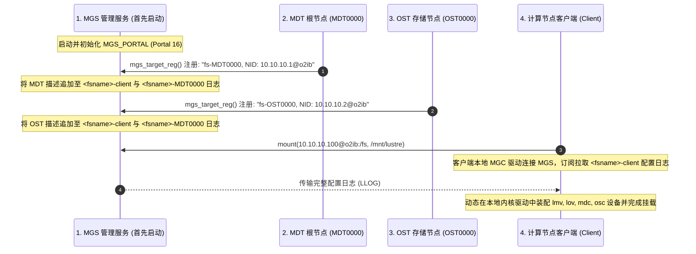
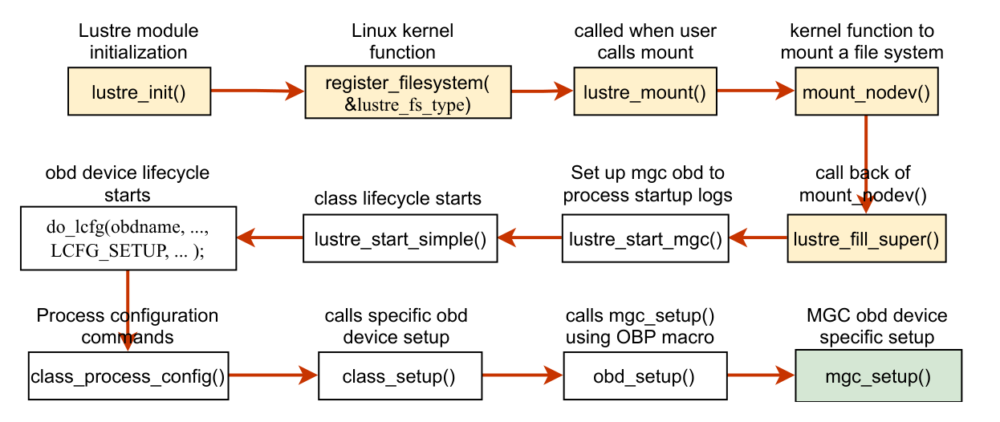
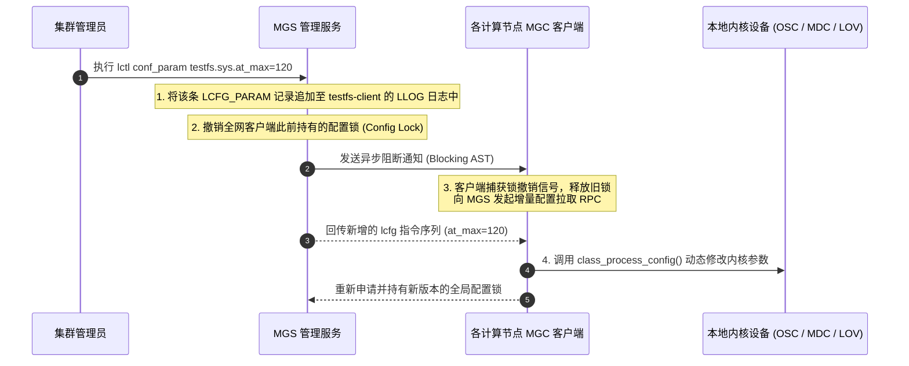
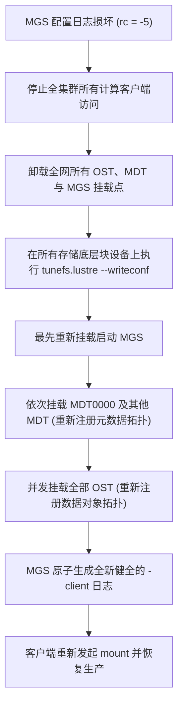

# 第 22 章：MGS 与动态配置分发中心

> **本章核心源码文件**：  
> - `lustre/mgs/mgs_handler.c`：管理服务器（MGS）RPC 调度、目标注册（`mgs_target_reg()`）与配置查询处理  
> - `lustre/mgs/mgs_llog.c`：配置日志（Config Log）在底层 LLOG 中的生成、追加与解析实现  
> - `lustre/mgc/mgc_request.c`：管理客户端（MGC）配置订阅、更新监听与本地应用实现  
> - `lustre/obdclass/obd_config.c`：配置指令（`lcfg`）解析器、设备树动态装配与参数刷新  
> - `lustre/utils/tunefs.c`：`tunefs.lustre` 磁盘元参数修改与 `writeconf` 实现  

---

## 19.1 MGS 的管理定位与集群自举流程（Bootstrap）

在由数千台存储与计算服务器构成的现代化数据中心内，任何静态的、基于本地配置文件的集群拓扑管理方案都会遭遇严重的工程收敛瓶颈：一旦发生存储目标扩容（增加 OST/MDT）、硬件故障倒换或全局内核参数调整，要求运维人员逐台修改并分发配置文件，既容易出现不一致性，又无法实现平滑的动态更新。

Lustre 设计了专门的 **管理服务器（MGS, Management Server）** 作为全局拓扑注册中心与动态配置广播源。



### 19.1.1 拓扑规划架构原则

- **合并部署（Colocated MGS/MDT）**：  
  在规模较小（例如 OST 数量小于 32、计算节点小于 500）的集群或实验环境中，通常将 MGS 与 MDT0000 部署在同一对高可用物理服务器和共享存储卷上（格式化参数声明 `--mgs --mdt`）。这种架构节省硬件成本，但存在元数据 I/O 争用隐患。
- **独立部署（Dedicated MGS）**：  
  在百 PB 级超算平台或万卡大模型训练集群中，**强烈建议将 MGS 独立部署在专属的高可用存储节点上**。将管理流与核心元数据流（MDT）彻底做物理隔离，可以防止高频元数据读写打满网络队列而导致全网配置分发延迟或心跳超时。

---

## 19.2 MGC 初始化与设备装配调用栈

客户端或存储服务端在启动时，其驱动层必须首先实例化 **MGC（Management Client）** 设备，以拉取配置日志。



如图 19-1 所示，`class_setup()` 驱动的 MGC 初始化流经一系列明确的内核函数调用：
1. **`mgc_setup()`**：分配并初始化本地 MGC 的私有数据结构，建立指向 MGS 的网络通信句柄（Import）；
2. **`mgc_llog_init()`**：初始化本地 LLOG 日志处理上下文，准备接收二进制格式的配置流；
3. **`ptlrpc_connect_import()`**：与远端 MGS 建立 Portal RPC 会话，校验服务端版本并同步网络超时基线。

---

## 19.3 底层配置日志格式：LLOG 与 `lcfg` 指令流

MGS 将所有的集群拓扑定义与配置参数保存在内部专用的日志结构——**LLOG（Lustre Log）** 中。每个文件系统对应两类主要日志：
- **`<fsname>-client`**：全集群客户端在挂载时必须读取的拓扑描述，定义了所有的 MDT 与 OST 客户端连接参数；
- **`<fsname>-MDTxxxx` / `<fsname>-OSTxxxx`**：特定存储目标在启动时必须加载的服务端私有配置。

### 19.3.1 `lcfg` 二进制指令结构

LLOG 中存储的每一个配置单元均为一个标准 `struct lustre_cfg` 结构体：

```c
struct lustre_cfg {
    __u32                       lcfg_version;   /* 配置指令版本 (如 LUSTRE_CFG_VERSION) */
    __u32                       lcfg_command;   /* 命令操作码：LCFG_ATTACH, LCFG_SETUP, LCFG_PARAM... */
    __u32                       lcfg_num;       /* 参数编号或 Target 逻辑索引 */
    __u32                       lcfg_flags;     /* 指令标志位 */
    __u32                       lcfg_nid;       /* 关联的目标 NID 地址 */
    __u32                       lcfg_nal;       /* 网络抽象层类型 (LNet 驱动类型) */
    __u32                       lcfg_bufcount;  /* 随附参数字符串的数量 */
    __u32                       lcfg_buflens[]; /* 各参数字节长度变长数组 */
};
```

常见的 `lcfg_command` 类型包括：
- **`LCFG_ATTACH`**：通知内核加载并注册指定类型的设备驱动（如 `lov`、`lmv`、`osc`）；
- **`LCFG_SETUP`**：传入具体参数初始化设备实例，建立与远端节点的连接通道；
- **`LCFG_PARAM`**：设置运行时动态参数（如超时时间、条带默认策略）；
- **`LCFG_CLEANUP` / `LCFG_DETACH`**：注销并销毁设备实例。

### 19.3.2 配置日志解析与流水线执行


结合图 19-2 展示的内核调用栈：
1. MGC 通过 RPC 获取到远端 LLOG 二进制流后，调用 **`mgc_process_config()`**；
2. 内部驱动进入 **`class_config_parse_llog()`**，逐条迭代扫描日志中的每一条 LLOG 记录；
3. 将记录反序列化为 `struct lustre_cfg` 内存对象，并向下投递给 **`class_process_config()`**；
4. `class_process_config()` 根据操作码分发至目标子系统（如 `lov_process_config`、`osc_process_config`），在客户端内存中动态搭建完整的虚拟存储设备树。

---

## 19.4 动态参数全网广播：配置锁（Config Lock）机制

在系统生命周期内，管理员需要动态调整参数（如提高全局客户端条带宽度、调节自适应超时上限）。Lustre 支持在不停机且不卸载客户端的前提下全网动态生效：


如图 19-3 所示，该能力完全基于 **全局配置锁（Config Lock）** 协同闭环实现：



- **锁驱动被动同步**：所有在线的客户端及服务端 MGC 驱动均在 MGS 上持有一把只读模式的全局配置锁。这种机制使客户端无需采用轮询轮询机制，真正实现了**零额外网络开销下的秒级全网动态同步**。
- **增量应用**：MGC 会在本地记录已解析的 LLOG 索引位置（Record Index），每次收到锁撤销通知后仅拉取新增记录，避免了重复加载全量配置的巨大开销。

---

## 19.5 生产实战：参数调优与监控指标

### 19.5.1 常用配置管理命令

```bash
# 1. 动态将全网客户端的默认条带大小调整为 2MB，条带数调整为 4
lctl conf_param testfs.lov.stripesize=2097152
lctl conf_param testfs.lov.stripecount=4

# 2. 动态调整全网自适应超时最大时限为 120 秒
lctl conf_param testfs.sys.at_max=120

# 3. 限制客户端最大允许挂起的 RPC 并发数量
lctl conf_param testfs.osc.max_rpcs_in_flight=32

# 4. 离线检查与打印底层 LLOG 配置日志内容 (在 MGS 挂载目录下执行)
llog_reader /mnt/mgs/CONFIGS/testfs-client
```

### 19.5.2 核心监控指标与状态查询

| 监控项目 | 查询命令 | 核心指标与诊断意义 |
| :--- | :--- | :--- |
| **已注册目标健康状态** | `lctl get_param mgs.MGS.live.*` | 查看 MGS 视角下已注册的各个 MDT 与 OST 是否处于就绪活跃状态。 |
| **客户端配置锁持有状态** | `lctl get_param mgc.*.config_lock` | 确认客户端本地持有的配置锁是否为 Granted 状态；若处于争用态，需排查网络连通性。 |
| **MGS 运行时 RPC 吞吐** | `lctl get_param mgs.MGS.stats` | 查看配置注册与拉取请求的处理延迟与频次分布。 |

---

## 19.6 生产事故案例：MGS 配置日志损坏导致全集群瘫痪与 `writeconf` 紧急自愈

### 19.6.1 故障现象

某国家级超算中心在进行机房高压配电柜突发切换演练后，多台存储服务器发生非正常掉电。重新开机后，MGS 节点自身可以正常挂载，但全集群 4096 台计算节点在执行 `mount -t lustre` 时全部报错挂起：
```text
mount.lustre: mount 10.10.1.100@o2ib:/testfs at /mnt/lustre failed: Input/output error
```
客户端内核 `dmesg` 循环输出错误堆栈：
```text
LustreError: 3821:0:(mgc_request.c:642:mgc_process_log()) testfs-client: parsing log failed: rc = -5
LustreError: 3821:0:(llite_lib.c:1120:ll_fill_super()) Unable to process log: -5
```
全集群作业调度被迫中止，生产完全瘫痪。

### 19.6.2 排查过程

1. **底层 LLOG 日志完整性校验**：  
   在 MGS 节点上利用专有二进制诊断工具对配置日志进行反序列化检查：
   ```bash
   llog_reader /mnt/mgs/CONFIGS/testfs-client
   ```
   输出在读取到第 58 条记录时发生崩溃：
   ```text
   Record 57: LCFG_PARAM ... (testfs.sys.at_max)
   llog_reader: record 58 has invalid magic 0x00000000, expected 0x10d10d00!
   llog_reader: corrupt log header at offset 0x3a00, exiting!
   ```
   **数据分析**：突发断电前，管理员恰好在通过 `lctl conf_param` 调整参数，MGS 尚未将该条记录的头部 Magic 数和尾部校验和（Checksum）刷入持久化介质便遭遇掉电，导致 LLOG 尾部出现截断性坏块。客户端内核驱动出于绝对安全防御机制，一旦遇到损坏记录即拒绝继续装配。

2. **恢复策略权衡与方案确立**：  
   所有后端 MDT 与 OST 底层的用户文件、元数据和条带索引在各自的物理磁盘上均完好无损，仅是 MGS 上的“配置目录索引”发生了逻辑损坏。  
   针对此类场景，Lustre 原生设计了 **`writeconf` 机制**：该机制允许清除并擦除 MGS 上旧的残留配置日志，并指示所有存储目标在下一次启动时强制向 MGS 重新上报自身信息，从零原子重建全新的配置日志。



### 19.6.3 修复措施与成效

1. **全面标记清除并准备重建**：  
   依次对 MGS、所有 MDT 和所有 OST 底层块设备执行标记（此操作不损坏底层实际数据）：
   ```bash
   # 1. 在 MGS 节点执行清除标记
   tunefs.lustre --writeconf /dev/vg_mgs/lv_mgs
   
   # 2. 在所有 MDT 节点执行重新注册标记
   tunefs.lustre --writeconf /dev/nvme0n1
   tunefs.lustre --writeconf /dev/nvme1n1
   
   # 3. 在所有 OST 节点批量执行重新注册标记
   for dev in /dev/mapper/mpath*; do
       tunefs.lustre --writeconf $dev
   done
   ```

2. **按严密时序逐级启动并自愈**：  
   - 先行挂载并启动 MGS；
   - 挂载 MDT0000，MDT0000 启动时检测到 `writeconf` 标志，立即向 MGS 发起 `mgs_target_reg()`，在 MGS 上初始化新的空日志；
   - 挂载其余 MDT 与全部 OST，各节点将各自的网络 NID、UUID 及配置追加写入；
   - 检查 MGS 上的配置日志：
     ```bash
     llog_reader /mnt/mgs/CONFIGS/testfs-client
     ```
     日志校验无误，包含全量 128 台 OST 与 4 台 MDT 的完整拓扑。

计算节点重新发起挂载，4096 台节点在 2 分钟内全部顺利挂载成功，集群零数据丢失恢复运转。

---

## 19.7 运维基线检查清单

- [ ] **高可靠 MGS 独立配置**：对于大规模生产集群，MGS 建议采用双机高可用独立部署，定期对其底层存储卷执行元数据快照或冷备，以防配置日志受损。
- [ ] **严格把控 `lctl conf_param` 执行权限**：任何全网配置参数的调整必须在测试集群验证后方可执行，防止因参数笔误导致全局秒级广播故障。
- [ ] **执行 `writeconf` 时必须遵循对称性与启动顺序**：使用 `--writeconf` 重建日志时，必须对 MGS 及所有服务端节点全量执行标记，严禁遗漏任何一台 OST，并严格遵循“先 MGS、再 MDT0000、最后其余 MDT 与 OST”的启动顺序。

---

## 本章小结

本章系统解析了 Lustre 集群配置中心 MGS 的底层工作机制与高可用自愈方案：
1. **集中管控架构**：MGS 作为集群自举和拓扑定义的唯一真理源，彻底解除了分布式节点间复杂的网状配置依赖；
2. **底层日志规范**：LLOG 以规整的二进制记录流承载 `lcfg` 指令，通过 MGC 驱动完成了驱动模块加载、设备构建与动态连接；
3. **秒级被动广播**：通过全局配置锁（Config Lock）机制，实现了全网运行参数的秒级无感知分发，兼具强一致性与零轮询开销；
4. **灾难自愈能力**：通过真实的配置日志断电损坏案例，深度推演了 `--writeconf` 机制的底层原理与实操时序，为保障大型分布式存储集群的高可用运维提供了关键工程范式。
