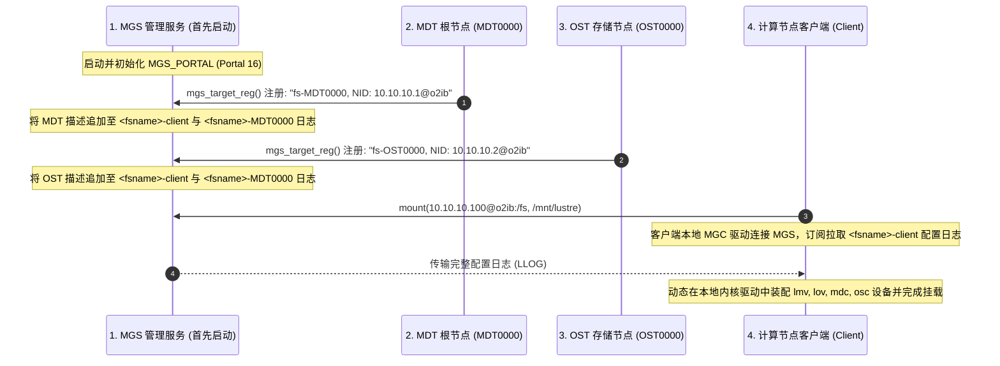

# 22.1 MGS 的管理定位与集群自举流程（Bootstrap）

在由数千台存储与计算服务器构成的现代化数据中心内，任何静态的、基于本地配置文件的集群拓扑管理方案都会遭遇严重的工程收敛瓶颈：一旦发生存储目标扩容（增加 OST/MDT）、硬件故障倒换或全局内核参数调整，要求运维人员逐台修改并分发配置文件，既容易出现不一致性，又无法实现平滑的动态更新。

Lustre 设计了专门的 **管理服务器（MGS, Management Server）** 作为全局拓扑注册中心与动态配置广播源。

## 19.1.1 拓扑规划架构原则

- **合并部署（Colocated MGS/MDT）**：  
  在规模较小（例如 OST 数量小于 32、计算节点小于 500）的集群或实验环境中，通常将 MGS 与 MDT0000 部署在同一对高可用物理服务器和共享存储卷上（格式化参数声明 `--mgs --mdt`）。这种架构节省硬件成本，但存在元数据 I/O 争用隐患。
- **独立部署（Dedicated MGS）**：  
  在百 PB 级超算平台或万卡大模型训练集群中，**强烈建议将 MGS 独立部署在专属的高可用存储节点上**。将管理流与核心元数据流（MDT）彻底做物理隔离，可以防止高频元数据读写打满网络队列而导致全网配置分发延迟或心跳超时。

---

