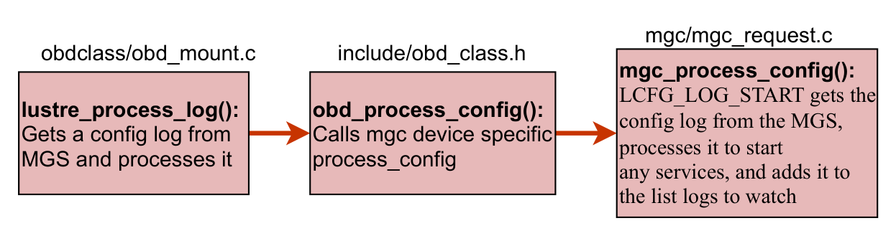

# 22.3 底层配置日志格式：LLOG 与 lcfg 指令流

MGS 将所有的集群拓扑定义与配置参数保存在内部专用的日志结构——**LLOG（Lustre Log）** 中。每个文件系统对应两类主要日志：
- **`<fsname>-client`**：全集群客户端在挂载时必须读取的拓扑描述，定义了所有的 MDT 与 OST 客户端连接参数；
- **`<fsname>-MDTxxxx` / `<fsname>-OSTxxxx`**：特定存储目标在启动时必须加载的服务端私有配置。

## 19.3.1 `lcfg` 二进制指令结构

LLOG 中存储的每一个配置单元均为一个标准 `struct lustre_cfg` 结构体：

```c
struct lustre_cfg {
    __u32                       lcfg_version;   /* 配置指令版本 (如 LUSTRE_CFG_VERSION) */
    __u32                       lcfg_command;   /* 命令操作码：LCFG_ATTACH, LCFG_SETUP, LCFG_PARAM... */
    __u32                       lcfg_num;       /* 参数编号或 Target 逻辑索引 */
    __u32                       lcfg_flags;     /* 指令标志位 */
    __u32                       lcfg_nid;       /* 关联的目标 NID 地址 */
    __u32                       lcfg_nal;       /* 网络抽象层类型 (LNet 驱动类型) */
    __u32                       lcfg_bufcount;  /* 随附参数字符串的数量 */
    __u32                       lcfg_buflens[]; /* 各参数字节长度变长数组 */
};
```

常见的 `lcfg_command` 类型包括：
- **`LCFG_ATTACH`**：通知内核加载并注册指定类型的设备驱动（如 `lov`、`lmv`、`osc`）；
- **`LCFG_SETUP`**：传入具体参数初始化设备实例，建立与远端节点的连接通道；
- **`LCFG_PARAM`**：设置运行时动态参数（如超时时间、条带默认策略）；
- **`LCFG_CLEANUP` / `LCFG_DETACH`**：注销并销毁设备实例。

## 19.3.2 配置日志解析与流水线执行



结合图 19-2 展示的内核调用栈：
1. MGC 通过 RPC 获取到远端 LLOG 二进制流后，调用 **`mgc_process_config()`**；
2. 内部驱动进入 **`class_config_parse_llog()`**，逐条迭代扫描日志中的每一条 LLOG 记录；
3. 将记录反序列化为 `struct lustre_cfg` 内存对象，并向下投递给 **`class_process_config()`**；
4. `class_process_config()` 根据操作码分发至目标子系统（如 `lov_process_config`、`osc_process_config`），在客户端内存中动态搭建完整的虚拟存储设备树。

---

