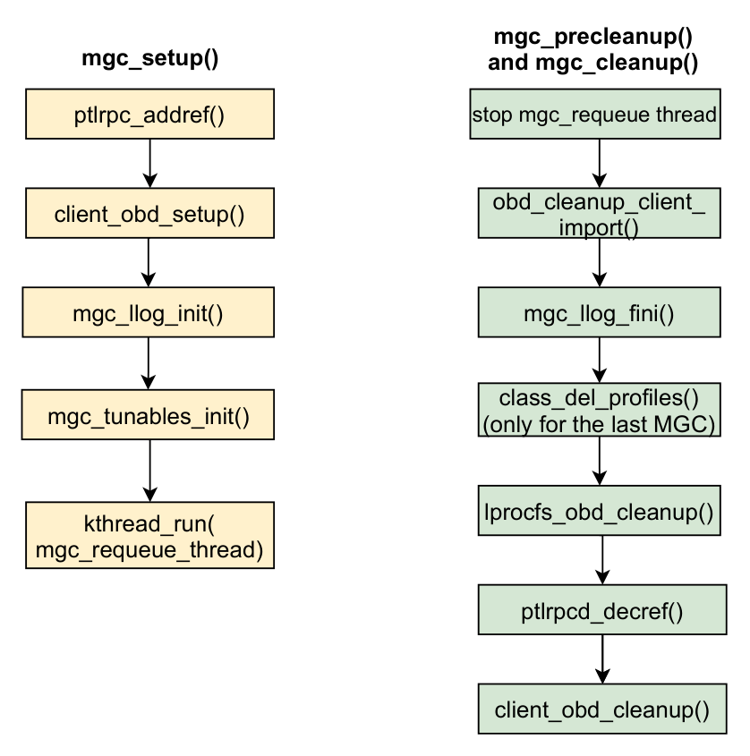
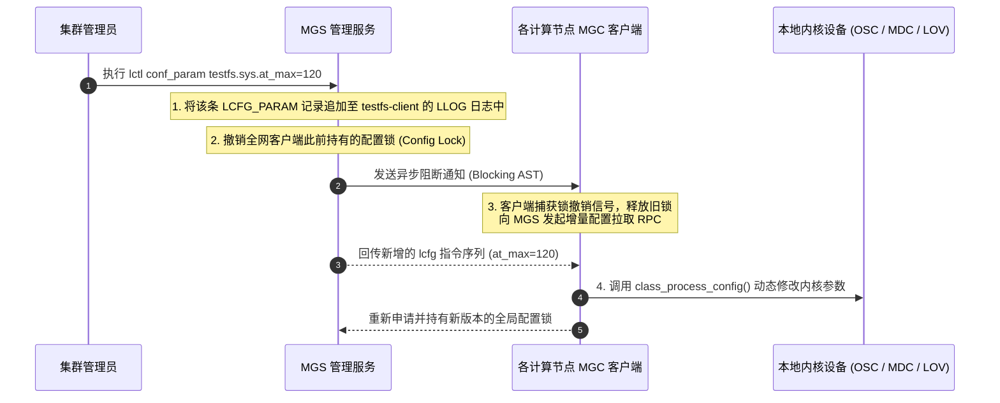

# 22.4 动态参数全网广播：配置锁（Config Lock）机制

在系统生命周期内，管理员需要动态调整参数（如提高全局客户端条带宽度、调节自适应超时上限）。Lustre 支持在不停机且不卸载客户端的前提下全网动态生效：

如图 19-3 所示，该能力完全基于 **全局配置锁（Config Lock）** 协同闭环实现：

- **锁驱动被动同步**：所有在线的客户端及服务端 MGC 驱动均在 MGS 上持有一把只读模式的全局配置锁。这种机制使客户端无需采用轮询轮询机制，真正实现了**零额外网络开销下的秒级全网动态同步**。
- **增量应用**：MGC 会在本地记录已解析的 LLOG 索引位置（Record Index），每次收到锁撤销通知后仅拉取新增记录，避免了重复加载全量配置的巨大开销。

---

