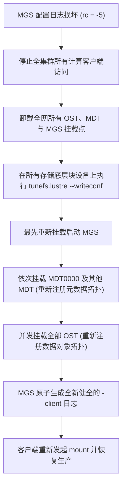

# 22.6 生产事故案例：MGS 配置日志损坏导致全集群瘫痪与 writeconf 紧急自愈

## 19.6.1 故障现象

某国家级超算中心在进行机房高压配电柜突发切换演练后，多台存储服务器发生非正常掉电。重新开机后，MGS 节点自身可以正常挂载，但全集群 4096 台计算节点在执行 `mount -t lustre` 时全部报错挂起：
```text
mount.lustre: mount 10.10.1.100@o2ib:/testfs at /mnt/lustre failed: Input/output error
```
客户端内核 `dmesg` 循环输出错误堆栈：
```text
LustreError: 3821:0:(mgc_request.c:642:mgc_process_log()) testfs-client: parsing log failed: rc = -5
LustreError: 3821:0:(llite_lib.c:1120:ll_fill_super()) Unable to process log: -5
```
全集群作业调度被迫中止，生产完全瘫痪。

## 19.6.2 排查过程

1. **底层 LLOG 日志完整性校验**：  
   在 MGS 节点上利用专有二进制诊断工具对配置日志进行反序列化检查：
   ```bash
   llog_reader /mnt/mgs/CONFIGS/testfs-client
   ```
   输出在读取到第 58 条记录时发生崩溃：
   ```text
   Record 57: LCFG_PARAM ... (testfs.sys.at_max)
   llog_reader: record 58 has invalid magic 0x00000000, expected 0x10d10d00!
   llog_reader: corrupt log header at offset 0x3a00, exiting!
   ```
   **数据分析**：突发断电前，管理员恰好在通过 `lctl conf_param` 调整参数，MGS 尚未将该条记录的头部 Magic 数和尾部校验和（Checksum）刷入持久化介质便遭遇掉电，导致 LLOG 尾部出现截断性坏块。客户端内核驱动出于绝对安全防御机制，一旦遇到损坏记录即拒绝继续装配。

2. **恢复策略权衡与方案确立**：  
   所有后端 MDT 与 OST 底层的用户文件、元数据和条带索引在各自的物理磁盘上均完好无损，仅是 MGS 上的“配置目录索引”发生了逻辑损坏。  
   针对此类场景，Lustre 原生设计了 **`writeconf` 机制**：该机制允许清除并擦除 MGS 上旧的残留配置日志，并指示所有存储目标在下一次启动时强制向 MGS 重新上报自身信息，从零原子重建全新的配置日志。



## 19.6.3 修复措施与成效

1. **全面标记清除并准备重建**：  
   依次对 MGS、所有 MDT 和所有 OST 底层块设备执行标记（此操作不损坏底层实际数据）：
   ```bash
   # 1. 在 MGS 节点执行清除标记
   tunefs.lustre --writeconf /dev/vg_mgs/lv_mgs
   
   # 2. 在所有 MDT 节点执行重新注册标记
   tunefs.lustre --writeconf /dev/nvme0n1
   tunefs.lustre --writeconf /dev/nvme1n1
   
   # 3. 在所有 OST 节点批量执行重新注册标记
   for dev in /dev/mapper/mpath*; do
       tunefs.lustre --writeconf $dev
   done
   ```

2. **按严密时序逐级启动并自愈**：  
   - 先行挂载并启动 MGS；
   - 挂载 MDT0000，MDT0000 启动时检测到 `writeconf` 标志，立即向 MGS 发起 `mgs_target_reg()`，在 MGS 上初始化新的空日志；
   - 挂载其余 MDT 与全部 OST，各节点将各自的网络 NID、UUID 及配置追加写入；
   - 检查 MGS 上的配置日志：
     ```bash
     llog_reader /mnt/mgs/CONFIGS/testfs-client
     ```
     日志校验无误，包含全量 128 台 OST 与 4 台 MDT 的完整拓扑。

计算节点重新发起挂载，4096 台节点在 2 分钟内全部顺利挂载成功，集群零数据丢失恢复运转。

---

