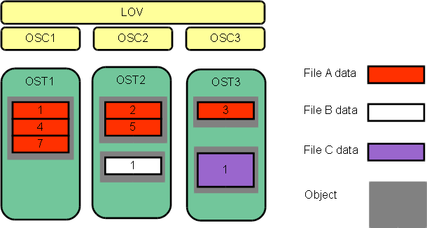
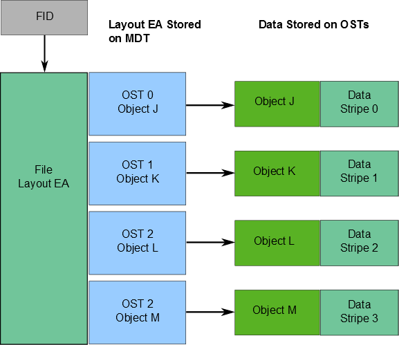
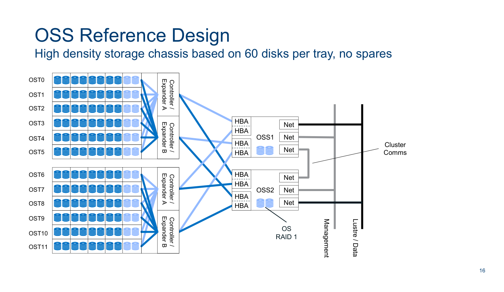
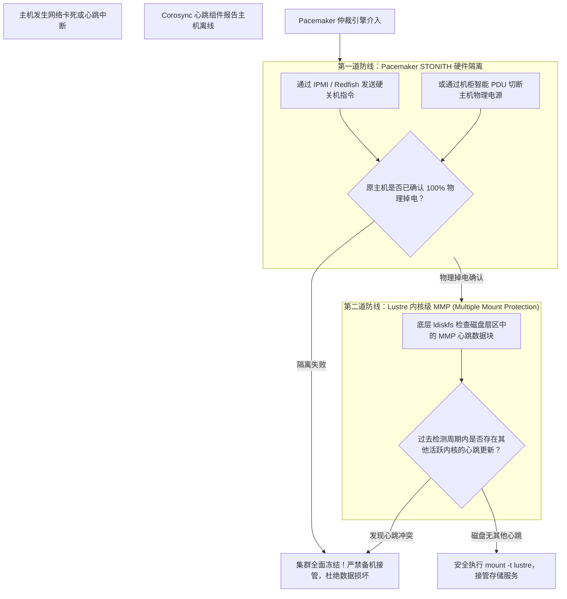
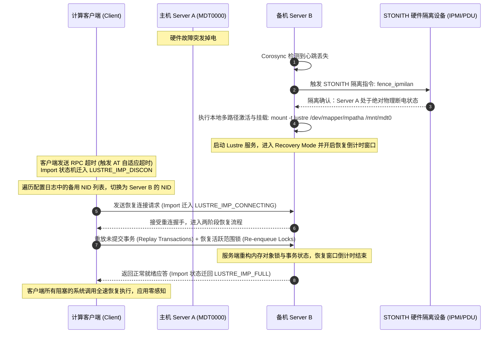

# 第 23 章：高可用架构（HA）与故障转移机制

> **本章核心源码文件**：  
> - `lustre/obdclass/genops.c`：多 NID 导出与连接重定向（Failover NID Mapping）逻辑实现  
> - `lustre/ptlrpc/recover.c`：故障转移重连握手、恢复窗口倒计时与重放事务协调  
> - `lustre/include/lustre_import.h`：Import 多路径网络连接描述符（`struct obd_import_conn`）定义  
> - `lustre/utils/mount_lustre.c`：挂载参数解析、多主备 NID 识别与高可用选项绑定  
> - `lustre/ldiskfs/mmp.c`：多挂载保护（MMP, Multiple Mount Protection）心跳写入与双挂防脑裂机制  

---

## 20.1 生产级高可用硬件拓扑：双活对偶与双端口共享存储

在支撑国家级科研、自动驾驶仿真及大模型训练的企业级存储集群中，单一硬件节点（如电源模块损坏、主板电容击穿、内存突发多位 ECC 错误）的突发宕机属于必然发生的统计常态。高可用（High Availability, HA）架构的目标是：**当任何单台服务器发生灾难性硬件故障时，集群服务自动透明漂移，客户端仅感知短暂 I/O 挂起，上层计算作业无须终止即可继续运行**。

Lustre 采用基于 **共享存储对偶互备（Dual-Attached Shared Storage Topology）** 的 Active-Active 高可用架构。



结合官方拓扑规范（图 20-1），高可用集群的物理层具备以下关键特征：
1. **双控物理通路（Dual-Attached SAS / NVMe-oF）**：  
   每个底层的物理磁盘阵列（JBOD / EBOF）均配备两个冗余的硬件控制器，通过两条完全物理隔离的 SAS 扩展电缆或 NVMe-oF 网络，同时交叉直连至两台对偶服务器（Server A 与 Server B）。
2. **多路径聚合（Device Mapper Multipath）**：  
   服务器操作系统内启用 `multipathd`，将冗余的物理链路聚合为单一稳定的逻辑块设备（如 `/dev/mapper/mpatha`），消除单根线缆或 HBA 卡损坏引发的掉盘。

---

## 20.2 MDS 与 OSS 的 Active-Active 对偶故障切换架构

在大规模生产环境中，Lustre 严格杜绝传统“一主一备、备机完全闲置”的冷备浪费模式，全面推行 **Active-Active（双活对偶互备）** 架构。

### 20.2.1 MDS 元数据双活故障转移



如图 20-2 所示，在由 Server A 与 Server B 构成的 MDS 高可用对中：
- **正常态**：Server A 正常挂载并运行 MDT0000（负责根目录与特定元数据分片），Server B 正常挂载并运行 MDT0001。两台服务器各自释放全部的 CPU 算力与网络带宽；
- **故障态**：当 Server A 突发故障断电时，集群管理软件自动将 MDT0000 的存储卷接管并在 Server B 上激活挂载。Server B 同时驱动 MDT0000 与 MDT0001，确保全集群元数据服务持续在线。

### 20.2.2 OSS 对象存储对偶高可用设计


对于数据存储层（OSS/OST），采用完全一致的对偶互备机制。



图 20-4 展示了生产级 OSS 节点的高可用参考实现：
- 节点 OSS-1 挂载 OST 0、2、4、6，节点 OSS-2 挂载 OST 1、3、5、7；
- 共享存储机柜的背板控制器为两台 OSS 节点提供全对称访问通路；
- 当 OSS-1 发生故障时，OSS-2 接管其全部存储卷，客户端通过更新后的 LNet 路由与备用 NID 直通 OSS-2，维持全量数据的正常读写。

---

## 20.3 防脑裂双保险机制：STONITH 硬隔离与驱动级 MMP

在双机共享存储架构中，最致命的灾难是 **脑裂（Split-Brain）**：如果心跳链路由于网络抖动发生假死，备机误判主机已宕机并强行挂载共享存储卷；而此时原主机实际上仍在向该卷并发写入。两个独立的 Linux 内核（JBD2 日志引擎与块分配器）同时操作同一物理卷，将在数秒内造成不可逆的文件系统元数据覆写毁灭。

为彻底杜绝脑裂，生产系统构建了“集群管理层 + 存储驱动层”的双层防护网：



### 20.3.1 第一道防线：STONITH（Shoot The Other Node In The Head）
**核心准则**：在备机获准执行 `mount` 接管共享卷之前，集群管理软件必须通过物理带外网络（IPMI、iLO、Redfish）或智能机柜 PDU，强制对原主机执行硬断电。**只有收到硬件层面“已断电（Power Off）”的确定性 ACK 回执，备机才被允许执行挂载**。

### 20.3.2 第二道防线：驱动级 MMP（多挂载保护）
即使管理员误操作关闭了 STONITH，Lustre 的底层文件系统驱动（`ldiskfs`）原生内置了 **MMP（Multiple Mount Protection）** 机制：
- 文件系统在格式化时默认开启 `mmp` 特性（`tune2fs -O mmp /dev/mapper/mpatha`）；
- 内核在挂载该卷后，会启动后台守护线程，每隔固定的周期（默认 5 秒）向磁盘超级块专用的 MMP 数据块中写入最新的随机序列号与主机时间戳；
- 任何节点在尝试挂载该卷时，内核首先读取 MMP 扇区并休眠等待两个周期（约 10 秒）。如果发现扇区内容仍在被其他节点周期性更新，驱动直接拒绝挂载并抛出致命错误，直接阻断了操作系统双挂。

---

## 20.4 故障转移完整时序与客户端透明重连

当发生突发宕机时，集群底座与 Lustre 客户端内核的协同执行流经以下阶段：



在整个切换期间，客户端通过保持其挂载状态，仅将用户的读写 I/O 放入等待队列。一旦备机接管并完成两阶段事务重放，挂起的请求即可继续落盘，上层运行的 MPI 计算或 PyTorch 训练无需重新拉起。

---

## 20.5 生产实战：Pacemaker 集群资源与 MMP 配置

### 20.5.1 Pacemaker / Corosync 标准资源配置

```bash
# 1. 配置第一道防线：基于 IPMI 带外电源的 STONITH 硬件隔离资源
pcs stonith create fence_node_a fence_ipmilan \
    ipmaddr="192.168.100.11" passwd="AdminPassword" user="admin" \
    pcmk_host_list="oss-node-a" action="off" delay="15"

pcs stonith create fence_node_b fence_ipmilan \
    ipmaddr="192.168.100.12" passwd="AdminPassword" user="admin" \
    pcmk_host_list="oss-node-b" action="off"

# 2. 锁定开启集群 STONITH 强制约束与仲裁策略
pcs property set stonith-enabled=true
pcs property set no-quorum-policy=stop

# 3. 创建 Lustre OST 存储目标 OCF 资源
pcs resource create lustre_ost0000 ocf:lustre:Lustre \
    target="/dev/mapper/mpatha" mountpoint="/mnt/ost0" \
    op monitor interval=5s timeout=20s

# 4. 配置运行倾向性位置约束 (正常情况下优先在 node-a 上运行)
pcs constraint location lustre_ost0000 prefers oss-node-a=100
```

### 20.5.2 MMP 检查与维护命令

```bash
# 1. 检查底层块设备是否已开启 MMP 特性
dumpe2fs -h /dev/mapper/mpatha | grep -i "mmp"

# 2. 若未开启，离线状态下强制启用 MMP 防脑裂保护
tune2fs -O mmp /dev/mapper/mpatha

# 3. 查看 MMP 详细运行参数与当前心跳节点信息
dumpe2fs -h /dev/mapper/mpatha | grep -A 10 "MMP"
```

---

## 20.6 生产事故案例：测试期私自禁用 STONITH 引发双主脑裂与元数据覆灭

### 20.6.1 故障现象

某国家重点科研计算集群在进行上线前高可用演练时，网络运维人员误将节点 Server A 的管理心跳交换机接口关闭。30 秒后，备机 Server B 判定主机失联，并成功在本地挂载接管了 MDT0000 存储卷。

然而，Server A 此时仅是心跳链路中断，其核心 CPU、内存以及连接共享存储的 SAS 光纤卡完全正常工作，本地原有服务并未退出。由于两台服务器同时对同一个底层存储卷执行元数据更新，演练开始仅 3 分钟，两台服务器的操作系统控制台连续爆发 Kernel Panic，底层 ldiskfs 文件系统崩溃并被操作系统强行重挂为只读模式：
```text
EXT4-fs error (device dm-0): ext4_lookup: deleted inode referenced: 284192
EXT4-fs error (device dm-0): ext4_mb_generate_buddy:758: group 128: 15328 blocks in bitmap, 14210 in gd; superblock is corrupted!
Aborting journal on device dm-0.
Remounting filesystem read-only
```
全集群元数据树完全损毁，所有计算客户端访问挂死。

### 20.6.2 排查过程

1. **集群调度日志回溯**：  
   检查 Pacemaker 调度器的隔离历史日志：
   ```text
   pengine: Initiating action: fence oss-node-a
   fence_ipmilan: Connecting to 192.168.100.11 failed: Network unreachable
   pengine: CRITICAL: STONITH of oss-node-a failed!
   pengine: WARNING: stonith-enabled is set to FALSE, bypassing fencing and forcing resource takeover!
   ```
   **排查发现**：工程师此前为了“防止测试期间服务器被意外关机”，在全局配置中执行了 `pcs property set stonith-enabled=false`，恶意禁用了强制物理隔离！

2. **根因机理深入分析**：  
   - 当 Server A 仅丢失心跳网线时，其内部的 Lustre 进程仍在处理在途的元数据写入请求；
   - 由于 STONITH 被关闭，Server B 在未能确保 Server A 处于死亡状态的前提下，强行执行了本地挂载；
   - 此时，两台操作系统的 ext4 块分配器（Block Allocator）与 JBD2 日志引擎在完全没有感知对方操作的情况下，同时向相同的物理磁盘块分配扇区、写入目录项、修改 Inode 属性与块位图（Block Bitmaps）；
   - 双核同时写入造成严重的交叉覆写（Cross-Overwrites），直接抹去了超级块与核心目录结构，引发灾难性脑裂。

### 20.6.3 修复措施与成效

1. **底层物理块深度离线抢救**：  
   - 紧急切断两台服务器电源，将底层存储卷映射至救援机；
   - 使用深度修复工具离线扫描并重构文件系统：
     ```bash
     e2fsck -f -y -b 32768 /dev/mapper/mpatha
     ```
   - 依赖备份的超级块恢复部分扇区，耗时 18 小时完成基础块修复；
   - 随后挂载 Lustre，全量运行 `lfsck -A -t layout -t namespace` 修复断链的 Inode 与丢失的条带映射。
2. **规范生产铁律与防护加固**：  
   - 在生产管理制度中确立铁律：**任何环境下严禁将 `stonith-enabled` 设为 `false`**；
   - 配置双通路带外隔离（IPMI 专网 + 智能 PDU 电源控制），确保单一管理网瘫痪时仍可通过物理电源切断故障主机；
   - 检查并确保所有存储卷的驱动级 MMP 处于强制开启状态。

经过加固后，再次执行拔线注入测试，备机在确认通过 PDU 切断主机电源前坚决不执行接管，彻底杜绝了脑裂风险。

---

## 20.7 运维基线检查清单

- [ ] **严禁关闭集群 STONITH 隔离（`stonith-enabled=true`）**：生产环境中绝不允许以任何借口禁用 STONITH，任何缺乏有效硬件级隔离手段的节点严禁接入生产集群。
- [ ] **必须全量启用存储卷 MMP 特性**：所有 MDT 与 OST 底层块设备必须通过 `dumpe2fs` 确认已开启 `mmp`，构建驱动层防脑裂兜底屏障。
- [ ] **部署物理隔离的双冗余心跳链路**：Corosync 心跳必须同时跨越两条物理交换机链路（如一条专用以太网，一条 InfiniBand 专网直连），防止单一交换机重启引发误判。
- [ ] **定期演练带外硬件隔离指令**：建立季度自动化巡检脚本，测试各节点 IPMI / PDU 的响应速度与有效性，确保真实故障时硬件隔离 100% 可达。

---

## 本章小结

本章深入阐述了 Lustre 生产级高可用架构的构建法则与故障转移机理：
1. **对偶双活拓扑**：通过基于双端口直连共享存储的多路径硬件架构，实现了 MDS 与 OSS 的 Active-Active 全双活互备，兼顾了高可靠性与资源利用率；
2. **防脑裂双重屏障**：通过 Pacemaker STONITH 硬件级物理硬断电与底层驱动级 MMP 心跳检测，构建了坚不可摧的防脑裂安全网；
3. **透明无损故障恢复**：依托 Lustre 内核原生的自适应恢复状态机与两阶段状态重放，实现了秒级故障转移与计算业务的透明平滑衔接；
4. **运维防线规范**：通过剖析真实测试中关闭 STONITH 导致的双主脑裂元数据损毁惨剧，确立了生产高可用工程落地的绝对红线。
