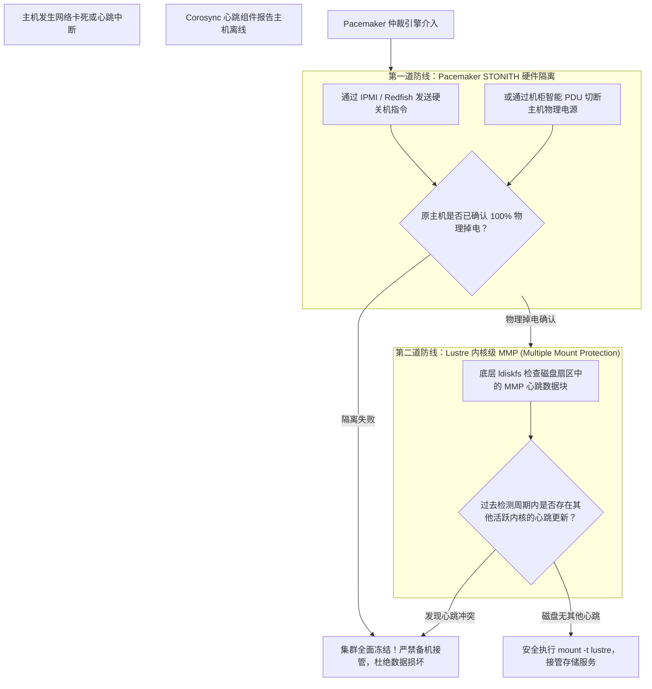

# 23.3 防脑裂双保险机制：STONITH 硬隔离与驱动级 MMP

在双机共享存储架构中，最致命的灾难是 **脑裂（Split-Brain）**：如果心跳链路由于网络抖动发生假死，备机误判主机已宕机并强行挂载共享存储卷；而此时原主机实际上仍在向该卷并发写入。两个独立的 Linux 内核（JBD2 日志引擎与块分配器）同时操作同一物理卷，将在数秒内造成不可逆的文件系统元数据覆写毁灭。

为彻底杜绝脑裂，生产系统构建了“集群管理层 + 存储驱动层”的双层防护网：

## 20.3.1 第一道防线：STONITH（Shoot The Other Node In The Head）
**核心准则**：在备机获准执行 `mount` 接管共享卷之前，集群管理软件必须通过物理带外网络（IPMI、iLO、Redfish）或智能机柜 PDU，强制对原主机执行硬断电。**只有收到硬件层面“已断电（Power Off）”的确定性 ACK 回执，备机才被允许执行挂载**。

## 20.3.2 第二道防线：驱动级 MMP（多挂载保护）
即使管理员误操作关闭了 STONITH，Lustre 的底层文件系统驱动（`ldiskfs`）原生内置了 **MMP（Multiple Mount Protection）** 机制：
- 文件系统在格式化时默认开启 `mmp` 特性（`tune2fs -O mmp /dev/mapper/mpatha`）；
- 内核在挂载该卷后，会启动后台守护线程，每隔固定的周期（默认 5 秒）向磁盘超级块专用的 MMP 数据块中写入最新的随机序列号与主机时间戳；
- 任何节点在尝试挂载该卷时，内核首先读取 MMP 扇区并休眠等待两个周期（约 10 秒）。如果发现扇区内容仍在被其他节点周期性更新，驱动直接拒绝挂载并抛出致命错误，直接阻断了操作系统双挂。

---

