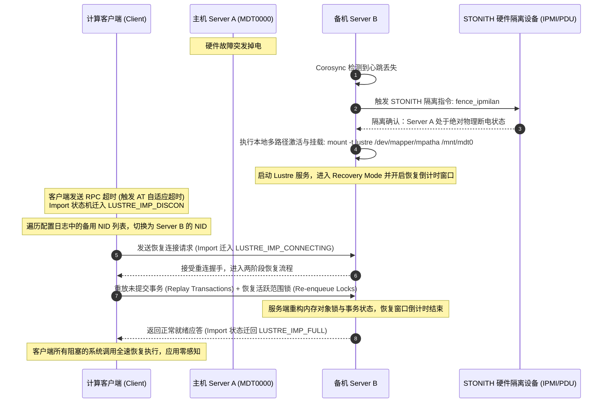

# 23.4 故障转移完整时序与客户端透明重连

当发生突发宕机时，集群底座与 Lustre 客户端内核的协同执行流经以下阶段：

```mermaid
sequenceDiagram
    autonumber
    participant Client as 计算客户端 (Client)
    participant ServerA as 主机 Server A (MDT0000)
    participant ServerB as 备机 Server B
    participant Fence as STONITH 硬件隔离设备 (IPMI/PDU)

    Note over ServerA: 硬件故障突发掉电
    ServerB->>ServerB: Corosync 检测到心跳丢失
    ServerB->>Fence: 触发 STONITH 隔离指令: fence_ipmilan
    Fence-->>ServerB: 隔离确认：Server A 处于绝对物理断电状态
    ServerB->>ServerB: 执行本地多路径激活与挂载: mount -t lustre /dev/mapper/mpatha /mnt/mdt0
    Note over ServerB: 启动 Lustre 服务，进入 Recovery Mode 并开启恢复倒计时窗口
    
    Note over Client: 客户端发送 RPC 超时 (触发 AT 自适应超时)<br/>Import 状态机迁入 LUSTRE_IMP_DISCON
    Note over Client: 遍历配置日志中的备用 NID 列表，切换为 Server B 的 NID
    Client->>ServerB: 发送恢复连接请求 (Import 迁入 LUSTRE_IMP_CONNECTING)
    ServerB-->>Client: 接受重连握手，进入两阶段恢复流程
    Client->>ServerB: 重放未提交事务 (Replay Transactions) + 恢复活跃范围锁 (Re-enqueue Locks)
    Note over ServerB: 服务端重构内存对象锁与事务状态，恢复窗口倒计时结束
    ServerB-->>Client: 返回正常就绪应答 (Import 状态迁回 LUSTRE_IMP_FULL)
    Note over Client: 客户端所有阻塞的系统调用全速恢复执行，应用零感知
```

在整个切换期间，客户端通过保持其挂载状态，仅将用户的读写 I/O 放入等待队列。一旦备机接管并完成两阶段事务重放，挂起的请求即可继续落盘，上层运行的 MPI 计算或 PyTorch 训练无需重新拉起。

---

