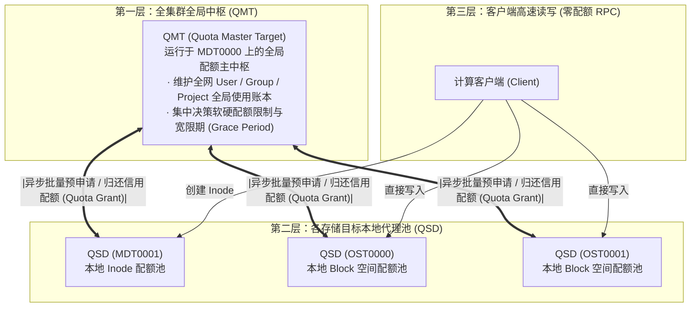
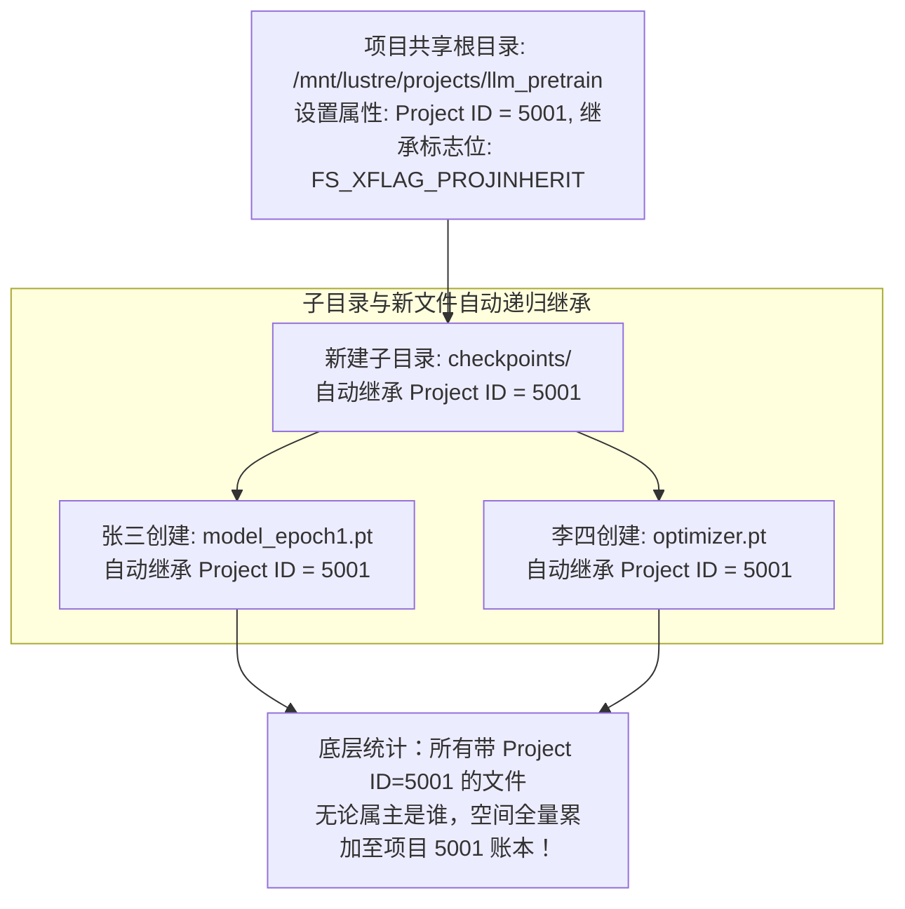
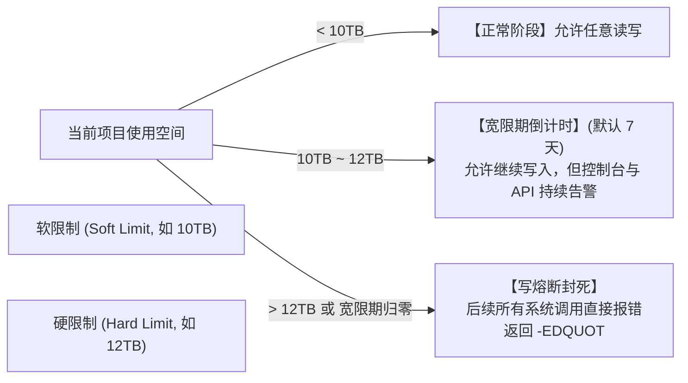
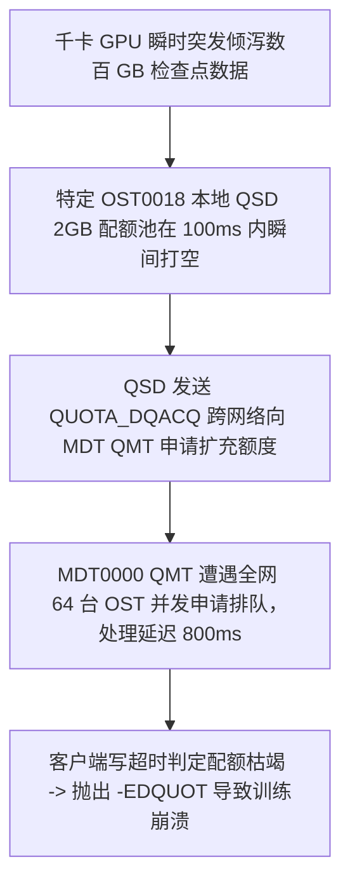

# 第 24 章：企业级磁盘配额系统与空间治理

> **本章核心源码文件**：  
> - `lustre/qmt/qmt_handler.c`：配额主目标（QMT, Quota Master Target）全局记账与配额协调引擎  
> - `lustre/qsd/qsd_handler.c`：配额从设备（QSD, Quota Slave Device）本地配额池与异步申请实现  
> - `lustre/osd-ldiskfs/osd_quota.c`：底层物理块与 Inode 配额硬校验与扣减钩子  
> - `lustre/include/lustre_quota.h`：用户/组/项目（Project）配额数据结构与二阶段配额协议定义  
> - `lustre/utils/lfs_project.c`：用户态目录级项目 ID（Project ID）继承与配置实现  

---

## 24.1 传统配额痛点与分布式配额工程矛盾

在数万台计算节点、数百台存储目标（OST/MDT）的大规模共享存储集群中，实现强一致性的磁盘配额面临极端的工程矛盾：
- **集中式计费的性能瓶颈**：如果每一次文件写入或 Inode 创建都必须同步向中央元数据节点发起网络 RPC 校验配额余额，超算集群的 IOPS 和写入带宽将被彻底掐死在配额锁竞争上；
- **纯本地粗放管理的失控风险**：如果各 OST 完全独立统计，由于用户文件分布在不同的条带对象上，系统无法获知全集群聚合使用总量，极易产生严重的跨节点容量超卖（Over-subscription）与底层磁盘被打爆。

为此，Lustre 构建了 **分层两级分布式配额架构（QMT / QSD 体系）**，在纳秒级本地高性能校验与全集群全局强一致性之间达成了精密的工程平衡：



---

## 24.2 QMT 与 QSD 分布式协调机制

### 24.2.1 角色分工与二阶段信用流转

1. **配额主目标（QMT, Quota Master Target）**：  
   固定驻留在主元数据节点 MDT0000 上。QMT 保存了全集群唯一的权威配额数据库（全局用户、用户组、项目配额上限与当前使用总量）。
2. **配额从设备（QSD, Quota Slave Device）**：  
   运行在集群的每一个 MDT 和 OST 实例中。每个 QSD 维护着本地私有的“配额信用池（Local Quota Pool）”。
3. **快速本地判定（Fast Path）**：  
   当客户端向某台 OST 写入 4MB 数据时，该 OST 本地的 QSD 仅需原子扣减本地信用池。**整个过程完全在 OST 本地内存闭环，不发生任何跨节点的全局网络 RPC**。
4. **异步水位补充（Slow Path）**：  
   当 QSD 本地池中的剩余配额低于预设水位线时，QSD 在后台工作队列中向 QMT 异步批量预支一大块配额信用（Quota Grant，如 10GB）；当用户删除大量数据时，QSD 同样在后台将多余信用返还给 QMT。

---

## 24.3 企业级目录级配额：Project Quota 机制

在多部门、多项目协同的现代大模型研发体系中，传统的 POSIX 用户配额（User Quota）与组配额（Group Quota）存在天然缺陷：
- 算法团队 A 包含 20 名研发人员，大家共同维护一个共享的数据集清洗目录 `/mnt/lustre/projects/nlp_clean`；
- 每个人都在该目录下写入数据，文件属主各不相同。传统 User Quota 无法限制整个目录树的总容量；
- 如果配置 Group Quota，要求所有成员的 Primary GID 严格一致，极大限制了跨组协作灵活性。

Lustre 实现了基于底层 Inode 扩展属性的 **项目配额（Project Quota）**：



- **目录树原子继承（Project Inheritance）**：  
  只要通过 `lfs project -s` 在目标目录上打上 Project ID 并开启继承位，未来在该目录下由任意用户创建的任何子目录、硬链接与文件，均在内核 Inode 分配时原子继承该 Project ID；
- **打破用户边界**：项目配额直接对该 Project ID 对应的全集群物理块数与 Inode 总量实施硬限制，实现了真正的多租户项目级存储空间精准管控。

---

## 24.4 软限制（Soft Limit）、硬限制（Hard Limit）与宽限期（Grace Time）

配额策略在时间与空间维度定义了明确的缓冲弹性：



1. **软限制（Softlimit）**：警戒水位线。一旦跨越，系统并不会立刻中断业务，而是启动 **宽限期倒计时（Grace Timer，默认 7 天）**，为业务留出清理或扩容时间；
2. **硬限制（Hardlimit）**：不可逾越的物理红线。一旦使用量触达硬限制，或者宽限期倒计时归零，底层 OSD 立即执行写熔断，向客户端强行返回错误码 `-EDQUOT`（Disk quota exceeded）；
3. **异构存储池配额（Pool Quotas）**：允许管理员针对 NVMe 全闪存储池（`flash_pool`）与 HDD 大盘存储池（`hdd_pool`）分别设定独立的容量配额，杜绝低优先级项目挤占昂贵的高性能全闪资源。

---

## 24.5 生产实战：配额配置与管理命令集

### 24.5.1 集群配额特性全局开启

在 MGS 上全局激活全集群的用户、组与项目配额特性：

```bash
# 1. 开启全集群针对 OST 空间与 MDT Inode 的全量配额校验 (u=user, g=group, p=project)
lctl conf_param testfs.quota.ost=ugp
lctl conf_param testfs.quota.mdt=ugp
```

### 24.5.2 项目配额配置与目录绑定

```bash
# 2. 为算法团队项目目录配置 Project ID 为 2001 并开启子树递归继承
lfs project -s -p 2001 -r /mnt/lustre/projects/multimodal_team

# 3. 校验该目录下文件的 Project ID 继承状态
lfs project -d -r /mnt/lustre/projects/multimodal_team

# 4. 为项目 2001 设定空间配额 (软限制 20TB, 硬限制 22TB, Inode 硬限制 500 万)
lfs setquota -p 2001 \
    -b 20T -B 22T \
    -i 4500000 -I 5000000 \
    /mnt/lustre

# 5. 调整全局宽限期时限为 5 天 (单位: 秒, 432000s)
lfs setquota -t -p -b 432000 -i 432000 /mnt/lustre

# 6. 查询项目当前的详细配额消耗与宽限期剩余
lfs quota -p 2001 -v /mnt/lustre
```

---

## 24.6 生产事故案例：大规模 Checkpoint 瞬时突发引发 QSD 信用滞后与非预期 `-EDQUOT` 假死

### 24.6.1 故障现象

某千卡 GPU 大模型训练集群在进行 175B 参数模型训练时，主训练流程在执行到第 15,000 步的持久化 Checkpoint 写入时，多个节点的 Rank 进程突然全部抛出异常并崩溃终止：
```text
OSError: [Errno 122] Disk quota exceeded: '/mnt/lustre/projects/llm_run/checkpoint_15000/rank_12_model.pt'
```
系统报错引发整个分布式训练任务失败中断。

然而，运维监控大盘显示：
- 该训练项目分配的空间配额硬限制为 **100TB**；
- 故障发生时，该项目全集群实际已使用的总容量仅为 **62TB**，**剩余可用额度高达近 38TB**；
- 为什么在配额额度绝对充裕的情况下，内核却向应用抛出了 `-EDQUOT`（配额超限）？

### 24.6.2 排查过程

1. **各 OST 本地配额从设备（QSD）池分布审查**：  
   运维人员在报错的特定存储目标 OST0018 上查询本地配额池状态：
   ```bash
   lctl get_param osd-ldiskfs.testfs-OST0018.quota_slave.*
   ```
   **排查发现**：在全集群 64 台 OST 中，报错的 OST0018 上的本地配额池余额已经归零，且其状态被置为了 `QSD_FL_BLOCKED`（处于向 QMT 申请补充信用中的阻塞态）。

2. **根因机理深入剖析**：  
   - 千卡 GPU 在保存检查点时，所有节点在 **几十毫秒的极短窗口内同时发起突发并发写入**；
   - 由于该模型文件采用了复合宽条带化布局（Stripe Count = 32），大量数据流瞬间涌入特定几台哈希命中的 OST（如 OST0018）；
   - OST0018 本地 QSD 预先持有的配额缓冲（Quota Grant）仅有 2GB，在短短 100 毫秒内被瞬间耗尽；
   - 按照协议，QSD 此时必须向主元数据节点 MDT0000 上的 QMT 发送 `QUOTA_DQACQ` RPC 申请补充配额；
   - 当时网络中同时有 64 台 OST 的 QSD 正在并发向 QMT 挤压申请配额，导致 QMT 处理队列发生微小的排队延迟（约 800 毫秒）；
   - 在客户端内核的 `cl_io` 状态机中，由于写入请求未能从本地 QSD 及时借出额度，且等待超时，底层驱动直接做出了悲观判定，向应用层返回了 `-EDQUOT`，造成了恶劣的“**配额充裕下的假性配额不足熔断**”。



### 24.6.3 修复措施与成效

1. **调优 QSD 最小预留配额单元（Least Unit）**：  
   在所有 OST 上将单次 QSD 自动预申请的配额下限大幅放大，避免高吞吐下高频向 QMT 乞求配额：
   ```bash
   # 将单次配额预申请最小单元由默认的 100MB 提高至 4GB
   lctl set_param osd-ldiskfs.*.quota_least_unit=4194304
   ```
2. **调整客户端配额超时容忍时限**：  
   在客户端内核中放宽对配额刷新等待的超时阈值（`quota_bunit_sz`），允许在后台异步补充期间实施微秒级平滑退避等待，而不是激进地直接报硬错误。

优化参数部署后，再次执行千卡 Checkpoint 压测，QSD 本地池始终保持充盈状态，跨目标批量写入全速完成，再未发生假性配额溢出故障。

---

## 24.7 运维基线检查清单

- [ ] **高并发大吞吐集群调大 `quota_least_unit`**：在承载 GPU 训练等突发大写作业的集群中，必须将 QSD 的最小配额分配单元调大至 2GB~4GB，防止本地配额池毫秒级击穿。
- [ ] **多租户目录强制配置 Project Quota**：面向共享项目与团队协作目录，必须使用 `lfs project -s` 开启目录树继承，杜绝基于 User Quota 导致的责任主体漂移与无法限额。
- [ ] **定期巡检宽限期倒计时状态**：配置 Prometheus 告警规则监控 `lfs quota` 输出中的 `grace` 字段，在倒计时归零前提前介入扩容或推动用户治理空间。
- [ ] **合理设置软硬限制缓冲区间**：软限制与硬限制之间必须保留至少 10%~15% 的弹性缓冲区，严禁将两者设为同一数值，防止业务在突发写入时直接猝死。

---

## 本章小结

本章系统剖析了 Lustre 分布式磁盘配额体系的架构原理与工程落地策略：
1. **两级分层治理模型**：通过 MDT QMT 全局权威账本与各 OST/MDT QSD 本地信用池的协同，完美兼顾了单节点纳秒级写入吞吐与全集群全局一致性；
2. **现代项目级配额（Project Quota）**：通过目录树级别的 Project ID 自动继承机制，彻底解决了多租户团队共享目录无法统一限额的历史痛点；
3. **软硬结合的弹性缓冲**：解析了软限制、硬限制与宽限期倒计时机制在保障存储安全与提升用户体验之间的平衡艺术；
4. **突发流量防护范式**：结合千卡并发写入引发 QSD 信用滞后的典型假死事故，确立了配额预分配单元（Least Unit）的科学调优基准。
