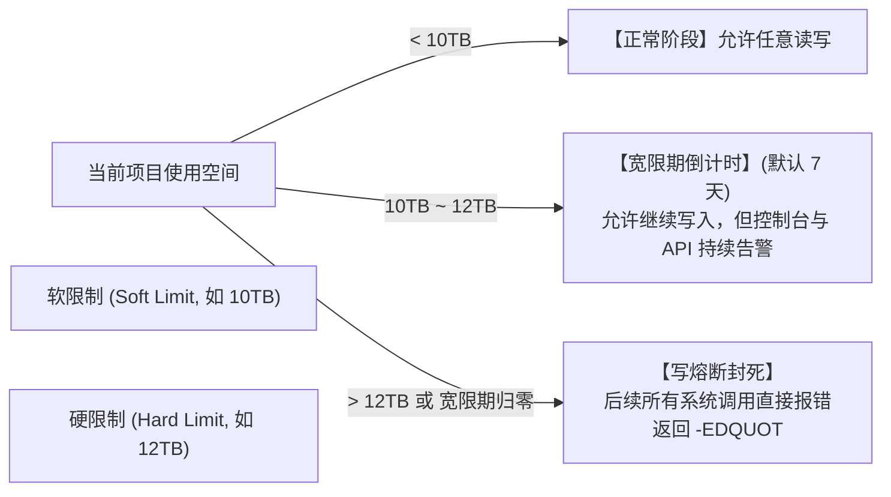

# 24.4 软限制（Soft Limit）、硬限制（Hard Limit）与宽限期（Grace Time）

配额策略在时间与空间维度定义了明确的缓冲弹性：

1. **软限制（Softlimit）**：警戒水位线。一旦跨越，系统并不会立刻中断业务，而是启动 **宽限期倒计时（Grace Timer，默认 7 天）**，为业务留出清理或扩容时间；
2. **硬限制（Hardlimit）**：不可逾越的物理红线。一旦使用量触达硬限制，或者宽限期倒计时归零，底层 OSD 立即执行写熔断，向客户端强行返回错误码 `-EDQUOT`（Disk quota exceeded）；
3. **异构存储池配额（Pool Quotas）**：允许管理员针对 NVMe 全闪存储池（`flash_pool`）与 HDD 大盘存储池（`hdd_pool`）分别设定独立的容量配额，杜绝低优先级项目挤占昂贵的高性能全闪资源。

---

