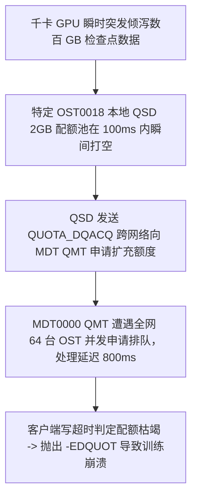

# 24.6 生产事故案例：大规模 Checkpoint 瞬时突发引发 QSD 信用滞后与非预期 -EDQUOT 假死

## 24.6.1 故障现象

某千卡 GPU 大模型训练集群在进行 175B 参数模型训练时，主训练流程在执行到第 15,000 步的持久化 Checkpoint 写入时，多个节点的 Rank 进程突然全部抛出异常并崩溃终止：
```text
OSError: [Errno 122] Disk quota exceeded: '/mnt/lustre/projects/llm_run/checkpoint_15000/rank_12_model.pt'
```
系统报错引发整个分布式训练任务失败中断。

然而，运维监控大盘显示：
- 该训练项目分配的空间配额硬限制为 **100TB**；
- 故障发生时，该项目全集群实际已使用的总容量仅为 **62TB**，**剩余可用额度高达近 38TB**；
- 为什么在配额额度绝对充裕的情况下，内核却向应用抛出了 `-EDQUOT`（配额超限）？

## 24.6.2 排查过程

1. **各 OST 本地配额从设备（QSD）池分布审查**：  
   运维人员在报错的特定存储目标 OST0018 上查询本地配额池状态：
   ```bash
   lctl get_param osd-ldiskfs.testfs-OST0018.quota_slave.*
   ```
   **排查发现**：在全集群 64 台 OST 中，报错的 OST0018 上的本地配额池余额已经归零，且其状态被置为了 `QSD_FL_BLOCKED`（处于向 QMT 申请补充信用中的阻塞态）。

2. **根因机理深入剖析**：  
   - 千卡 GPU 在保存检查点时，所有节点在 **几十毫秒的极短窗口内同时发起突发并发写入**；
   - 由于该模型文件采用了复合宽条带化布局（Stripe Count = 32），大量数据流瞬间涌入特定几台哈希命中的 OST（如 OST0018）；
   - OST0018 本地 QSD 预先持有的配额缓冲（Quota Grant）仅有 2GB，在短短 100 毫秒内被瞬间耗尽；
   - 按照协议，QSD 此时必须向主元数据节点 MDT0000 上的 QMT 发送 `QUOTA_DQACQ` RPC 申请补充配额；
   - 当时网络中同时有 64 台 OST 的 QSD 正在并发向 QMT 挤压申请配额，导致 QMT 处理队列发生微小的排队延迟（约 800 毫秒）；
   - 在客户端内核的 `cl_io` 状态机中，由于写入请求未能从本地 QSD 及时借出额度，且等待超时，底层驱动直接做出了悲观判定，向应用层返回了 `-EDQUOT`，造成了恶劣的“**配额充裕下的假性配额不足熔断**”。



## 24.6.3 修复措施与成效

1. **调优 QSD 最小预留配额单元（Least Unit）**：  
   在所有 OST 上将单次 QSD 自动预申请的配额下限大幅放大，避免高吞吐下高频向 QMT 乞求配额：
   ```bash
   # 将单次配额预申请最小单元由默认的 100MB 提高至 4GB
   lctl set_param osd-ldiskfs.*.quota_least_unit=4194304
   ```
2. **调整客户端配额超时容忍时限**：  
   在客户端内核中放宽对配额刷新等待的超时阈值（`quota_bunit_sz`），允许在后台异步补充期间实施微秒级平滑退避等待，而不是激进地直接报硬错误。

优化参数部署后，再次执行千卡 Checkpoint 压测，QSD 本地池始终保持充盈状态，跨目标批量写入全速完成，再未发生假性配额溢出故障。

---

