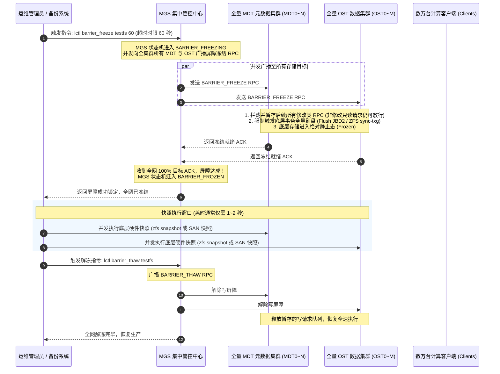
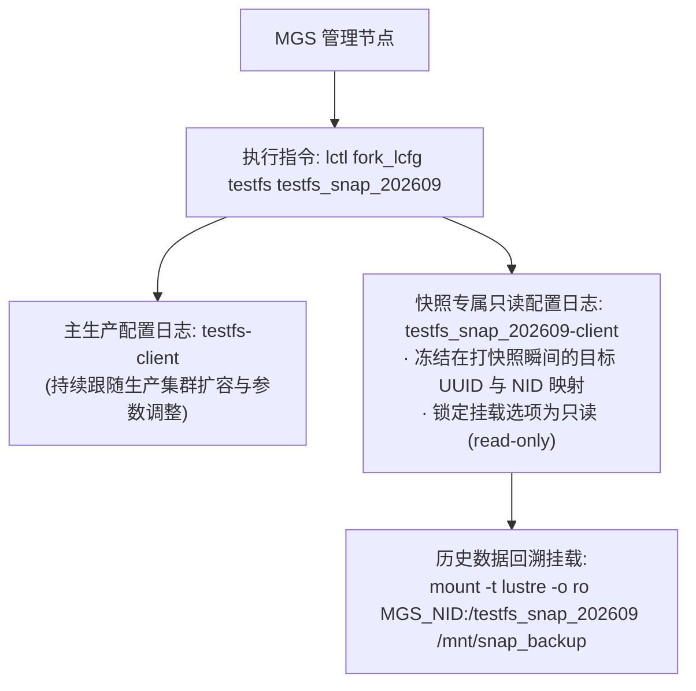
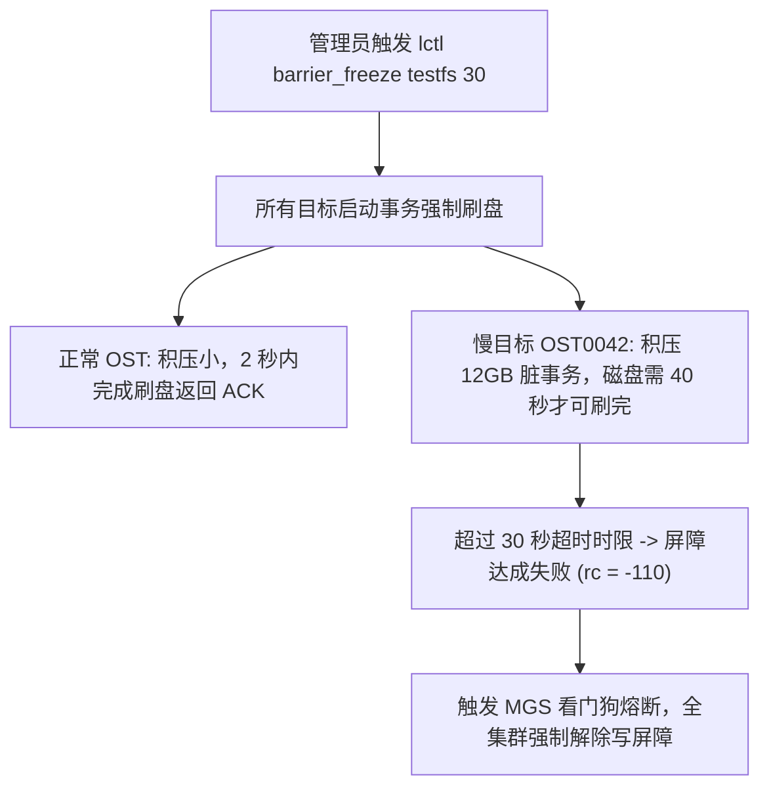

# 第 25 章：分布式写屏障（Barrier）与集群级全局快照

> **本章核心源码文件**：  
> - `lustre/mgs/mgs_barrier.c`：全集群分布式写屏障（Write Barrier）协调引擎与状态机实现  
> - `lustre/dt_run/barrier.c`：底层 OSD 存储目标事务冻结、刷盘与解除实现  
> - `lustre/osd-zfs/osd_snapshot.c`：基于 ZFS 数据集快照的底层协同创建与回滚  
> - `lustre/utils/lfs_snapshot.c`：用户态 `lctl snapshot_*` 与 `lctl barrier_*` 控制命令实现  
> - `lustre/mgs/mgs_llog.c`：快照专属配置日志分支（`fork_lcfg` / `erase_lcfg`）实现  

---

## 25.1 跨节点一致性快照的工程困境

在包含数十台 MDT 元数据服务器、数百台 OST 数据存储节点的大规模分布式存储系统中，为全集群创建崩溃一致性（Crash-Consistent）的历史数据快照，是一项极具挑战的分布式协同难题：
- **时钟与网络延迟不对齐**：如果直接向各个存储节点异步发送单机快照命令（如对各盘独立执行 `zfs snapshot`），由于网络往返时间差与各节点处理延迟，节点 A 在 $T_1$ 时刻打快照，节点 B 在 $T_1 + 50\text{ms}$ 时刻打快照；
- **元数据与条带断链**：在这 50 毫秒的空隙内，客户端可能刚刚删除了文件元数据但尚未删除 OST 对象，或者刚刚写入了新条带但元数据尚未提交。异步单机快照拼接出的全集群镜像将充斥着大量孤儿对象与悬空 Inode，**该快照挂载后甚至无法通过文件系统一致性校验**；
- **停机维护代价高昂**：若采用传统的离线方案（将数万台客户端全量卸载后挂停维护再打快照），业务中断时间将以小时计，在 7x24 小时连续运行的智算中心中完全无法接受。

为了实现 **在线不停机、全集群客户端无感且具备强一致性的全局快照**，Lustre 开发了 **分布式写屏障（Distributed Write Barrier）** 与 **快照配置分支（Forked Config Log）** 机制。

---

## 25.2 分布式写屏障（Barrier）协议时序与状态机

分布式写屏障的核心思想是：**在极其短暂的安全时间窗口内（通常为 1~3 秒），通过协议协同命令全网所有活动目标暂停接纳具有修改属性的写请求，强行将各节点内存中的在途事务同步落盘，使全集群瞬时收敛至一个全局冻结的静止时间点（Point-in-Time）**。



### 屏障阶段关键机制剖析

1. **写请求暂存与排队（Request Queuing）**：  
   在屏障冻结（Frozen）期间，计算客户端发来的新写请求并不会报错拒绝，而是被存储目标的服务队列（NRS 调度器）安静地暂存起来。客户端仅感知到该系统调用的响应出现微秒/秒级的瞬时停顿；
2. **只读请求直通放行**：  
   对于不改变任何元数据与物理块的只读查询（如 `getattr`、`read`、`stat`），各目标节点依然照常并发处理，最大程度降低了对在途业务的冲击；
3. **超时自动熔断保活（Auto-Thaw Watchdog）**：  
   为了防止因快照脚本异常导致集群被无限期冻结，`barrier_freeze` 必须显式声明超时时限（例如 60 秒）。一旦倒计时归零且未收到管理员的解冻指令，MGS 的看门狗计时器强制触发自动解冻（Auto-Thaw），确保生产业务底线安全。

---

## 25.3 快照配置日志分支：`fork_lcfg` 与只读挂载

成功对全集群存储目标创建了底层块/数据集快照后，面临的下一个问题是：**如何将这套历史快照作为独立的文件系统挂载并对外提供只读数据回溯？**

Lustre 采用了 **配置日志分支（Fork Configuration Log）** 机制：



- **配置与历史对齐**：通过 `lctl fork_lcfg`，MGS 从当前生产日志中完整复制出一份分支日志。当客户端挂载快照时，其连接的是快照当时所属的只读目标列表，即使未来生产集群增加了新的 OST，快照的命名空间与拓扑结构依然维持历史原貌；
- **配置清理**：当快照生命周期结束并被销毁时，通过 `lctl erase_lcfg` 彻底擦除分支日志，保持 MGS 内部 LLOG 数据库的轻量纯洁。

---

## 25.4 生产实战：写屏障与快照管理指令集

### 25.4.1 分布式写屏障控制流程

```bash
# 1. 冻结全集群写操作，设定最大容忍超时窗口为 60 秒
lctl barrier_freeze testfs 60

# 2. 检查写屏障当前是否已经成功处于全网达成状态 (FROZEN)
lctl barrier_stat testfs
# 预期正常输出：
# state: 'frozen'
# timeout: 58 seconds remaining

# 3. 此时可在后台安全并行触发各存储节点的快照脚本 (如 zfs snapshot 或 SAN 快照)
# (例如: pdsh -g mds,oss "zfs snapshot -r storage_pool/ost@snap_20260927")

# 4. 快照创建完成后，立即全网解冻，恢复业务并发写入
lctl barrier_thaw testfs

# 再次确认屏障状态已恢复为正常未激活态 (IDLE)
lctl barrier_stat testfs
# 预期输出：state: 'idle'
```

### 25.4.2 快照配置分支与历史数据挂载

```bash
# 1. 在 MGS 上为新快照创建专属只读配置日志分支
lctl fork_lcfg testfs testfs_snap_20260927

# 2. 挂载历史快照至专门的数据恢复审计路径 (只读模式)
mount -t lustre -o ro 10.10.10.100@o2ib:/testfs_snap_20260927 /mnt/snapshot_view

# 3. 验证历史数据完整性并按需提取误删文件
ls -la /mnt/snapshot_view/projects/important_model/

# 4. 快照生命周期结束卸载后，擦除该配置日志分支
umount /mnt/snapshot_view
lctl erase_lcfg testfs_snap_20260927
```

---

## 25.5 生产事故案例：大写突发期间写屏障超时熔断与长尾 OST 事务挂起

### 25.5.1 故障现象

某国家基因工程实验室计划在每日凌晨进行基于写屏障的自动化全局快照备份。备份控制平台调用定时任务执行：
```bash
lctl barrier_freeze testfs 30
```
然而，脚本执行后并未在预期的 3 秒内返回成功，而是持续卡顿了整整 30 秒，最终抛出错误退出：
```text
error: barrier_freeze: LustreError: 1842:0: communication timed out: target 'testfs-OST0042' failed to freeze, rc = -110 (Connection timed out)
barrier: operation failed, filesystem automatically thawed!
```
由于写屏障未达成，全集群备份任务失败。更严重的是，部分上层分析任务在此期间感知到了长达 30 秒的 I/O 挂起停顿。

### 25.5.2 排查过程

1. **定位未就绪的长尾存储目标**：  
   从报错日志中明确锁定了唯一未能及时响应屏障的节点——`testfs-OST0042`。
2. **该节点底层 I/O 状态追踪**：  
   运维人员登录承载 OST0042 的存储服务器进行指标审计：
   ```bash
   lctl get_param osd-ldiskfs.testfs-OST0042.stats
   iostat -x -k 1 5
   ```
   **数据分析**：  
   - 该服务器挂载的底层磁盘阵列在当时遭遇了严重的硬件写入风暴（`%util` 达到 100%）；
   - 在触发屏障指令的瞬间，该 OST 刚好接收到一个多线程密集写入的大型训练数据集落盘请求，内核 JBD2 日志队列中积压了超过 **12GB 的未提交脏事务（Uncommitted Transactions）**；
   - 屏障协议要求目标在返回 Freeze ACK 前，**必须将当前在途的所有脏事务全量物理刷盘并落盘确认**；
   - 由于该磁盘阵列的连续写入带宽仅为 300MB/s，清空这 12GB 的在途积压需要超过 **40 秒**；
   - 而管理员设置的屏障全局超时时间仅有狭隘的 `30 秒`。倒计时归零时刷盘仍未结束，MGS 判定操作超时失败并触发自动解冻熔断。



### 25.5.3 修复措施与成效

1. **优化生产屏障前置准备时序**：  
   修改备份自动化控制脚本：在执行 `barrier_freeze` 之前，**提前 30 秒向全网广播触发预刷盘信号（Pre-sync）**，将大部分脏数据平滑回写，消除瞬时清空峰值；
2. **合理放宽容忍超时时限**：  
   结合集群最大磁盘阵列的物理落盘吞吐能力，将屏障超时参数由保守的 30 秒调整为更加科学的 90 秒：
   ```bash
   lctl barrier_freeze testfs 90
   ```
3. **加固成效**：  
   经过参数与时序优化后，重新执行全局快照测试。全集群 128 台 OST 在 4 秒内全部完成事务收敛并返回冻结确认；快照脚本在 1.5 秒内完成全网 ZFS 快照创建并即刻触发 `barrier_thaw`。全流程业务无感平稳通过，快照镜像 100% 具备强一致性。

---

## 25.6 运维基线检查清单

- [ ] **执行 `barrier_freeze` 必须指定合理的超时时限**：严禁将超时参数设得过短（通常建议在 60~120 秒之间），必须留出长尾慢节点清空脏事务的物理落盘时间。
- [ ] **快照创建完成后必须显式触发 `barrier_thaw`**：严禁依赖超时等待自动解冻，快照脚本必须在 `try...finally` 块中确保解冻指令被 100% 执行。
- [ ] **定期演练快照挂载与恢复验证**：每月抽取历史快照，通过 `fork_lcfg` 挂载至隔离验证节点，验证文件一致性与校验和，防止“打了快照却无法恢复”。
- [ ] **监控长尾存储目标在途事务深度**：在计划打快照前，检查各 OST 的 `cur_dirty_bytes`，尽量避开业务 Checkpoint 倾泻的尖峰时段。

---

## 本章小结

本章系统阐述了超大规模分布式存储集群全局一致性快照的底层实现体系：
1. **破除异步快照悖论**：分布式写屏障（Barrier）机制通过短暂停顿写修改、强制事务收敛刷盘，彻底解决了多节点异步快照必然导致的跨目标条带元数据撕裂难题；
2. **轻量在线与业务保活**：通过只读流量直通放行、写请求透明队列排队以及看门狗自动解冻熔断，实现了在全集群不停机状态下的秒级快照创建；
3. **快照分支与历史对齐**：依托 `fork_lcfg` 机制构建了快照专属配置日志分支，确保历史镜像在未来集群拓扑演进中始终保持静态可访问性；
4. **长尾刷盘避坑范式**：结合高并发写入下屏障超时的典型生产案例，确立了前置平滑预刷盘与科学超时窗口的工程实战规范。
