# 25.2 分布式写屏障（Barrier）协议时序与状态机

分布式写屏障的核心思想是：**在极其短暂的安全时间窗口内（通常为 1~3 秒），通过协议协同命令全网所有活动目标暂停接纳具有修改属性的写请求，强行将各节点内存中的在途事务同步落盘，使全集群瞬时收敛至一个全局冻结的静止时间点（Point-in-Time）**。

```mermaid
sequenceDiagram
    autonumber
    participant Admin as 运维管理员 / 备份系统
    participant MGS as MGS 集中管控中心
    participant MDTs as 全量 MDT 元数据集群 (MDT0~N)
    participant OSTs as 全量 OST 数据集群 (OST0~M)
    participant Clients as 数万台计算客户端 (Clients)

    Admin->>MGS: 触发指令: lctl barrier_freeze testfs 60 (超时时限 60 秒)
    Note over MGS: MGS 状态机进入 BARRIER_FREEZING<br/>并发向全集群所有 MDT 与 OST 广播屏障冻结 RPC
    
    par 并发广播至所有存储目标
        MGS->>MDTs: 发送 BARRIER_FREEZE RPC
        MGS->>OSTs: 发送 BARRIER_FREEZE RPC
    end

    Note over MDTs,OSTs: 1. 拦截并暂存后续所有修改类 RPC (非修改只读请求仍可放行)<br/>2. 强制触发底层事务全量刷盘 (Flush JBD2 / ZFS sync-txg)<br/>3. 底层存储进入绝对静止态 (Frozen)

    MDTs-->>MGS: 返回冻结就绪 ACK
    OSTs-->>MGS: 返回冻结就绪 ACK
    
    Note over MGS: 收到全网 100% 目标 ACK，屏障达成！<br/>MGS 状态机迁入 BARRIER_FROZEN
    MGS-->>Admin: 返回屏障成功锁定，全网已冻结

    rect rgb(240, 248, 255)
        Note over Admin,OSTs: 快照执行窗口 (耗时通常仅需 1~2 秒)
        Admin->>MDTs: 并发执行底层硬件快照 (zfs snapshot 或 SAN 快照)
        Admin->>OSTs: 并发执行底层硬件快照 (zfs snapshot 或 SAN 快照)
    end

    Admin->>MGS: 触发解冻指令: lctl barrier_thaw testfs
    Note over MGS: 广播 BARRIER_THAW RPC
    MGS->>MDTs: 解除写屏障
    MGS->>OSTs: 解除写屏障
    Note over MDTs,OSTs: 释放暂存的写请求队列，恢复全速执行
    MGS-->>Admin: 全网解冻完毕，恢复生产
```

## 屏障阶段关键机制剖析

1. **写请求暂存与排队（Request Queuing）**：  
   在屏障冻结（Frozen）期间，计算客户端发来的新写请求并不会报错拒绝，而是被存储目标的服务队列（NRS 调度器）安静地暂存起来。客户端仅感知到该系统调用的响应出现微秒/秒级的瞬时停顿；
2. **只读请求直通放行**：  
   对于不改变任何元数据与物理块的只读查询（如 `getattr`、`read`、`stat`），各目标节点依然照常并发处理，最大程度降低了对在途业务的冲击；
3. **超时自动熔断保活（Auto-Thaw Watchdog）**：  
   为了防止因快照脚本异常导致集群被无限期冻结，`barrier_freeze` 必须显式声明超时时限（例如 60 秒）。一旦倒计时归零且未收到管理员的解冻指令，MGS 的看门狗计时器强制触发自动解冻（Auto-Thaw），确保生产业务底线安全。

---

