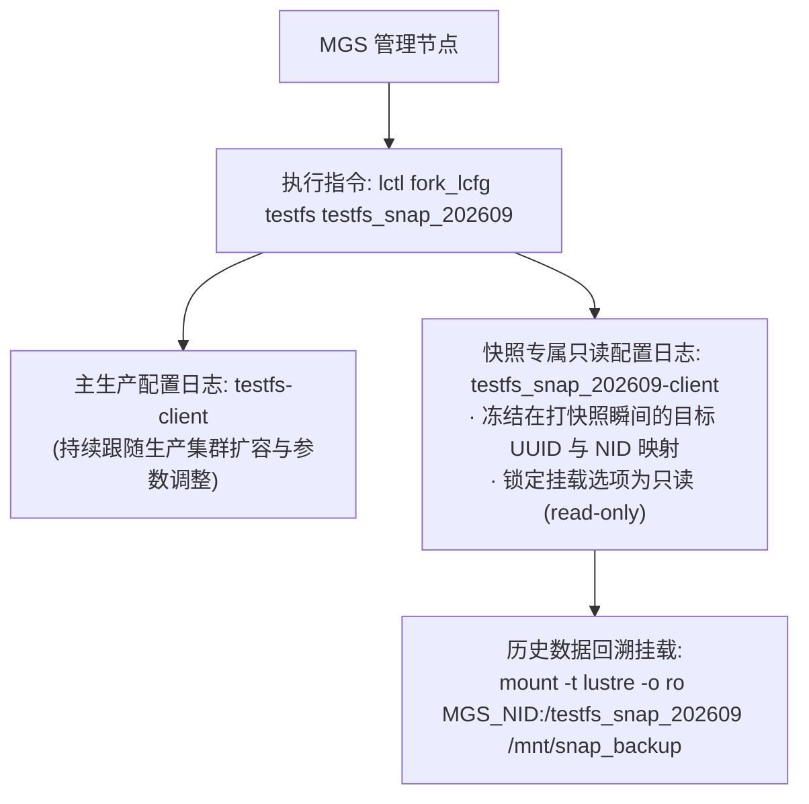

# 25.3 快照配置日志分支：fork_lcfg 与只读挂载

成功对全集群存储目标创建了底层块/数据集快照后，面临的下一个问题是：**如何将这套历史快照作为独立的文件系统挂载并对外提供只读数据回溯？**

Lustre 采用了 **配置日志分支（Fork Configuration Log）** 机制：

- **配置与历史对齐**：通过 `lctl fork_lcfg`，MGS 从当前生产日志中完整复制出一份分支日志。当客户端挂载快照时，其连接的是快照当时所属的只读目标列表，即使未来生产集群增加了新的 OST，快照的命名空间与拓扑结构依然维持历史原貌；
- **配置清理**：当快照生命周期结束并被销毁时，通过 `lctl erase_lcfg` 彻底擦除分支日志，保持 MGS 内部 LLOG 数据库的轻量纯洁。

---

