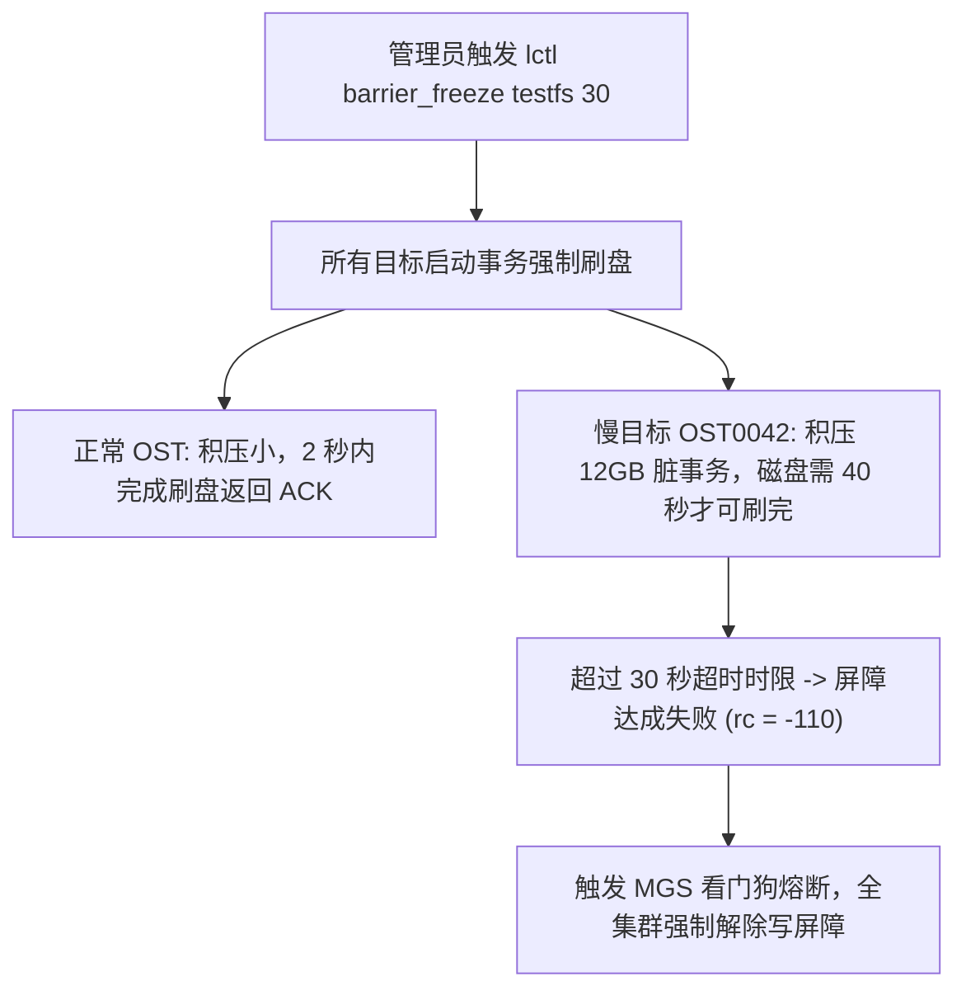

# 25.5 生产事故案例：大写突发期间写屏障超时熔断与长尾 OST 事务挂起

## 25.5.1 故障现象

某国家基因工程实验室计划在每日凌晨进行基于写屏障的自动化全局快照备份。备份控制平台调用定时任务执行：
```bash
lctl barrier_freeze testfs 30
```
然而，脚本执行后并未在预期的 3 秒内返回成功，而是持续卡顿了整整 30 秒，最终抛出错误退出：
```text
error: barrier_freeze: LustreError: 1842:0: communication timed out: target 'testfs-OST0042' failed to freeze, rc = -110 (Connection timed out)
barrier: operation failed, filesystem automatically thawed!
```
由于写屏障未达成，全集群备份任务失败。更严重的是，部分上层分析任务在此期间感知到了长达 30 秒的 I/O 挂起停顿。

## 25.5.2 排查过程

1. **定位未就绪的长尾存储目标**：  
   从报错日志中明确锁定了唯一未能及时响应屏障的节点——`testfs-OST0042`。
2. **该节点底层 I/O 状态追踪**：  
   运维人员登录承载 OST0042 的存储服务器进行指标审计：
   ```bash
   lctl get_param osd-ldiskfs.testfs-OST0042.stats
   iostat -x -k 1 5
   ```
   **数据分析**：  
   - 该服务器挂载的底层磁盘阵列在当时遭遇了严重的硬件写入风暴（`%util` 达到 100%）；
   - 在触发屏障指令的瞬间，该 OST 刚好接收到一个多线程密集写入的大型训练数据集落盘请求，内核 JBD2 日志队列中积压了超过 **12GB 的未提交脏事务（Uncommitted Transactions）**；
   - 屏障协议要求目标在返回 Freeze ACK 前，**必须将当前在途的所有脏事务全量物理刷盘并落盘确认**；
   - 由于该磁盘阵列的连续写入带宽仅为 300MB/s，清空这 12GB 的在途积压需要超过 **40 秒**；
   - 而管理员设置的屏障全局超时时间仅有狭隘的 `30 秒`。倒计时归零时刷盘仍未结束，MGS 判定操作超时失败并触发自动解冻熔断。



## 25.5.3 修复措施与成效

1. **优化生产屏障前置准备时序**：  
   修改备份自动化控制脚本：在执行 `barrier_freeze` 之前，**提前 30 秒向全网广播触发预刷盘信号（Pre-sync）**，将大部分脏数据平滑回写，消除瞬时清空峰值；
2. **合理放宽容忍超时时限**：  
   结合集群最大磁盘阵列的物理落盘吞吐能力，将屏障超时参数由保守的 30 秒调整为更加科学的 90 秒：
   ```bash
   lctl barrier_freeze testfs 90
   ```
3. **加固成效**：  
   经过参数与时序优化后，重新执行全局快照测试。全集群 128 台 OST 在 4 秒内全部完成事务收敛并返回冻结确认；快照脚本在 1.5 秒内完成全网 ZFS 快照创建并即刻触发 `barrier_thaw`。全流程业务无感平稳通过，快照镜像 100% 具备强一致性。

---

