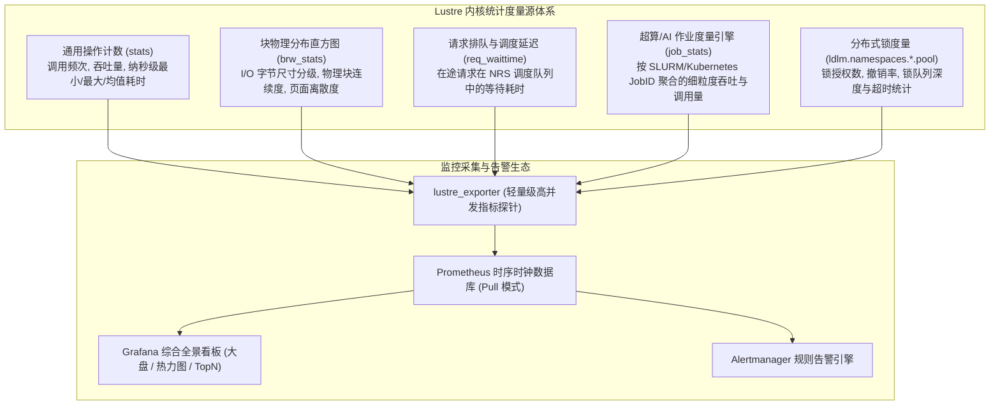
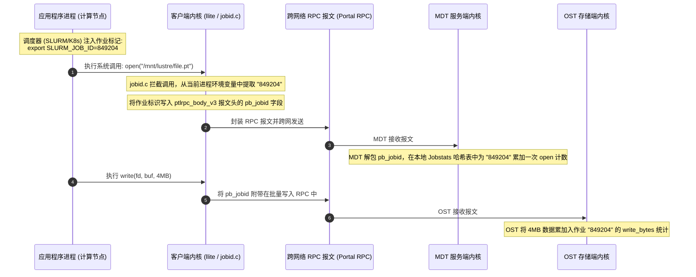

# 第 26 章：性能监控、指标度量与可观测性体系

> **本章核心源码文件**：  
> - `lustre/obdclass/lprocfs_status.c`：内核统计框架与 procfs/sysfs 虚拟文件系统指标导出实现  
> - `lustre/obdclass/jobid.c`：Jobstats 作业标识解析、调度环境变量捕获与聚合度量引擎  
> - `lustre/include/lprocfs_status.h`：统计直方图、衰减计数器与高精度采样数据结构定义  
> - `lustre/osc/lproc_osc.c`：客户端传输延迟、在途 RPC 与脏数据指标收集实现  
> - `lustre/obdfilter/lproc_obdfilter.c`：OST 块读写统计、物理 I/O 分布直方图（`brw_stats`）实现  

---

## 21.1 内核级度量源：procfs 与 sysfs 监控全景

在承载数万张 GPU 互联、聚合吞吐达数百 GB/s 的超大规模高性能计算与 AI 训练基础设施中，外部黑盒式监控（如传统的 SNMP 探针、仅度量操作系统磁盘繁忙率的 `iostat`）完全无法揭示分布式存储内核的深层状态。当集群发生长尾抖动时，粗粒度的指标无法回答：是网络丢包导致的重传、LDLM 锁撤销引发的流水线冻结，还是后端物理盘的碎片化寻道？

Lustre 在内核态内置了极低系统开销（基于 Per-CPU 变量与无锁原子累加器）的多维观测度量源，通过 `/proc/fs/lustre/`（老版本）及现代统一的 `/sys/fs/lustre/` 向用户态开放：



### 21.1.1 核心指标文件与内核度量语义

| 指标文件路径 | 作用组件 | 核心输出字段与工程诊断价值 |
| :--- | :--- | :--- |
| `obdfilter.*.stats` / `mdt.*.stats` | OST / MDT | `read_bytes`、`write_bytes`（吞吐）、`open`、`close`、`getattr`（IOPS）。包含各操作的样本数、累计值、方差及最小/最大微秒耗时。 |
| `obdfilter.*.brw_stats` | OST 存储层 | **I/O 块尺寸分布直方图**（从 4KB 至 4MB 的占比）与 **页面离散度（Discontiguous Pages）**，直接诊断是否存在恶劣的微小碎片写入。 |
| `ost.OSS.ost_io.req_waittime` | OSS 服务端 | 报文从到达网卡入队到被工作线程取出处理的时间差。若均值持续超过 10 毫秒，表明 OSS 线程池严重耗尽。 |
| `osc.*.cur_active_rpcs` | 计算客户端 | 客户端当前向各 OST 投递的在途 RPC 并发度，用于识别特定目标通道的网络瓶颈。 |
| `mds.MDS.service.reqbuf_avail` | MDS 服务端 | MDS 剩余的未经请求网络 RPC 缓冲区数量。数值降为 0 说明服务端即将发生网络背压丢包。 |
| `*.job_stats` | MDT / OST | 按作业 ID 归纳的多维立体报表，精准追踪作业粒度的读写带宽与元数据调用频率。 |

---

## 21.2 物理 I/O 分布直方图：`brw_stats` 深度解析

在大规模顺序写场景下，磁盘驱动器最期望接收到 1MB 或 4MB 且物理扇区完全连续的数据块。`brw_stats` 通过二维直方图揭示了落盘特征：

```text
# lctl get_param obdfilter.testfs-OST0000.brw_stats
pages   per   rpc         rw
1:              0           0
2:              0           0
4:            120           0
...
256:       154820    89421000   (1MB 规整大块 I/O 占比达到 98.2%)
1024:           0           0

discontiguous pages       rw
0:         154800    89420000   (0 离散表示 100% 物理块连续)
1:             20        1000
```

- **I/O 规整度分析**：若直方图中 4KB（1 page）至 16KB（4 pages）的占比极高，说明业务程序存在大量未经过聚合的非对齐微小写入，将直接导致后端磁盘控制器产生严重的写入放大与寻道延迟；
- **页面不连续度（Discontiguous Pages）**：反映底层分配器分配给同一 RPC 的多个内存页在底层块设备上的离散程度。数值越小，表明磁盘连续磁道写入效果越好。

---

## 21.3 超算与 AI 作业度量引擎：Jobstats

在由数百个科研团队、数千个容器混合调度的共享超算平台中，传统的“节点级”监控（如观测到某台节点 I/O 暴涨）往往无法锁定具体责任人：单台计算节点可能同时运行着属于不同用户的多个作业，或者数千台计算节点同时被同一个分布式大模型训练作业占用。

Lustre 原生开发了 **Jobstats 作业级度量引擎**（`lustre/obdclass/jobid.c`）：



### 21.3.1 配置与支持的作业环境解析模式

通过 `lctl conf_param` 可全集群指定作业标识的提取模式：

```bash
# 1. 适配 SLURM 调度系统 (从进程环境变量 SLURM_JOB_ID 自动提取)
lctl conf_param testfs.sys.jobid_var=SLURM_JOB_ID

# 2. 适配 PBS / Torque 调度系统
lctl conf_param testfs.sys.jobid_var=PBS_JOBID

# 3. 适配通用多租户环境 (自动提取进程名与 Linux 用户 UID: procname.uid)
lctl conf_param testfs.sys.jobid_var=procname_uid

# 4. 控制每个 Target 最多追踪的最近活跃作业数量 (默认 512，可调整为 2048)
lctl set_param *.job_stats_max_jobs=2048
```

---

## 21.4 现代可观测性体系构建：Prometheus 与 Grafana 全景集成

现代企业级部署通过结合云原生可观测性工具链，实现高频低负载指标采集与全景呈现：

```mermaid
flowchart LR
    subgraph Storage_Nodes ["全集群存储节点 (MDS / OSS)"]
        PROC["/sys/fs/lustre/*"] --> EXP["lustre_exporter (Go 二进制探针)<br/>端口: :9169"]
    end

    subgraph Monitor_Core ["监控中枢平台"]
        EXP -->|HTTP GET /metrics (10s 抓取)| PROM["Prometheus 时序数据库"]
        PROM --> ALERT["Alertmanager 告警管理"]
    end

    subgraph Visualization ["可视化与运维决策"]
        PROM --> GRAF_TOTAL["Grafana: 集群聚合总吞吐 / IOPS 大盘"]
        PROM --> GRAF_HEAT["Grafana: 各 OST 空间与吞吐热力分布图"]
        PROM --> GRAF_TOP["Grafana: 全网 TOP 10 消耗作业排行榜"]
    end
```

### 常用一键排障与 Top 作业聚合查询

运维工程师可通过快速脚本，直接在 MDT 服务端实时提取引发吞吐倾斜的前列作业：

```bash
# 实时提取在 MDT0000 上消耗 open 次数最高的前 5 个作业
lctl get_param mdt.testfs-MDT0000.job_stats | \
awk '/job_id:/ {id=$2} /open:/ {print $2, id}' | sort -rn | head -n 5

# 实时提取在 OST 存储目标上写入带宽最高的活跃作业
lctl get_param obdfilter.*.job_stats | \
awk '/job_id:/ {id=$2} /write_bytes:/ {bytes=$2; getline; print bytes, id}' | sort -rn | head -n 5
```

---

## 21.5 生产事故案例：死循环 `stat` 作业引发元数据风暴，通过 Jobstats 3 分钟定界截杀

### 21.5.1 故障现象

某国家超算中心在凌晨工作高峰期，全网 3,000 余个高性能科研计算作业突然大面积卡顿。主元数据服务器 MDT0000 的平均响应延迟由基线的 60 微秒飙升至 **920 毫秒**，上层计算节点几乎全部陷入等待 `stat(2)` 返回的不可中断状态。

监控大盘告警：
- MDT0000 的 `getattr` 请求速率从平时 30,000 IOPS 垂直暴涨至 **410,000 IOPS**；
- MDS 服务器的 64 个 CPU 核心全部被内核网络中断及 LDLM 锁队列遍历打满（CPU 100% Utilized）；
- 传统监控工具 `top` 仅能显示 MDS 本地内核在全力处理报文，无法判断是哪台客户端、哪一个业务任务发起的恶意攻击。

### 21.5.2 排查过程

1. **利用 Jobstats 实施作业级全景反查**：  
   运维工程师登录 MDT0000 控制台，执行聚合扫描：
   ```bash
   lctl get_param mdt.testfs-MDT0000.job_stats | grep -E "(job_id|getattr)" | head -n 20
   ```
   **排查发现**：在每秒 41 万次的极端元数据调用中，作业标识为 `job_id: 1048572` 的单个作业独占了其中的 **385,000 次**！其余 3,000 个科研作业的正常元数据请求被挤压在服务队列末尾，导致全局饥饿超时。

2. **作业上下文精准溯源**：  
   结合 SLURM 调度中心快速检索 `job_id: 1048572`：
   - 确定该作业属于某研究团队的一个多节点分布式数据增强任务，主进程运行于 `gpu-node-042`；
   - 登录 `gpu-node-042` 审查代码调用栈发现：开发人员为了等待另一个并行节点输出标志文件，编写了一段 Python 死循环逻辑：
     ```python
     # 故障代码片段：未设置任何睡眠退避的极速轮询
     while True:
         if os.path.exists("/mnt/lustre/data/run_ready.flag"):
             break
     ```
   - 该 Python 脚本在多核节点上多进程并发全速运行，每一个进程都在以 CPU 允许的极限频率疯狂向 MDT 发送 `stat` 请求，在 30 秒内迅速击穿了 MDS 的处理能力。

### 21.5.3 修复措施与成效

1. **精准阻断与拦截**：  
   运维人员通过作业系统直接终止该恶意作业：
   ```bash
   scancel 1048572
   ```
2. **恢复成效与防护固化**：  
   作业终止后 1.5 秒，MDT0000 的 `getattr` 请求频次瞬间回落至正常水位（28,000 IOPS），全集群元数据响应时间在 3 秒内恢复至 50 微秒以内，其余 3,000 个受阻的正常作业全部平稳继续推进；
   团队随后出台研发红线，严禁在网络文件系统上编写无 `time.sleep()` 退避的自旋轮询代码，并部署基于 Prometheus 的“单作业元数据超限自动熔断探针”。从故障爆发到精准处置完毕，全流程历时仅 3 分钟。

---

## 21.6 运维基线检查清单

- [ ] **全集群统一开启 Jobstats 体系**：在文件系统初始化时通过 `lctl conf_param` 固化 `jobid_var`（如 `SLURM_JOB_ID` 或 `procname_uid`），为生产故障保留全链路业务溯源依据。
- [ ] **严密监控 `req_waittime` 与 `reqbuf_avail`**：将服务队列等待延迟与空闲请求缓冲区纳入 P0 级监控告警项，及时预警服务端线程池耗尽。
- [ ] **定期清理直方图指标**：在进行 IOR、mdtest 等关键性能基准测试前，使用 `lctl set_param *.stats=clear` 清空历史计数器，确保测试样本具有绝对独立性。
- [ ] **监控 `brw_stats` 块大小分布**：定期评估主要 OST 上的 I/O 规整度，若小块（<16KB）占比长期超过 30%，需推动业务层引入缓存或批量写入优化。

---

## 本章小结

本章系统梳理了构建现代化高性能 Lustre 可观测性体系的架构与实践方法：
1. **多维内核白盒度量**：依托 `/sys/fs/lustre/` 导出的 `stats`、`brw_stats` 与 `req_waittime`，提供了从调用延迟、块规整度到队列拥塞的全方位内核透视；
2. **业务级精确定位**：Jobstats 打破了传统物理节点监控的壁垒，将每一个跨网络 RPC 与调度作业 ID 深度绑定，赋予了运维人员秒级锁定热点作业的能力；
3. **现代化云原生整合**：通过 `lustre_exporter`、Prometheus 与 Grafana 构筑了自动化时序聚合大盘，实现了从宏观容量规划到微观故障排查的全场景覆盖；
4. **故障自愈范式**：结合死循环 `stat` 引发元数据风暴的经典生产案例，验证了可观测性指标在保障超大规模异构算力稳定运行中的决定性价值。
