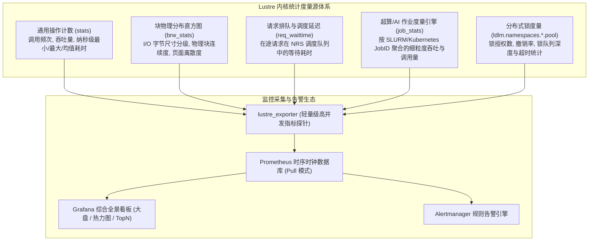

# 26.1 内核级度量源：procfs 与 sysfs 监控全景

在承载数万张 GPU 互联、聚合吞吐达数百 GB/s 的超大规模高性能计算与 AI 训练基础设施中，外部黑盒式监控（如传统的 SNMP 探针、仅度量操作系统磁盘繁忙率的 `iostat`）完全无法揭示分布式存储内核的深层状态。当集群发生长尾抖动时，粗粒度的指标无法回答：是网络丢包导致的重传、LDLM 锁撤销引发的流水线冻结，还是后端物理盘的碎片化寻道？

Lustre 在内核态内置了极低系统开销（基于 Per-CPU 变量与无锁原子累加器）的多维观测度量源，通过 `/proc/fs/lustre/`（老版本）及现代统一的 `/sys/fs/lustre/` 向用户态开放：

## 21.1.1 核心指标文件与内核度量语义

| 指标文件路径 | 作用组件 | 核心输出字段与工程诊断价值 |
| :--- | :--- | :--- |
| `obdfilter.*.stats` / `mdt.*.stats` | OST / MDT | `read_bytes`、`write_bytes`（吞吐）、`open`、`close`、`getattr`（IOPS）。包含各操作的样本数、累计值、方差及最小/最大微秒耗时。 |
| `obdfilter.*.brw_stats` | OST 存储层 | **I/O 块尺寸分布直方图**（从 4KB 至 4MB 的占比）与 **页面离散度（Discontiguous Pages）**，直接诊断是否存在恶劣的微小碎片写入。 |
| `ost.OSS.ost_io.req_waittime` | OSS 服务端 | 报文从到达网卡入队到被工作线程取出处理的时间差。若均值持续超过 10 毫秒，表明 OSS 线程池严重耗尽。 |
| `osc.*.cur_active_rpcs` | 计算客户端 | 客户端当前向各 OST 投递的在途 RPC 并发度，用于识别特定目标通道的网络瓶颈。 |
| `mds.MDS.service.reqbuf_avail` | MDS 服务端 | MDS 剩余的未经请求网络 RPC 缓冲区数量。数值降为 0 说明服务端即将发生网络背压丢包。 |
| `*.job_stats` | MDT / OST | 按作业 ID 归纳的多维立体报表，精准追踪作业粒度的读写带宽与元数据调用频率。 |

---

