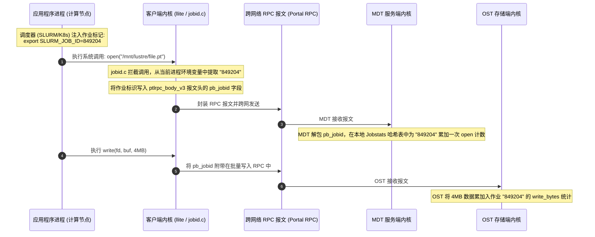

# 26.3 超算与 AI 作业度量引擎：Jobstats

在由数百个科研团队、数千个容器混合调度的共享超算平台中，传统的“节点级”监控（如观测到某台节点 I/O 暴涨）往往无法锁定具体责任人：单台计算节点可能同时运行着属于不同用户的多个作业，或者数千台计算节点同时被同一个分布式大模型训练作业占用。

Lustre 原生开发了 **Jobstats 作业级度量引擎**（`lustre/obdclass/jobid.c`）：



## 21.3.1 配置与支持的作业环境解析模式

通过 `lctl conf_param` 可全集群指定作业标识的提取模式：

```bash
# 1. 适配 SLURM 调度系统 (从进程环境变量 SLURM_JOB_ID 自动提取)
lctl conf_param testfs.sys.jobid_var=SLURM_JOB_ID

# 2. 适配 PBS / Torque 调度系统
lctl conf_param testfs.sys.jobid_var=PBS_JOBID

# 3. 适配通用多租户环境 (自动提取进程名与 Linux 用户 UID: procname.uid)
lctl conf_param testfs.sys.jobid_var=procname_uid

# 4. 控制每个 Target 最多追踪的最近活跃作业数量 (默认 512，可调整为 2048)
lctl set_param *.job_stats_max_jobs=2048
```

---

