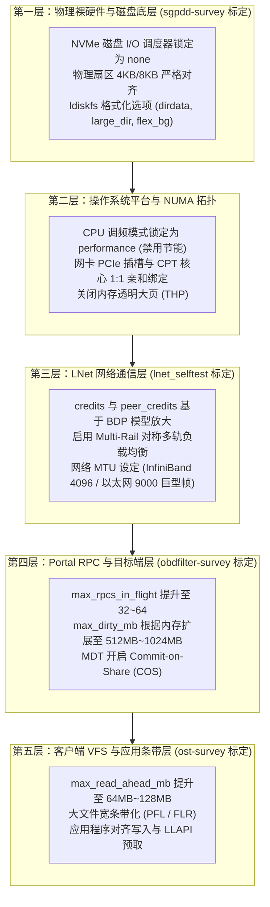

# 第 27 章：全栈性能调优与 Lustre 基准测试套件

> **本章核心源码与工具**：  
> - `lustre-iokit`：官方存储性能基准测试工具包（`sgpdd-survey`、`obdfilter-survey`、`ost-survey`、`mds-survey`）  
> - `lnet/klnds/o2iblnd/o2iblnd.c`：InfiniBand / RoCE 队列深度、映射描述符与信用流控实现  
> - `lustre/osc/osc_request.c`：在途 RPC 并发度（`max_rpcs_in_flight`）与脏页配额控制  
> - `lustre/llite/rw.c`：客户端自适应预读窗口（`max_read_ahead_mb`）算法  
> - `lustre/mdt/mdt_handler.c`：服务端元数据并发工作线程与提交时共享（COS）机制  
> - `lustre/utils/mkfs_lustre.c`：底层格式化参数与块设备物理条带对齐实现  

---

## 22.1 全栈性能调优分层架构

在由数千张 GPU 构成的大模型训练集群或国家级超算平台中，单纯依靠高性能硬件（如 NVMe SSD、400Gbps InfiniBand）无法自动换取理想的端到端吞吐。若系统采用默认的保守参数，由于网络信用受限、NUMA 跨片访存延迟、RPC 并发管道受阻以及文件系统调度争用，整体性能可能仅能发挥出硬件物理上限的 30%~50%。

高性能存储工程的调优必须建立在“分层消除瓶颈”的模型之上：



---

## 22.2 性能基准测试套件：Lustre I/O Kit（lustre-iokit）

在对新集群进行调优时，盲目在最上层运行应用程序极难定位瓶颈所在。官方维护的 **`lustre-iokit`** 提供了分级分层的标准化基准测试工具，能够由底至上逐层标定性能上限：

### 22.2.1 裸硬件吞吐标定：`sgpdd-survey`
- **定位**：直接向底层裸块设备（如 NVMe 裸盘或后端磁盘阵列 LUN）发起高并发直接 I/O，**完全绕过操作系统文件系统缓存与内核块设备调度层**。
- **作用**：获取存储硬件控制器的纯物理极限吞吐，作为后续所有软件层调优的理论天花板（Upper Bound）。
- **运行命令**：
  ```bash
  # 测试两个底层磁盘阵列 LUN 的原始顺序并发读写能力
  device="/dev/mapper/mpatha /dev/mapper/mpathb" \
  crssize=4096 \
  sh sgpdd-survey
  ```
  > [!CAUTION]
  > `sgpdd-survey` 会直接覆写测试设备扇区，严禁在包含有效数据的生产设备上执行！必须在集群格式化前进行。

### 22.2.2 存储目标分层性能测定：`obdfilter-survey`
`obdfilter-survey` 通过调节并发线程数（`thrhi`）与并发对象数（`nobjhi`），模拟生成大规模规整顺序 I/O：
1. **`case=disk`（本地磁盘测试）**：  
   直接在 OSS 节点上运行，测试底层 ldiskfs/ZFS 文件系统的对象读写极限，排查物理磁盘驱动瓶颈：
   ```bash
   nobjhi=4 thrhi=16 size=1024 case=disk sh obdfilter-survey
   ```
2. **`case=network`（纯网络测试）**：  
   在客户端运行，数据仅在客户端与 OSS 的内存网络栈中传输，不落底层物理盘。用于检验 LNet 与 Portal RPC 的网络吞吐上限。
3. **`case=netdisk`（端到端完整链路测试）**：  
   在客户端运行，数据从客户端内存经过网络直达 OSS 并完成底层磁盘持久化落盘，反映真实业务读写能力：
   ```bash
   nobjhi=8 thrhi=32 size=2048 case=netdisk targets="lustre-OST0000" sh obdfilter-survey
   ```

### 22.2.3 异常单 OST 离群点检测：`ost-survey`
在大规模拥有上百台 OST 的存储集群中，单个慢盘或降速的 RAID 阵列（“慢节点 / 离群点”）会严重拖慢整体分布式条带吞吐。
- `ost-survey` 是一个自动化评测脚本，通过调用 `lfs setstripe` 分别且独立地对集群中的每一个 OST 执行规整读写压力测试：
  ```bash
  # 对指定挂载点内的所有 OST 逐一执行性能采样，识别异常慢节点
  sh ost-survey /mnt/lustre
  ```
  测试生成的性能对比报表能瞬间暴露出吞吐显著偏低的异常 OST，便于运维人员定点更换硬件。

---

## 22.3 网络层调优：打破 LNet 吞吐瓶颈

### 22.3.1 信用配额（Credits）与带宽时延积（BDP）数学模型

LNet 的端到端并发能力受控于信用流控机制：
- **`credits`**：本地 HCA 网卡允许同时挂载在底层发送环形队列（TX Ring）的最大工作请求数；
- **`peer_credits`**：本地允许向单个远程 NID 并发提交的最大 RPC 数量。

在高带宽时延积（BDP, Bandwidth-Delay Product）的现代高速网络中，管道理论容量为：

$$\text{Capacity} = \text{Bandwidth} \times \text{RTT}$$

以 200Gb/s（约 25GB/s）InfiniBand HDR 网络、单向往返时延约为 40 微秒的智算集群为例：
$$\text{BDP} = 25\text{ GB/s} \times 0.00004\text{ s} = 1.0\text{ MB}$$

若单个 Portal RPC 控制信令大小为 4KB，为了让物理网络管道时刻保持饱和传输，必须有至少 $1000\text{ KB} / 4\text{ KB} = 250$ 个在途工作请求。如果保持系统默认保守的 `peer_credits=8`，网络适配器发送队列将频繁处于饥饿等待状态，实测带宽将被腰斩。

**生产级高性能网络推荐配置**（`/etc/modprobe.d/lnet.conf`）：
```ini
# 针对 100G/200G/400G InfiniBand / RoCE 网络放宽并发队列
options ko2iblnd credits=256 peer_credits=64 peer_credits_hiw=32 concurrent_sends=64 map_on_demand=256 fmr_pool_size=2048
```

### 22.3.2 跨 NUMA 亲和性与中断绑定

在多路多核 CPU 服务器中，如果处理网络中断的 CPU 核心与物理网卡所在的 PCIe 控制器跨越了不同的 NUMA 节点，跨 Socket 总线通信会产生额外的访存开销与缓存失效。

```bash
# 1. 查询物理网卡绑定的 NUMA 节点
cat /sys/class/net/ib0/device/numa_node
# 输出 0 说明网卡直连 Socket 0 的 PCIe 控制器

# 2. 将网卡中断处理亲和性限制在对应 NUMA 核心范围内
set_irq_affinity_bynode.sh 0 ib0

# 3. 配置 LNet 接口的 CPT 绑定，确保 LNet 内核线程与网卡在同一个 NUMA 域调度
lnetctl net add --net o2ib0 --if ib0 --cpt 0
```

---

## 22.4 客户端与 RPC 并发层调优：释放并行条带潜能

客户端与各个后端 OST 之间的网络并发深度直接决定了聚合 I/O 速度：

| 关键参数 | 默认值 | 生产优化推荐值 | 调优机理与性能收益 |
| :--- | :--- | :--- | :--- |
| `max_rpcs_in_flight` | `8` | `32` ~ `64` | 单客户端与单 OST 间并发在途的 RPC 上限。在大条带或长跨度网络下显著消除 RTT 等待。 |
| `max_dirty_mb` | `32` | `512` ~ `1024` | 单客户端针对每个 OST 允许在本地缓冲的最大脏页量。调大后显著提高小写的规整聚合度。 |
| `max_read_ahead_mb` | `40` | `64` ~ `128` | 客户端最大连续预读滑动窗口。大模型读取权重或连续数据流读取吞吐可提升 40% 以上。 |

```bash
# 在所有计算客户端上批量生效优化参数
lctl set_param osc.*.max_rpcs_in_flight=32
lctl set_param osc.*.max_dirty_mb=512
lctl set_param llite.*.max_read_ahead_mb=128
lctl set_param llite.*.async_read_ahead=1
```

---

## 22.5 元数据层性能调优：提交时共享锁（COS）与高并发

针对高频海量小文件创建或跨节点目录检索，MDT 的瓶颈通常在于底层文件系统的元数据同步刷盘开销。

### 1. 提交时共享锁（Commit-on-Share, COS）
传统模式下，MDS 处理涉及不同客户端的事务时，频繁执行同步落盘以维持全局顺序。开启 COS 机制后，当多个并发事务不存在语义冲突时，允许它们合并在同一个底层 JBD2 事务批次中异步提交：
```bash
lctl set_param mdd.*.cos=1
```
开启后，小文件批量创建（如深度学习预处理数据集解压）的 IOPS 可提升 2 至 3 倍。

### 2. MDT 服务端工作线程池扩展
当 MDS 节点配备 64 核以上高频 CPU 与全闪 NVMe 介质时，默认的服务线程池容易成为排队瓶颈：
```bash
lctl set_param mdt.MDS.mdt.threads_min=64
lctl set_param mdt.MDS.mdt.threads_max=256
```

---

## 22.6 操作系统平台与硬件基线调优

### 1. 锁定 CPU 为高性能模式（`performance`）
生产存储服务器必须彻底关闭操作系统与 BIOS 中的动态节能降频，杜绝因短突发 I/O 无法唤醒 CPU 高频而造成的延迟抖动：
```bash
cpupower frequency-set -g performance
```

### 2. NVMe SSD I/O 调度器设为 `none`
全闪存 NVMe 介质具备极高的内部硬件并发队列，Linux 内核的电梯调度算法（如 `mq-deadline`）只会徒增 CPU 自旋锁开销。必须直通设置为 `none`：
```bash
for dev in $(lsblk -d -o NAME | grep -E "nvme|pmem"); do
    echo none > /sys/block/${dev}/queue/scheduler
done
```

### 3. 禁用透明大页（Transparent HugePages, THP）
Linux 内核的 THP 在执行后台内存紧缩（Memory Compaction）时会持有巨型读写信号量，极易在存储节点产生长达数百毫秒的系统卡顿：
```bash
echo never > /sys/kernel/mm/transparent_hugepage/enabled
echo never > /sys/kernel/mm/transparent_hugepage/defrag
```

---

## 22.7 生产事故案例：CPU 节能调节器导致元数据小文件延迟翻倍

### 22.7.1 故障现象

某国家人工智能超算中心新建了一组由 4 台双路 AMD EPYC 7763（共 128 核心，标称最高加速频率 3.5GHz）组成的全闪 NVMe MDS 集群。但在进行上线前 `mdtest` 基准压测时，单目录文件创建性能仅为 **22,000 IOPS**，远低于同配置实验室集群的 **56,000 IOPS**。

监控采集显示：
- NVMe 固态硬盘排队延迟极低（低于 20 微秒）；
- 网络带宽与 InfiniBand 端口速率完全无压力；
- MDS 服务器 CPU 使用率维持在 35% 左右，无严重内核自旋锁争用，但单次元数据 RPC 的处理周期被异常拉长。

### 22.7.2 排查过程

1. **CPU 实时运行时钟频率采样**：  
   在压测持续执行期间，运维人员通过 `turbostat` 抓取所有核心的实际工作主频：
   ```bash
   cat /proc/cpuinfo | grep "cpu MHz" | head -n 16
   ```
   **数据分析**：虽然处理器的基础加速频率可达 3.5GHz，但当前所有 CPU 核心的主频全部被压制在 **1500MHz ~ 1800MHz（最低节能基频）**。

2. **根因机理深入剖析**：  
   - 该批服务器操作系统安装镜像中，默认将 CPU 频率调节器设置为 `powersave`（节能模式）；
   - 元数据小文件创建的物理特征是：单次操作消耗的 CPU 时间极短（仅十几微秒），但在全集群并发下呈现密集的微突发脉冲（Micro-Bursts）；
   - 现代 CPU 的节能调频算法是基于时间窗口内的平均利用率进行加权计算的。由于每个操作执行完毕后 CPU 立即进入微秒级空闲等待下一次网络中断，平均计算负载始终低于调频阈值，调频器判定无需升频，使得 CPU 始终在半速状态下“爬行”；
   - 在低主频下，MDT 内部的 Inode 分配锁仲裁、Htree 目录哈希计算与网络内存拷贝耗时成倍增加，直接导致了峰值吞吐的大幅滑坡。

### 22.7.3 修复措施与成效

运维团队在全部 MDS 节点上强制锁定 CPU 运行策略：
```bash
cpupower frequency-set -g performance
```
并在 `/etc/default/cpupower` 中固化配置。

调整生效后，CPU 核心主频即刻稳定锁定至 3.2GHz ~ 3.5GHz。重新执行 `mdtest`，单目录文件创建速率从 22,000 IOPS 垂直飙升至 **59,200 IOPS**（提升 169%），平均元数据创建延迟从 45 微秒大幅下降至 16 微秒，完全释放了全闪 MDS 的硬件性能潜力。

---

## 22.8 运维基线检查清单

- [ ] **确认全集群服务器锁定 `performance` 调频模式**：所有 MDS、OSS 及计算客户端必须关闭 CPU 节能模式，并在系统启动项中固化。
- [ ] **网络 Credits 与巨型帧基线配置**：确认各节点配置了 `credits=256`、`peer_credits=64`，InfiniBand 网卡开启 4096 MTU，以太网交换机开启 9000 巨型帧。
- [ ] **客户端并发与缓存配额匹配**：根据计算节点物理内存总量合理设定 `max_dirty_mb`（通常为 512MB~1024MB）与 `max_rpcs_in_flight=32`。
- [ ] **上线前运行 `lustre-iokit` 标定性能基线**：新集群上线前必须依次运行 `sgpdd-survey`（裸盘）、`obdfilter-survey`（网络与磁盘）及 `ost-survey`（单盘一致性），彻底排查硬件离群慢节点。

---

## 本章小结

本章系统梳理了 Lustre 全栈性能调优与基准测试的完整工程方法论：
1. **分层评测与标定体系**：通过官方 `lustre-iokit` 工具集（`sgpdd-survey`、`obdfilter-survey`、`ost-survey`），确立了从裸硬件、网络传输到单目标性能的分层基准与离群点排查范式；
2. **高速网络并发释放**：基于带宽时延积（BDP）数学模型放大了 LNet 信用配额，结合 NUMA 亲和性与中断绑定，消除了高速互联网络的传输瓶颈；
3. **RPC 与缓存流水线优化**：通过调优客户端在途 RPC 并发度、脏页回写配额与预读窗口，最大化释放了分布式并行条带化读写吞吐；
4. **底层操作系统基准加固**：通过对 NVMe 调度器、透明大页及 CPU 调频模式的精细治理，消除了内核态延迟毛刺，为海量计算负载构筑了确定性的极致性能底座。
