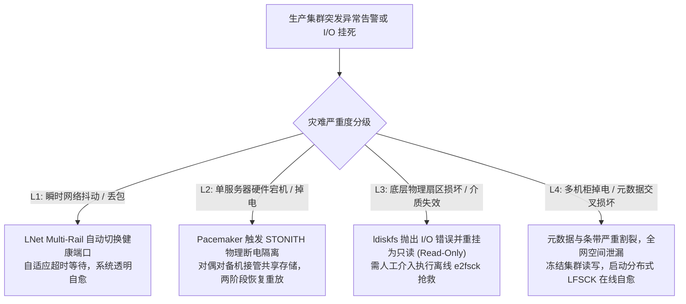
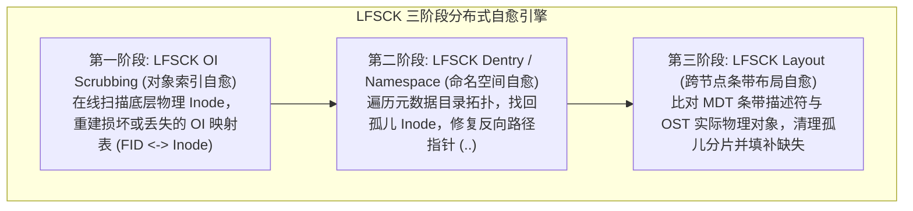
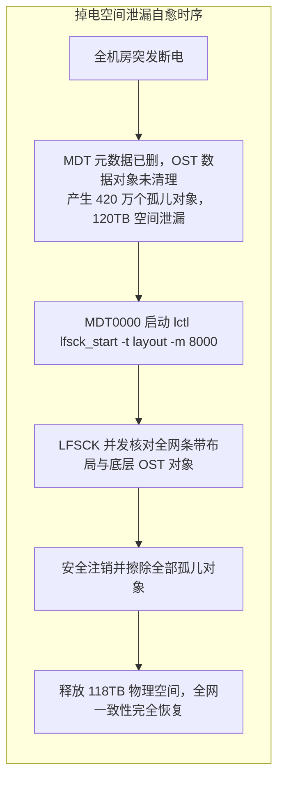

# 第 28 章：生产灾难排查与 LFSCK 深度自愈手册

> **本章核心源码文件**：  
> - `lustre/osd-ldiskfs/osd_scrub.c`：底层 OI（Object Index）表离线与在线扫描修复驱动实现  
> - `lustre/mdd/mdd_lfsck.c`：分布式文件系统一致性检查器（LFSCK）命名空间与目录树自愈引擎  
> - `lustre/ofd/ofd_lfsck.c`：OST 数据条带布局跨节点核对与孤儿对象回收实现  
> - `lustre/utils/lfsck.c`：用户态 `lctl lfsck_*` 控制命令与多阶段进度监控实现  

---

## 23.1 生产灾难分级与应急排障铁律

在管理跨越数百个节点与数十万块存储介质的企业级分布式集群中，硬件故障、光纤断连与异常全机房掉电属于必然遭遇的统计常态。在高压事故现场，**最致命的风险往往不是故障本身，而是运维人员因焦虑或缺乏准则采取盲目操作引发的“二次毁灭”**。

必须确立标准化的灾难分级与处置准则：



### 应急排障三大铁律

1. **第一铁律：抢救事故黑匣子，严禁盲目直接强制重启（`reboot -f`）**：  
   当服务器出现内核卡顿或进程陷入 D 状态时，若控制台尚有响应，首选执行 `lctl dk /tmp/lustre-panic.log` 转储内核环形日志，或通过 `sysrq-t` 导出全量调用栈。盲目硬重启会抹除内存证据，使偶发竞态故障陷入无法溯源的被动循环。
2. **第二铁律：未确认物理硬断电前，严禁在备机强行重复挂载存储卷**：  
   若某台存储节点因网络中断被高可用集群判定失联，在通过带外管理卡（IPMI）或智能 PDU 确认原主机 100% 物理掉电之前，**严禁手动执行 `mount` 重复挂载共享 LUN**，彻底杜绝操作系统双挂引发的双主脑裂元数据损毁。
3. **第三铁律：执行具有破坏性修复命令前，必须备份底层关键扇区**：  
   在对底层块设备执行带有修改属性的命令（如 `e2fsck -y`）前，必须使用 `dd` 备份磁盘头部前 100MB 物理扇区（包含 Superblock、Block Group 描述符与根 Inode 区），保留灾备退路。

---

## 23.2 底层物理修复：`e2fsck` 与超级块抢救

针对基于 `ldiskfs` 的存储目标，当底层物理介质由于异常掉电发生元数据损坏时，Linux 内核出于防御机制会自动将文件系统重挂为只读模式（Read-Only）。

### 23.2.1 离线底层文件系统标准修复

```bash
# 1. 在集群管理器中禁用该存储资源，防止 Pacemaker 自动尝试重启
pcs resource disable lustre_ost0002

# 2. 卸载该目标挂载点
umount /mnt/ost0002

# 3. 强制执行文件系统一致性扫描并自动修复简单块位图与孤儿 Inode
e2fsck -f -p -C 0 /dev/mapper/mpathb
```

### 23.2.2 主超级块损坏抢救：备用超级块（Backup Superblock）计算

若主超级块（Block 0）遭遇坏块损坏，系统会抛出 `wrong fs type, bad superblock` 致命报错，导致常规 `mount` 失败。此时必须借助备用超级块实施救援：

```bash
# 1. 模拟格式化输出，获取系统预留备用超级块的精确物理偏移
mke2fs -n /dev/mapper/mpathb
```
输出将明确标识备用超级块分布（通常为 32768, 98304, 163840, 229376 等块号）：

```bash
# 2. 指定备用超级块执行底层强制重构
e2fsck -b 32768 -y /dev/mapper/mpathb
```

修复成功后，系统能够正确读取超级块，存储目标即可顺利重新挂载接入集群。

---

## 23.3 分布式一致性在线修复引擎：LFSCK

单机工具（如 `e2fsck`）仅能保证单台物理服务器本地的文件系统块结构合法，**完全不具备跨越网络感知分布式条带关联的能力**。如果 MDT 上的 Inode 指向了 OST-5 上的一个对象，而 OST-5 因掉电丢失了该对象，单机 `e2fsck` 根本无法检测此类逻辑悬空。

Lustre 内置了工业级 **分布式文件系统一致性检查器（LFSCK, Lustre File System Consistency Checker）**，具备在系统生产运行状态下跨全集群执行全局一致性自愈的能力：



### 1. 第一阶段：LFSCK OI（对象索引扫描修复）
- **核心职责**：验证并重构底层单机物理 Inode 与 128 位全局 FID 之间的双向对应关系；
- **执行机理**：当底层磁盘因断电丢失 `oi.16/*` 哈希索引时，OI Scrubbing 会自动扫描磁盘底层每一个被占用的 Inode，解析其扩展属性中的 `trusted.fid`，并无损重建丢失的索引项。

### 2. 第二阶段：LFSCK Dentry（目录树与命名空间修复）
- **核心职责**：修复多 MDT 拓扑中的断链目录树与悬空目录项；
- **执行机理**：遍历所有元数据 Inode。若发现某 Inode 真实存在但目录树中无任何硬链接指向它，自动将其收录至根目录下的 `/lost+found` 中；若目录项的父目录指针（`..`）错乱，自动根据反向链路重新修复。

### 3. 第三阶段：LFSCK Layout（跨网络条带布局修复）
- **核心职责**：跨越网络全面核对全集群所有 MDT 与所有 OST 之间的条带对象拓扑；
- **清理跨节点孤儿对象（Orphan Objects）**：当用户在客户端删除了文件，MDT 已经清空元数据，但个别 OST 因通信中断未能及时收到清理 RPC 时，Layout 检查器自动识别这些没有父文件归属的底层数据碎片，并将其安全释放，**找回全网泄漏的物理磁盘空间**；
- **识别并标记数据缺失**：若元数据记录了 4 个条带，但某台 OST 发生物理永久性坏道丢失了数据对象，LFSCK 自动在 MDT 上将该分片标记为缺失损坏，防止应用读请求在此无限重试卡死。

---

## 23.4 生产实战：LFSCK 控制与进度监控

LFSCK 支持全在线异步运行，管理员可精细调节扫描速率上限，防止修复过程冲击生产业务：

```bash
# 1. 在主元数据目标 MDT0000 上启动全量三阶段在线自愈 (限制每秒扫描 5000 个对象)
lctl lfsck_start -M testfs-MDT0000 -t all -m 5000 -e

# 2. 查询当前正在执行的 Layout 阶段修复进度与统计指标
lctl get_param mdd.testfs-MDT0000.lfsck_layout
```

### 23.4.1 LFSCK 状态查询输出样例分析

```text
status: scanning-phase2
flags: completed_failure,reset
param: error_reset
start_time: 1711200000
last_checkpoint_time: 1711203600
success_count: 1
run_time: 3600
checked_phase1: 18450200
checked_phase2: 1205000
repaired_orphan_objects: 48210     <-- 成功识别并清理的 OST 孤儿数据对象数
repaired_unmatched_pairs: 12      <-- 成功修复的跨目标元数据不匹配数
failed: 0
speed: 5120/sec                   <-- 当前实际扫描速率
```

```bash
# 3. 动态暂停当前正在运行的 LFSCK 任务
lctl lfsck_stop -M testfs-MDT0000

# 4. 手动重置自愈历史标记并强制重新执行全量扫描
lctl lfsck_start -M testfs-MDT0000 -t layout -r
```

---

## 23.5 生产事故案例：全机房硬掉电引发全网条带孤儿与 120TB 空间泄漏自愈

### 23.5.1 故障现象

某国家重大科技基础设施机房遭遇外部高压输电线路雷击，全机房动力电源突发硬掉电，UPS 支撑超时后 32 台存储服务器与 200 余台 OST 阵列非正常宕机。

电力恢复并完成开机自检后，文件系统正常挂载，但存储大盘出现严重的数据完整性异常：
1. **全网空间严重泄漏**：在掉电前，多个大规模 AI 数据集批量清洗任务刚执行完文件删除操作。开机后，全网 128 台 OST 的磁盘使用率依然显示接近打满，统计差值达 **120TB** 的物理空间未能释放；
2. **应用访问突发 `-EIO` 报错**：部分计算节点在尝试读取掉电前数秒正在写入的数据文件时，系统返回输入输出错误（`-EIO`），客户端内核抛出找不到目标 OST 对象的警告。

### 23.5.2 排查过程

1. **分布式元数据与数据对象断链定性**：  
   运维人员在某台容量异常偏高的 OSS 上利用 `debugfs` 抽查底层数据块：
   ```bash
   debugfs -R "stat O/0/d$((obj_id%32))/obj_$obj_id" /dev/mapper/mpatha
   ```
   **数据分析**：MDT 在掉电前已经通过内存提交了删除事务并向客户端返回了成功，但向各个后端 OST 发送的异步数据对象删除 RPC（`OST_DESTROY`）恰好被突发断电拦截丢弃。结果是：**MDT 上的元数据已被完全清空，而 128 台 OST 的物理磁盘上依然滞留着数百万个没有任何文件引用的“孤儿数据对象（Orphans）”**。这些孤儿块不仅白白霸占了 120TB 宝贵空间，还造成了全网容量统计的虚高失真。

2. **自愈技术方案确立**：  
   在包含数亿个文件与复杂宽条带映射的超大集群中，任何人工比对脚本均不具备可行性。必须依靠原生跨目标协同机制——**LFSCK Layout 级联修复引擎**。



### 23.5.3 修复措施与成效

1. **设定安全速率并启动全网 Layout 自愈**：  
   为了在确保生产计算作业正常运行的前提下实施修复，将自愈引擎的最大扫描速率设定为每秒 8,000 个对象：
   ```bash
   lctl lfsck_start -M testfs-MDT0000 -t layout -m 8000 -e
   ```
2. **执行进度追踪与自愈成果**：  
   通过监控虚拟文件系统持续追踪自愈进展：
   - 经过 16 小时的后台非阻塞并发扫描，LFSCK 遍历了全网 3.8 亿个活动文件；
   - 精准识别并安全注销了散落在 128 台 OST 上的 **4,215,690 个孤儿数据对象**；
   - **全网瞬间自动回收并释放出 118.4TB 物理磁盘存储空间**；
   - 识别出 16 个因断电导致物理块损坏的残缺条带，并向运维团队输出了精准的损坏文件路径清单，指导业务侧通过原始备份集重新导入。全网零人工误删，文件系统平稳恢复至百分之百的一致性健康状态。

---

## 23.6 运维基线检查清单

- [ ] **执行底层破坏性命令前强制扇区备份**：对任何出现 Superblock 异常的底层存储卷执行 `e2fsck` 前，必须使用 `dd if=/dev/mapper/... of=/tmp/sb_backup.img bs=1M count=100` 备份关键扇区。
- [ ] **定期执行低速 LFSCK 预防性体检**：建议在每季度低峰期启动受控速率的 `lctl lfsck_start -t layout -m 3000`，主动清理长期运行累积的隐匿孤儿对象与空间碎片。
- [ ] **严禁在未确认隔离前跨机重复挂载**：高可用故障切换必须严格依赖 STONITH 物理断电，严禁在两台服务器上盲目尝试同时挂载同一底层共享存储卷。

---

## 本章小结

本章系统梳理了应对大规模分布式存储生产级灾难的应急救援与一致性自愈体系：
1. **分级应急防御铁律**：确立了“事故黑匣子保护、防脑裂单挂契约、破坏性操作前强制备份”的三大实战铁律，筑牢了人工排障的操作安全底线；
2. **底层单机物理抢救**：深入剖析了 `e2fsck` 结合备用超级块（Backup Superblock）偏移行算拯救损坏块设备的工程路径；
3. **分布式全局在线自愈**：系统解析了工业级 LFSCK 三阶段（OI、Namespace、Layout）自愈体系，实现了单机文件系统检查器无法企及的跨网络条带拓扑核对与数据孤儿自动回收；
4. **真实灾难处置范式**：结合全机房断电引发 120TB 空间泄漏的典型事故，推演了完整的排查、限速扫描与全自动化自愈流程，为超大规模分布式系统的容灾运维提供了标杆指引。
