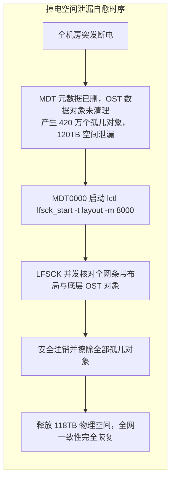

# 28.5 生产事故案例：全机房硬掉电引发全网条带孤儿与 120TB 空间泄漏自愈

## 23.5.1 故障现象

某国家重大科技基础设施机房遭遇外部高压输电线路雷击，全机房动力电源突发硬掉电，UPS 支撑超时后 32 台存储服务器与 200 余台 OST 阵列非正常宕机。

电力恢复并完成开机自检后，文件系统正常挂载，但存储大盘出现严重的数据完整性异常：
1. **全网空间严重泄漏**：在掉电前，多个大规模 AI 数据集批量清洗任务刚执行完文件删除操作。开机后，全网 128 台 OST 的磁盘使用率依然显示接近打满，统计差值达 **120TB** 的物理空间未能释放；
2. **应用访问突发 `-EIO` 报错**：部分计算节点在尝试读取掉电前数秒正在写入的数据文件时，系统返回输入输出错误（`-EIO`），客户端内核抛出找不到目标 OST 对象的警告。

## 23.5.2 排查过程

1. **分布式元数据与数据对象断链定性**：  
   运维人员在某台容量异常偏高的 OSS 上利用 `debugfs` 抽查底层数据块：
   ```bash
   debugfs -R "stat O/0/d$((obj_id%32))/obj_$obj_id" /dev/mapper/mpatha
   ```
   **数据分析**：MDT 在掉电前已经通过内存提交了删除事务并向客户端返回了成功，但向各个后端 OST 发送的异步数据对象删除 RPC（`OST_DESTROY`）恰好被突发断电拦截丢弃。结果是：**MDT 上的元数据已被完全清空，而 128 台 OST 的物理磁盘上依然滞留着数百万个没有任何文件引用的“孤儿数据对象（Orphans）”**。这些孤儿块不仅白白霸占了 120TB 宝贵空间，还造成了全网容量统计的虚高失真。

2. **自愈技术方案确立**：  
   在包含数亿个文件与复杂宽条带映射的超大集群中，任何人工比对脚本均不具备可行性。必须依靠原生跨目标协同机制——**LFSCK Layout 级联修复引擎**。



## 23.5.3 修复措施与成效

1. **设定安全速率并启动全网 Layout 自愈**：  
   为了在确保生产计算作业正常运行的前提下实施修复，将自愈引擎的最大扫描速率设定为每秒 8,000 个对象：
   ```bash
   lctl lfsck_start -M testfs-MDT0000 -t layout -m 8000 -e
   ```
2. **执行进度追踪与自愈成果**：  
   通过监控虚拟文件系统持续追踪自愈进展：
   - 经过 16 小时的后台非阻塞并发扫描，LFSCK 遍历了全网 3.8 亿个活动文件；
   - 精准识别并安全注销了散落在 128 台 OST 上的 **4,215,690 个孤儿数据对象**；
   - **全网瞬间自动回收并释放出 118.4TB 物理磁盘存储空间**；
   - 识别出 16 个因断电导致物理块损坏的残缺条带，并向运维团队输出了精准的损坏文件路径清单，指导业务侧通过原始备份集重新导入。全网零人工误删，文件系统平稳恢复至百分之百的一致性健康状态。

---

