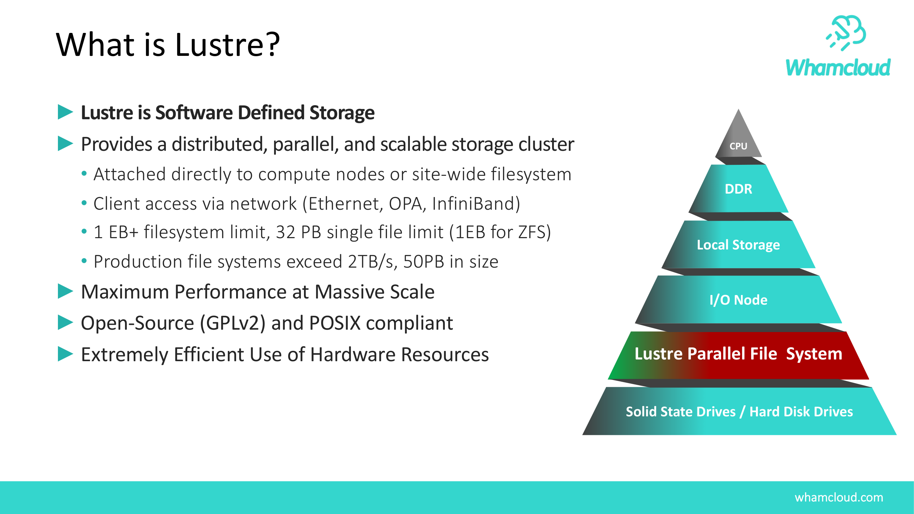
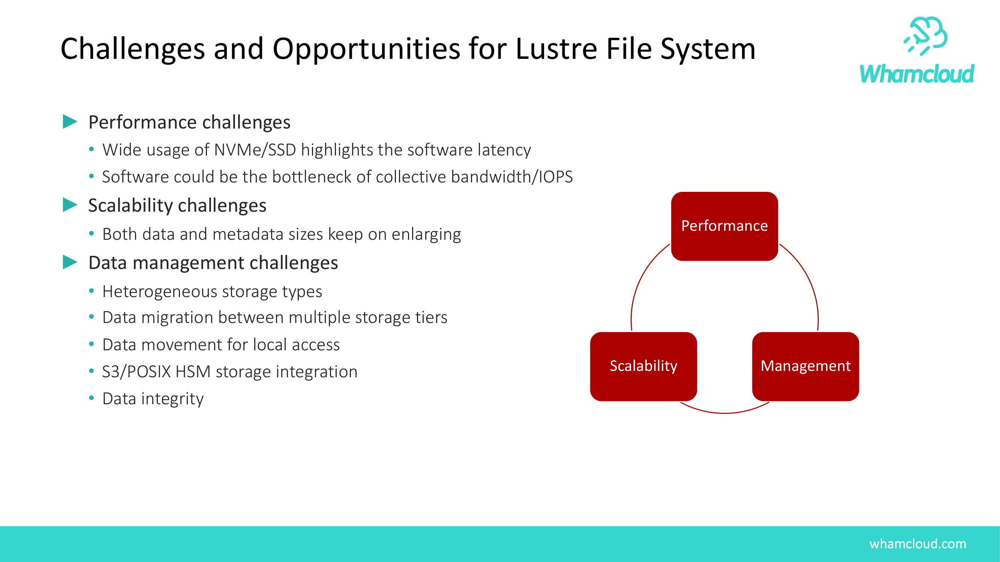
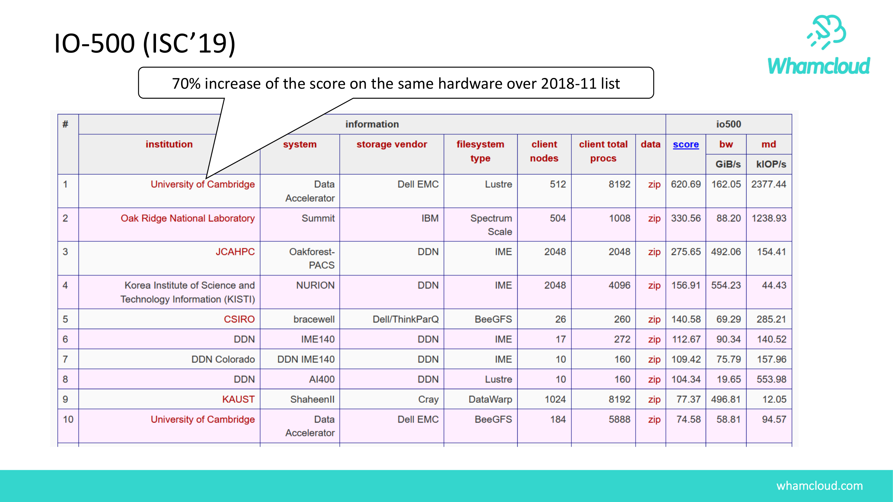
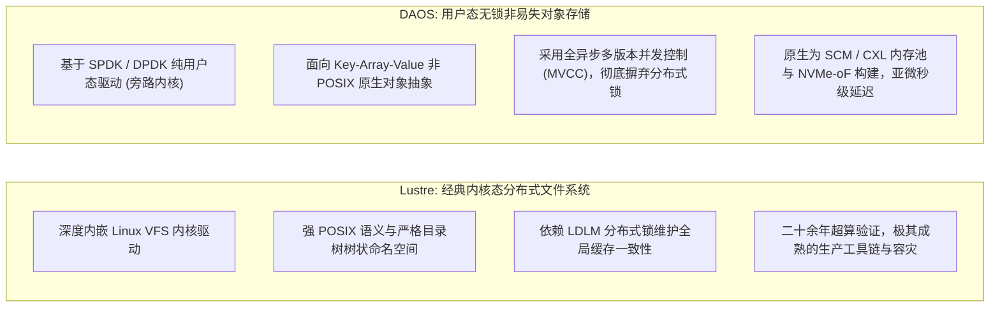
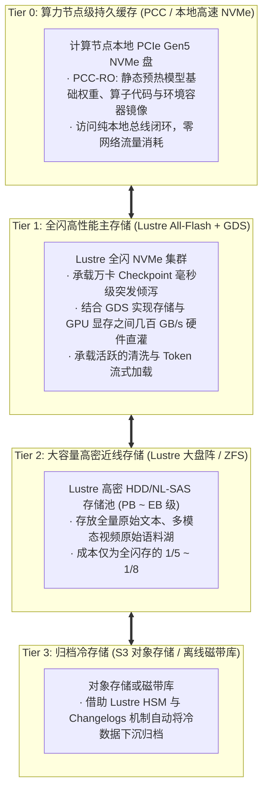

# 第 29 章：面向 AI 时代的演进与前沿架构 (GDS / DAOS 反思)

> **本章核心源码文件与接口**：  
> - `lustre/llite/file.c`：直接 I/O（`O_DIRECT`）与 GPU 显存缓冲区（GPU HBM）适配路径  
> - `lnet/klnds/o2iblnd/o2iblnd.c`：对 GPU 物理内存基地址寄存器（BAR 空间）的 RDMA 注册与 DMA 映射  
> - `libcfs/libcfs/libcfs_mem.c`：端到端跨设备 Peer-to-Peer DMA 映射与非统一内存兼容  
> - `include/uapi/linux/lustre/lustre_user.h`：GDS 兼容标志位与用户态扩展接口定义  
> - `cufile.h`：NVIDIA Magnum IO GPUDirect Storage（cuFile API）用户态直通调用定义  

---

## 24.1 AI 大模型时代对传统并行存储的冲击

随着大语言模型（LLM）、多模态大模型及自动驾驶仿真进入万卡甚至十万卡 GPU 协同训练阶段，底层算力集群的计算密度发生了指数级跃升。与过去数十年服务于气象预报、流体力学模拟等传统科学计算（HPC）相比，现代 AI 工作负载的存储 I/O 行为呈现出截然不同的特征：



结合图 24-1 的对比剖析，AI 工作负载在以下三个维度对传统分布式存储构成了严峻挑战：

1. **训练样本流式高频打乱（Massive Data Shuffle）**：  
   传统的 HPC 倾向于规整的大块矩阵读写（如单个进程写入 16MB~128MB 的连续块）；而多模态 AI 训练涉及数以亿计的微小图片、音频片段与 Token 序列。在多卡分布式数据并行（DDP）阶段，数据加载器（DataLoader）需要跨节点执行高频的随机随机抽取（Random Shuffling），对元数据检索与非对齐小 I/O 的延迟极其敏感。
2. **万卡并发瞬时突发检查点（Checkpoints Burst）**：  
   在万亿参数模型训练中，为防止硬件突发故障导致数天算力白费，系统每隔数小时需将数百 TB 的模型权重（Weights）、梯度（Gradients）与优化器状态（Optimizer States）写入持久化介质。万卡同时执行持久化落盘，瞬间产生数 TB/s 的峰值写吞吐脉冲。
3. **主机系统内存与 CPU 调度瓶颈**：  
   在传统的计算架构中，GPU 仅作为外部加速卡挂载在 CPU 主机上，所有网络存储的数据均需首先流经主机系统内存（Host DDR5）。当 GPU 显存带宽已达 3TB/s（如 H100 HBM3）且算力利用率极高时，主机 CPU 的内存拷贝与上下文切换成为了卡死训练吞吐的系统瓶颈。

---

## 24.2 GPU Direct Storage（GDS）：穿透 Host 内存的硬件直通

在传统基于 POSIX 的网络文件系统数据路径中，即便底层网络采用了 InfiniBand RDMA，数据在注入 GPU 显存之前依然必须经历冗长的主机中转：

```mermaid
flowchart TD
    subgraph Traditional_Path ["传统网络数据路径 (CPU 介入与三次跨总线拷贝)"]
        OST_1["OST 存储节点"] -->|InfiniBand RDMA| HCA_1["计算节点网卡 (NIC)"]
        HCA_1 -->|PCIe DMA 写入| HOST_RAM["主机系统内存 (Host DDR5)"]
        HOST_RAM -->|CPU 上下文中断与内核拷贝| K_BUF["内核虚拟页面缓存"]
        K_BUF -->|再次跨 PCIe 总线拷贝| GPU_HBM_1["GPU 显存 (HBM3)"]
    end

    subgraph GDS_Direct_Path ["GPUDirect Storage (GDS) 硬件直通路径"]
        OST_2["OST 存储节点"] -->|InfiniBand RDMA| HCA_2["计算节点网卡 (NIC)"]
        HCA_2 ==>|PCIe Switch 内部 Peer-to-Peer 直接 DMA| GPU_HBM_2["GPU 显存 (HBM3)"]
    end
```



### 24.2.1 GDS 架构原理与 PCIe 内部直通

基于 NVIDIA Magnum IO **GPUDirect Storage（GDS）** 技术，存储系统允许高速网络适配器（HCA）与 GPU 之间直接发起对等 DMA 传输（Peer-to-Peer DMA）：



结合官方架构图 24-2，GDS 的核心技术特征包括：
- **完全旁路主机系统内存（Host Memory Bypass）**：数据直接在 InfiniBand 网卡（NIC）与 GPU 显存（HBM）之间直灌，不占用任何主机 DDR5 内存带宽；
- **CPU 零拷贝与算力卸载**：系统消除了用户态与内核态之间的数据反弹缓冲（Bounce Buffer），主机 CPU 彻底从数据搬运的繁重开销中解放，仅负责极轻量的元数据调度；
- **超低微秒级端到端延迟**：数据包由计算节点内部的 PCIe Switch 直接路由转发，单次 I/O 往返延迟由毫秒级压缩至微秒级。

### 24.2.2 Lustre 内核对 GDS 的底层改造

为了实现对 GDS 的原生驱动支持，Lustre 客户端在内核协议栈中完成了深度适配：

1. **GPU 显存 BAR 空间的 RDMA 注册**：  
   传统的 LNet（`klnds/o2iblnd/o2iblnd.c`）仅能识别由 Linux 虚拟内存系统分配的标准 `struct page`。为了支持 GPU 显存，LNet 扩展了内存描述符，直接接收由 NVIDIA 内核驱动（`nvidia-fs.ko`）通过 `nvidia_p2p_get_pages()` 导出的 GPU 显存物理基地址寄存器（BAR1 映射物理地址），并将其直接注册为 InfiniBand 内存区域（`ib_reg_mr`）。
2. **`O_DIRECT` 通道直通封装**：  
   `lustre/llite/file.c` 拦截上层带有直接 I/O 标志的读写请求。当检测到目标缓冲区属于 GPU 虚拟地址时，跳过通用 Page Cache，直接将底层 GPU 物理页封装入 `struct ptlrpc_bulk_desc` 的网络传输描述符中。

### 24.2.3 用户态 cuFile API 编程示例

AI 应用可通过 NVIDIA 提供的 `libcufile` 库直接读写 Lustre 挂载点上的文件：

```c
#include <stdio.h>
#include <fcntl.h>
#include <unistd.h>
#include <cuda_runtime.h>
#include <cufile.h>

/**
 * 示例：使用 cuFile API 将 Lustre 上的检查点直灌入 GPU 显存
 */
int load_weights_gds_direct(const char *filepath, size_t size)
{
    CUfileError_t status;
    CUfileDescr_t descr;
    CUfileHandle_t cf_handle;
    void *d_buf = NULL;
    int fd;

    /* 1. 初始化 cuFile 运行时驱动 */
    cuFileDriverOpen();

    /* 2. 打开 Lustre 文件，必须携带 O_DIRECT 绕过操作系统缓存 */
    fd = open(filepath, O_RDONLY | O_DIRECT);
    if (fd < 0) {
        perror("Failed to open file on Lustre");
        return -1;
    }

    /* 3. 分配 GPU 显存 (HBM) 并将其注册至 GDS 驱动 */
    cudaMalloc(&d_buf, size);
    cuFileBufRegister(d_buf, size, 0);

    /* 4. 注册文件句柄至 cuFile */
    descr.handle.fd = fd;
    descr.type = CU_FILE_HANDLE_TYPE_OPAQUE_FD;
    status = cuFileHandleRegister(&cf_handle, &descr);
    if (status.err != CU_FILE_SUCCESS) {
        fprintf(stderr, "cuFileHandleRegister failed\n");
        return -1;
    }

    /* 5. 发起 Peer-to-Peer 硬件直通读取 (数据由网卡直达 GPU 显存) */
    ssize_t ret = cuFileRead(cf_handle, d_buf, size, 0, 0);
    printf("GDS successfully transferred %zd bytes directly to GPU HBM.\n", ret);

    /* 6. 注销句柄并释放资源 */
    cuFileHandleDeregister(cf_handle);
    cuFileBufDeregister(d_buf);
    close(fd);
    cudaFree(d_buf);
    cuFileDriverClose();
    return 0;
}
```

---

## 24.3 现代存储架构反思：Lustre 与 DAOS 的架构对决

随着持久化内存（PMEM）、CXL 共享内存池以及纯 NVMe-oF 网络协议的成熟，存储架构界爆发了关于“内核态传统文件系统”与“用户态新型无锁对象存储”的深刻技术路线之争。其中最具代表性的即为 **DAOS（Distributed Asynchronous Object Storage）**。



结合图 24-3 展示的纯用户态存储栈模型，Lustre 与 DAOS 代表了两种完全不同的架构哲学：



### 深度维度技术对比

| 架构维度 | Lustre 分布式文件系统 | DAOS 分布式异步对象存储 |
| :--- | :--- | :--- |
| **执行上下文** | **内核态驱动**（运行在 Linux 内核空间，与 VFS、Page Cache 及块设备紧密集成） | **纯用户态进程**（基于 SPDK 旁路操作系统内核，直接对 NVMe 寄存器轮询） |
| **原生数据模型** | **POSIX 文件模型**（标准层次化目录树、Inode 属性与连续字节流） | **Key-Array-Value 对象模型**（多级键与定长数组，POSIX 需通过 DFS 抽象层仿真） |
| **并发一致性机制** | **LDLM 分布式锁**（采用意向锁与范围锁，读写冲突时触发阻塞 AST 撤销） | **无锁 MVCC 与纪元（Epochs）**（全异步非阻塞事务，多版本并发控制） |
| **单次 I/O 延迟** | **微秒至毫秒级**（受制于内核中断上下文切换与跨节点锁协商） | **亚微秒至微秒级**（SCM / NVMe 轮询，零内核开销） |
| **生态成熟度与通用性**| **极高**（所有 Linux 标准工具与科研软件零修改直接运行，容灾与配额完备） | **演进中**（复杂传统应用需重构或依赖仿真层，运维监控工具链仍在成熟中） |

### 架构反思与工程权衡
- **DAOS 的颠覆性优势**：在极端高频小 I/O、海量元数据并发以及原生使用 CXL/PMEM 的场景下，DAOS 凭借纯用户态无锁架构展现出了令人惊叹的低延迟；
- **Lustre 的工程不可替代性**：生产实践表明，数以万计的已有工业软件（如 EDA 仿真、老牌物理计算程序、通用 Python 生态）重度依赖绝对标准的 POSIX 行为（符号链接、文件锁、随机 Seek、硬链接）。Lustre 凭借二十余年淬炼出的完备生态、成熟的高可用双活机制、多 MDT 线性扩展以及数百万客户端下的稳定性，依然是当前绝大多数生产级大模型训练集群最可靠的主存储中枢。

---

## 24.4 未来演进：混合智算分层存储体系

面向千亿乃至万亿参数的超大规模大模型时代，单一类型的存储介质与架构难以在经济性（TCO）与极致性能之间取得双重胜利。现代高性能算力中心正在全面演进为 **混合智算四级分层存储体系**：




结合官方未来演进路线（图 24-4），Lustre 正在加速向全闪存优化、容器化云原生部署（Kubernetes CSI）、用户态客户端（User-Space Client）以及与 HSM/PCC 的深度协同方向持续进化，持续捍卫其在顶级大规模计算领域的基石地位。

---

## 本章小结与全书结语

自 1999 年作为卡内基梅隆大学的研究项目立项以来，Lustre 走过了四分之一个世纪的辉煌历程，穿越了从百兆以太网、千兆网络直至今日 400G/800G InfiniBand 的数次硬件计算范式革命。

纵览全书二十四章的系统解析，我们可以清晰洞察其历久弥坚的核心架构密码：
- **`libcfs`** 屏蔽了异构体系架构差异，构建了面向多核 NUMA 拓扑与高并发 CPT 分区的稳健基石；
- **`LNet`** 与 **`Wire Protocol`** 构筑了具备零拷贝 RDMA 与动态多轨聚合（Multi-Rail）能力的线控通信主动脉；
- **`Portal RPC`** 与 **`LDLM`** 建立了全异步非阻塞服务调度引擎与高确定性的分布式并发锁协调体系；
- **`lu_object`**、**`DNE`** 与 **`PFL/FLR/DoM`** 在服务端与数据通道实现了命名空间与数据条带在物理维度的弹性横向扩展；
- **`llite`**、**`cl_object`** 与 **`PCC`** 在客户端将复杂的分布式网络交互平滑对齐至通用 POSIX 语义与端侧硬件直通；
- 完备的 **可观测性、双活高可用与 LFSCK 分布式一致性自愈体系**，为超大规模企业级核心数据资产构筑了坚固的底线防线。

在万物智联与通用人工智能（AGI）蓬勃发展的今天，存储系统面对的数据吞吐与并发规模已超越以往任何时代。深入理解 Lustre 的内核设计哲学、状态机演进与生产实战沉淀，不仅使我们具备驾驭当今最宏大分布式集群的深厚工程功底，更为探索和构建下一代面向 AI 算力原生的未来存储架构点亮了前行航标。
