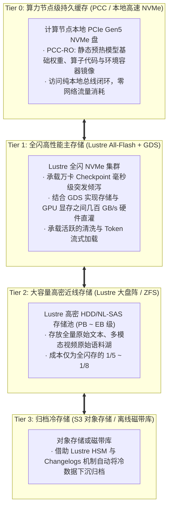
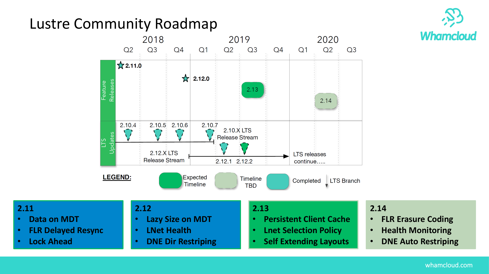

# 29.4 未来演进：混合智算分层存储体系

面向千亿乃至万亿参数的超大规模大模型时代，单一类型的存储介质与架构难以在经济性（TCO）与极致性能之间取得双重胜利。现代高性能算力中心正在全面演进为 **混合智算四级分层存储体系**：

结合官方未来演进路线（图 24-4），Lustre 正在加速向全闪存优化、容器化云原生部署（Kubernetes CSI）、用户态客户端（User-Space Client）以及与 HSM/PCC 的深度协同方向持续进化，持续捍卫其在顶级大规模计算领域的基石地位。

---

