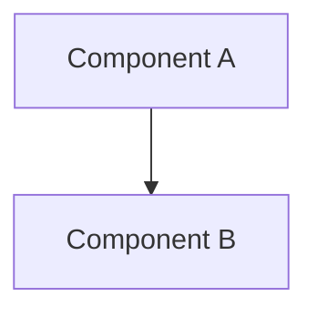

[Core concept definition and high-level premise.]

## Mental model

[Conceptual analogy, diagram, or structural model.]

## How it works

[Detailed breakdown of mechanisms and lifecycles.]

## Trade-offs and considerations

| Choice | Benefit | Cost / Trade-off |
| :--- | :--- | :--- |
| Option A | High write speed | Eventual consistency |
